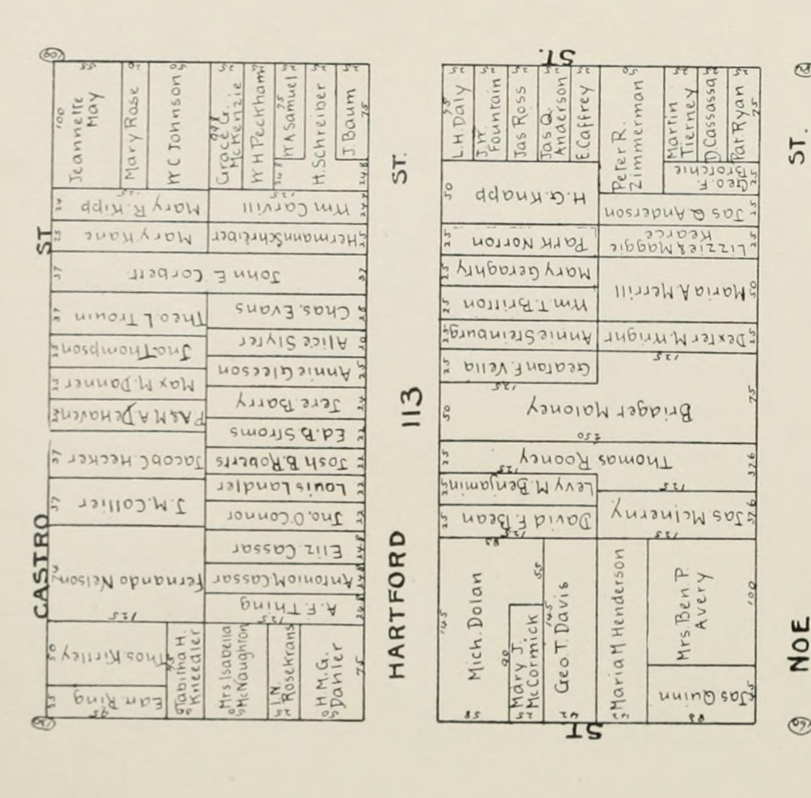
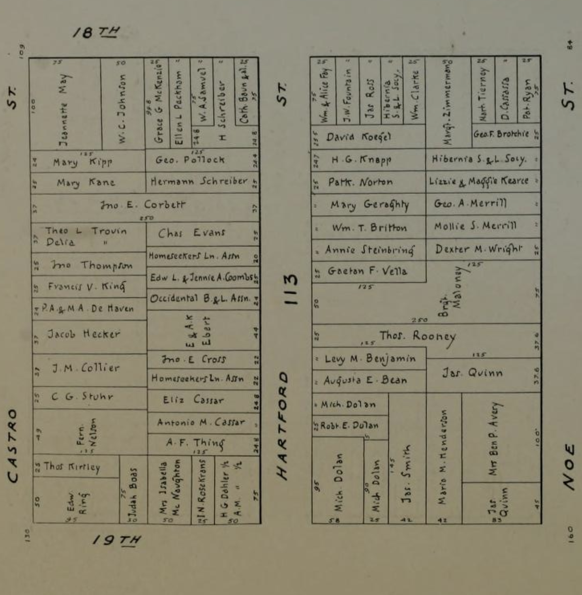

100-199 Hartford St

Originally Mission block 113, houses numbered 1-18 on the west side, and 92-108 on the East, later 1-50, with odd on the west side and even on the east.
Renumbered AGAIN poor things, in 1900 when Fernando Nelson began construction of the north block.

The first two blocks of Hartford St appear some time between [John Miers Horner](https://en.wikipedia.org/wiki/John_M._Horner) and his brother getting the plot in 1854 ([map here](https://hdl.huntington.org/digital/collection/p15150coll4/id/3502/), look for the pencilled in 112, 113, 114 at the top of the map), and when they had to liquidate due to financial panic in 1857 - [there's an 1858 map showing the wild overlapping land claims](https://www.davidrumsey.com/luna/servlet/detail/RUMSEY~8~1~289005~90060593), but it does show the two blocks of Hartford clearly labeled. There are rumors that they couldn't get much money for it because of squatters, and I wouldn't be surprised if Hartford St had already been settled for awhile.

Hartford St first appears on the [1858 Map of Western Addition Land Claims](https://www.davidrumsey.com/luna/servlet/detail/RUMSEY~8~1~289005~90060593), after not appearing in the Horner land grant in 1854. We know the Horners had to sell up in 1857, 

### 1874

[Turnbull 1874 Map](https://www.davidrumsey.com/luna/servlet/detail/RUMSEY~8~1~326621~90095174:Map-Of-San-Francisco?)

### 1886

[Sanborn 1886 map for central Hartford](https://www.loc.gov/resource/g4364sm.g4364sm_g00813188605/?sp=20&st=image&r=-0.073,0.652,1.553,0.768,0)

### 1894

[1894 Block book](https://archive.org/details/handyblockbookof1894hick/page/757/mode/1up?view=theater)

### 1901

### 1905

[1905 Sanborn map](https://www.davidrumsey.com/luna/servlet/detail/RUMSEY~8~1~214222~5501577:Vol--6,-Page-669-670--San-Francisco)

## People

[1868 Langley](https://archive.org/details/sanfranciscodire1868lang) - first mentions of Hartford st
> Bourne  Jasper  J.,  brickmaker,  dwl  E  s  Hartford  nr Eigijteenth 
> Crowley  Jeremiah,  teamster,  dwl  E  s  Hartford  nr Nineteenth 

[1869 Langley](https://archive.org/details/sanfranciscodire1869langrich/mode/2up)
> Crowley    Kate,    (widow)   dwl    E    s  Hartford    bet Eighteenth  and  Ninete-nth 
> Maloney  Patrick,   laborer,   dwl   E  s  Hartford  bet Eighteenth  and  Nineteenth 
> O'Neil  Daniel,  laborer,  dwl  E  s  Hartford  bet  Eight- eenth and  Nineteenth 
> Tierney  Patrick,  laborer,  dwl  E  s  Hartford  bet Eighteenth  and  Nineteenth 

...Skipping ahead a few years...

[1880 Langley](https://archive.org/details/langleyssanfranc1880sanf/page/n57/mode/2up)
Residential:

> Bean  David  F..  porter  Haas  Brothers,  r.  E  s  Hartford, bet  Eighteenth  and  Nineteenth 
>Britton   Patrick,  laborer,  r.   E  s  Hartford,  bet  Eighteenth and  Nineteenth 
>Glennan   Richard,  laborer,  r.  E  8  Hartford,  bet  Eighteenth and  Nineteenth 
> Glennan  William,  laborer,  r.  E  s  Hartford,  bet  Eighteenth and  Nineteenth 
> Joost  B.  &  M.  (Behrend  and  Martin)  general  commission merchants,  SW  cor  Eighteenth  and Hartford 
> Maloney  Patrick,  dairy,  E  s  Hartford,  bet  Eighteenth and  Nineteenth 
> McMichael    Charles,    laborer,    r.   E  s   Hartford,  bet Eighteenth  and  Nineteenth 
> Naughtm  P.,   laborer,  r.   W  s  Hartford,   bet  Eighteenth  and  Nineteenth
> Norton  Patrick,  laborer,  r.  E  s  Hartford,  bet  Eighteenth and  Nineteenth 
> Simon  George,  brushmaker  Richard  W.  Simpson,  r. 955  Hartford  (Ed note: 955???)

Milk dealers:   
> Moloney  Patrlik,   E  s  Hartford,  bet Eighteenth  aud  Nineteenth 