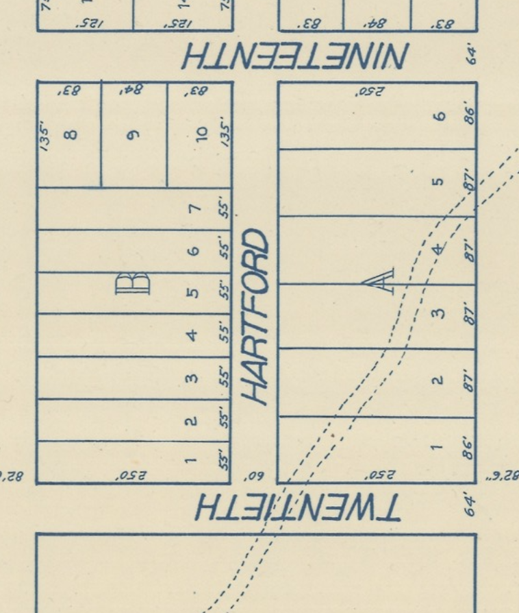
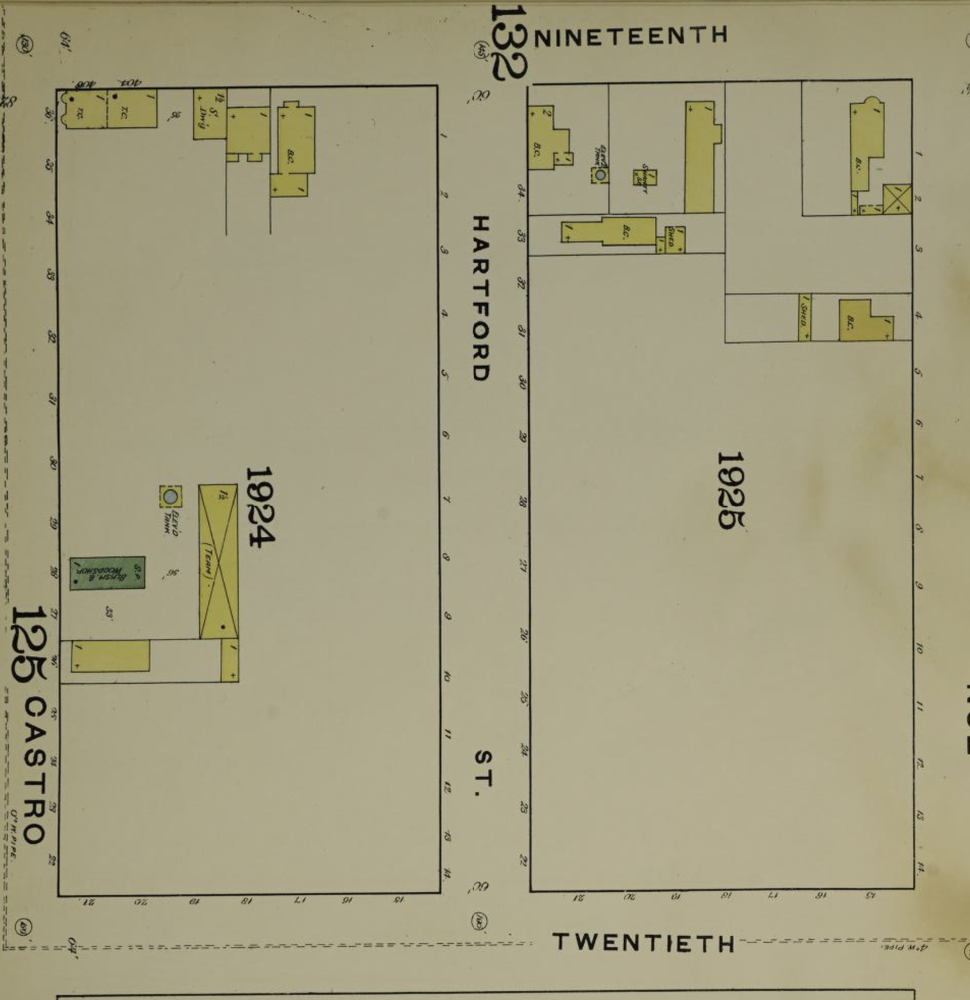
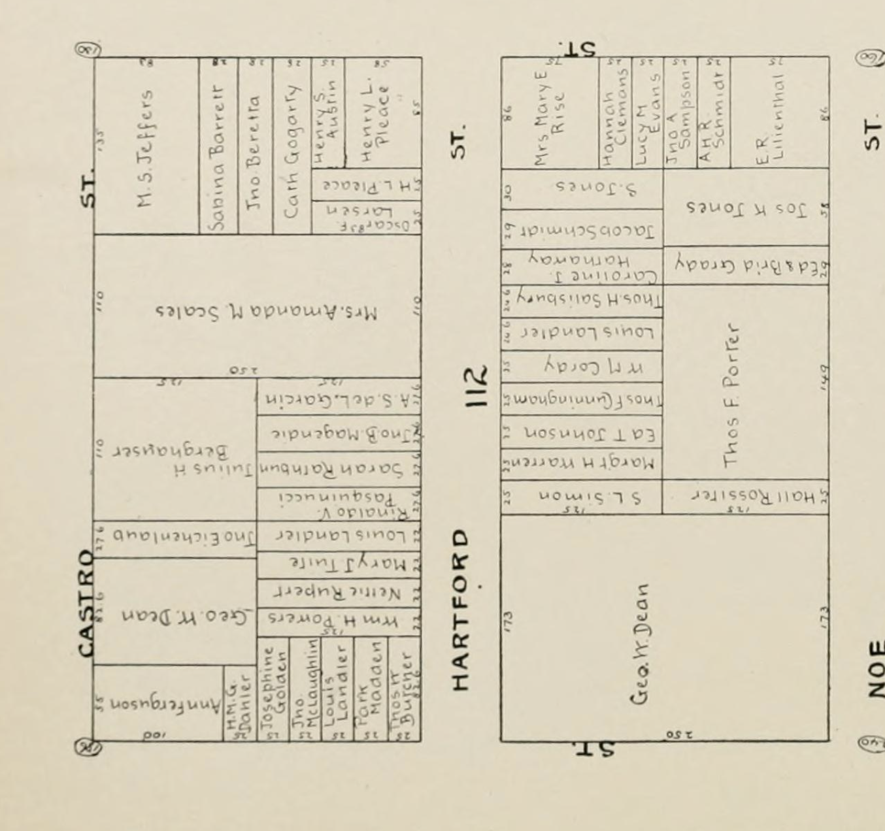

200-299 Hartford St.

Originally Mission block 112, houses numbered 1-14 on the west side, and 22-34 on the east. Later renumbered 102-124 even on the west side, 101-177 odd on the east side, then again in 1900 to the current numbering.

The first two blocks of Hartford St appear some time between [John Miers Horner](https://en.wikipedia.org/wiki/John_M._Horner) and his brother getting the plot in 1854 ([map here](https://hdl.huntington.org/digital/collection/p15150coll4/id/3502/), look for the pencilled in 112, 113, 114 at the top of the map), and when they had to liquidate due to financial panic in 1857 - [there's an 1858 map showing the wild overlapping land claims](https://www.davidrumsey.com/luna/servlet/detail/RUMSEY~8~1~289005~90060593), but it does show the two blocks of Hartford clearly labeled. There are rumors that they couldn't get much money for it because of squatters, and I wouldn't be surprised if Hartford St had already been settled for awhile.

### 1874

[Turnbull 1874 Map](https://www.davidrumsey.com/luna/servlet/detail/RUMSEY~8~1~326621~90095174:Map-Of-San-Francisco?)

### 1886

### 1894 

[1894 Block book](https://archive.org/details/handyblockbookof1894hick/page/766/mode/2up)

### 1901

### 1905
[1905 Sanborn map](https://www.davidrumsey.com/luna/servlet/detail/RUMSEY~8~1~214222~5501577:Vol--6,-Page-669-670--San-Francisco)

