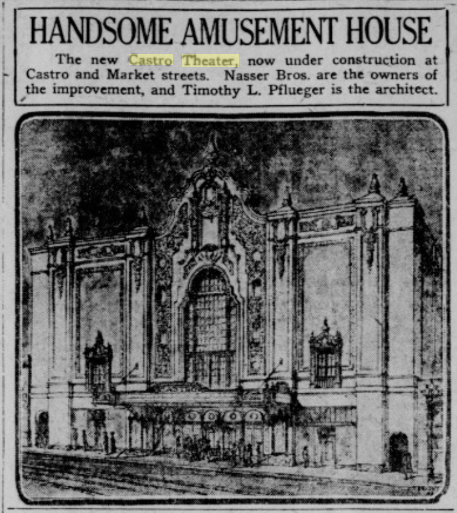

[San Francisco Call, Volume 109, Number 17, 17 December 1910](https://cdnc.ucr.edu/?a=d&d=SFC19101217.2.84&srpos=2&e=-------en--20-SFC-1-byDA-txt-txIN-%22castro+theater%22-------)

> LEADING EVENTS OF THE WEEK AMONG THE IMPROVEMENT CLUBS
> The riot of carnival spirit continues to grow In the Mission district. Each evening finds the streets crowded with merrymakers. [...]
> EUREKA VALLEY CLUB
> The Eureka Valley improvement dub association has about completed arrangements for tlie dedication of the new Castro theater, which will be opened under the auspices of -the .club Wednesday - evening. . This theater is one of tfie most commodious and artistic of its kind in. the -city.

The Call records a few engagements, mostly with serialized movies, a few traveling shows that put their ads in the papers, and a series of political speeches and rallies around the [1919 SF mayoral election](https://en.wikipedia.org/wiki/1919_San_Francisco_mayoral_election), where James "Sunny Jim" Rolph gave some campaign speeches. 

In 1921 the Nasser brothers begin a new building designed by Timothy Pfleuger. 

_[San Francisco Call, Volume 109, Number 134, 11 June 1921](https://cdnc.ucr.edu/?a=d&d=SFC19210611.1.10&e=-------en--20-SFC-21-byDA-txt-txIN-%22castro+theater%22-------)_