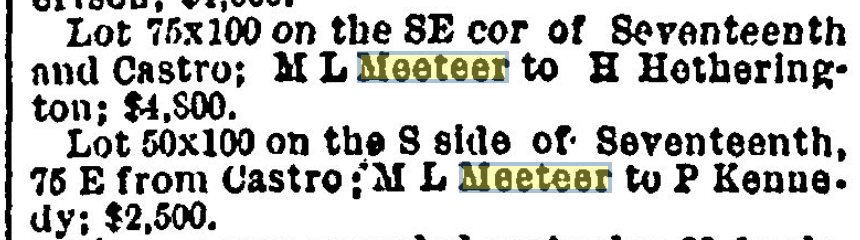

This fine peaked building with the lacy bargeboards is Meeteer House, sometimes called "Matear House". It was originally built by [Marshall Meeteer](/people/meeteer/)(the most-misspelled man in history), a carpenter from Baltimore who came to San Francisco around 1860.

<i>Meeteer House at 429 Castro St, on a rainy April 28, 1901. Photo by [DH Wulzen Jr.](/people/dhwulzen/)  <a href="/images/dhwulzen-4-28-1901-meeteer-house-front.png" target="_blank" rel="noopener noreferrer">Click to open the full size image in a new tab</a>
 </i>

The style is what we'd generally call "carpenter gothic", which is to say fancy, but fancy made by _hand_ rather than with machined millwork and engine-powered lathes. The house clearly started as a single peaked structure, but quickly developed porches and verandahs. Eureka Valley was [rich in water](/history/water-wars/), and it looks like Meeteer capitalized on that by digging a well and fitting it with a wind-driven pump and a large water tank. With the city's history of fire, these improvements were more than a luxury - they lowered your fire insurance premiums! The rest of the parcel was taken up with gardens, animal sheds, outbuildings, and some rental flats that sat directly at the property line.

_Detail of June 28, 1900 photo by [DH Wulzen Jr.](/people/dhwulzen/), showing Meeteer House from behind._

[San Francisco Evening Post - March 25, 1876](https://infoweb-newsbank-com.ezproxy.sfpl.org/apps/news/openurl?ctx_ver=z39.88-2004&rft_id=info%3Asid/infoweb.newsbank.com&svc_dat=WORLDNEWS&req_dat=C4A791F4197B4BD28C27A2A6A0C93929&rft_val_format=info%3Aofi/fmt%3Akev%3Amtx%3Actx&rft_dat=document_id%3Aimage%252Fv2%253A14B412E1BAC042E4%2540EANX-NB-14F20246E8456708%25402406339-14F0F39AB0BC3240%25404-14F0F39AB0BC3240%2540/hlterms%3A%2522meeteer%2522)

The San Francisco Bulletin for October 2, 1876 Real estate transactions lists:
> M.L. Meeteer and wife to C.L. Wulff, lot 24x80 on the east line of Castro, 203 ft south of 17th st, $1800.

The Meeteer family moved to Oakland around 1880, and the property went through a series of owners.

1. Meeteer to Kalloch
   [Daily Alta California, Volume 32, Number 10938, 26 March 1880](https://cdnc.ucr.edu/?a=d&d=DAC18800326.2.44&srpos=3&e=-------en--20-DAC-1-byDA-txt-txIN-%22meeteer%22-------)
   
   > M. L. Meeteer and wife to Isaac M. Kalloch, lot 80x80; on east Una of Castro street, 100 feet South of Seventeenth, $2750. 
2. Meeteer to Kalloch
   [Daily Alta California, Volume 32, Number 11023, 19 June 1880](https://cdnc.ucr.edu/?a=d&d=DAC18800619.2.48&srpos=3&e=-------en--20-DAC-1-byDA-txt-txIN-+Kalloch+castro-------)
   > M. L. McCleer and wife to Annie F. Kalloch, lot 68x80, commencing 80 feet east of Castro street, and 180 south of Seventeenth, $5.
3. Annie Kalloch to M. E. Garvey.    
   [Daily Alta California, Volume 36, Number 12369, 27 February 1884](https://cdnc.ucr.edu/?a=d&d=DAC18840227.2.42&srpos=4&e=-------en--20-DAC-1-byDA-txt-txIN-+Kalloch+castro-------)
   > Annie F. Kalloch to M.E. Garvey, lot 25x80, on E. line of Castro st, 100 S. of Seventeenth, 
4. Garvey to Williams
   [Daily Alta California, Volume 42, Number 13768, 12 May 1887](https://cdnc.ucr.edu/?a=d&d=DAC18870512.2.65&srpos=9&e=-------en--20-DAC-1-byDA-txt-txIN-garvey+castro-------)
   > Mary E. Garvey to R. S. Williams, lot 25x80 on E. line of Castro, 100 S. of Seventeenth st., $1,300.
5. Williams to Spaulding
   [Daily Alta California, Volume 42, Number 13805, 18 June 1887](https://cdnc.ucr.edu/?a=d&d=DAC18870618.2.78&srpos=1&e=--1886-----en--20-DAC-1-byDA-txt-txIN-%22R+s+williams%22+castro-------)
    > A. F. Farman to A. Spaulding. lot 20x60, on S. line of Frank place, 97.6 W. of Mason, $1. 
    > R. S. Williams to same, lot 25x80, on E. line of Castro, 100 S. of Seventeenth st., $15.

The entire parcel, including house, grounds, and rental flats, ended up in the hands of [Andrew Spaulding](/people/spaulding/). Andrew was a watchmaker and jeweler and silversmith who came to SF in 1867, working at a number of different jewelry stores and investing in real estate. Spaulding passed away in Nov 23, 1906, and his widow Susan Shockley Spaulding moved across the street to 428 Castro, where she lived until her death on Nov 27, 1915. Before her passing, Susan rented out the house.

William C. Hopper, a physician, is listed in the SF Directories first as a tenant, and then owner of the address starting in 1907, and continuing until 1912. The SF directory lists several others as living at this address until 1922.

Meeteer house was torn down around 1921 to make way for the new Pfluger-designed second location of the Castro Theater. San Francisco nostalgia being what it is, a newspaper columnist eulogized the early block of Castro in 1923 in their column "Cities within a City". [Meeteer House is briefly mentioned](https://archive.org/details/citieswithincity19241sanf/page/n202/mode/1up) (and badly misspelled), and this misspelling continues in historical records to this day.

The parking lot behind the Castro Theater is still called “Spaulding Court” or "Spalding Court" on older city and Sanborn maps.

<!-- Meeteer to Kalloch, 

Kalloch to Mary E. Garvey.    
[Daily Alta California, Volume 36, Number 12369, 27 February 1884](https://cdnc.ucr.edu/?a=d&d=DAC18840227.2.42&srpos=4&e=-------en--20-DAC-1-byDA-txt-txIN-+Kalloch+castro-------)
> Annie F. Kalloch to M.E. Garvey, lot 25x80, on E. line of Castro st, 100 S. of Seventeenth, $900

[Daily Alta California, Volume 42, Number 13768, 12 May 1887](https://cdnc.ucr.edu/?a=d&d=DAC18870512.2.65&srpos=9&e=-------en--20-DAC-1-byDA-txt-txIN-garvey+castro-------)
> Mary E. Garvey to R. S. Williams, lot 25x80 on E. line of Castro, 100 S. of Seventeenth st., $1,300.

<!-- Meeteer to Isaac Kalloch & separately Annie?

Kallochs arrive  [Daily Alta California, Volume 30, Number 10426, 28 October 1878](https://cdnc.ucr.edu/?a=d&d=DAC18781028.2.46&srpos=1&e=-------en--20-DAC-1-byDA-txt-txIN-+Kalloch+castro-------)

-->