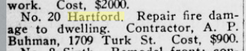

## 1921

> No. 20 Hartford. Repair fire damage to dwelling. Contractor, A. P. Buhman, 1709 Turk St. Cost, $9OO.
[Organized Labor, Volume 22, Number 26, 25 June 1921](https://cdnc.ucr.edu/?a=d&d=OLSF19210625.2.37&srpos=162&e=-------en--20-OLSF-161-byDA-txt-txIN-hartford-------)
