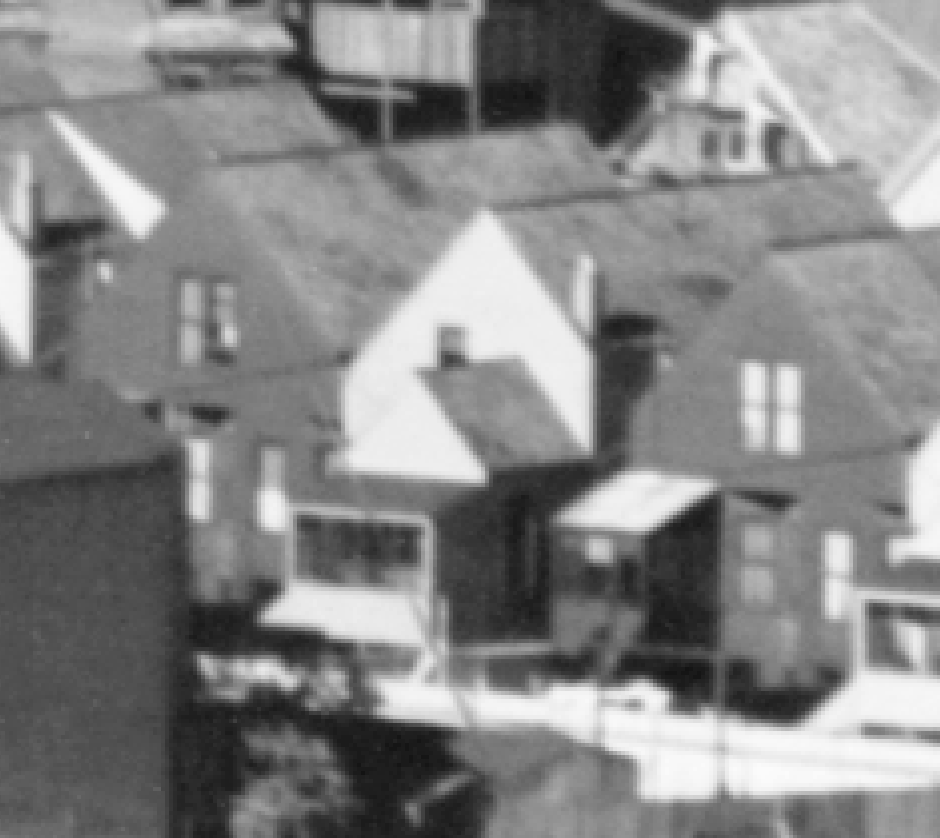
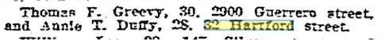

> W line of Hartford street, 166:3 S of Seventeenth, S 25 by W 102.

## House history

Nelson bought the lots preemptively before an auction, per the San Francisco Chronicle
November 5, 1900. He must've been impatient to start, because five months later on March 7th 1901, [an application for water service was filed](https://archive.org/details/springvalleywate03unse/page/n281/mode/2up)for 32 Hartford, implying that it was done or at least near completion. Per the above, the first account # 45465, later xed out and written as 42352. The other note on the date says Feb 20th 1903. Not sure what that means.

1902, view from Corbett shows the original back porch/sunroom which we had to remove and rebuild, showing the original orientation of the back stairs that went North instead of West.

## Schillings - April 1901- Nov 1904

Joseph Schilling was the vice-president of the family business, "Adam Schilling & Sons" which built engines at the "Golden Gate Machine Works" at 211-213 Main St. His father Adam was the President, and his brothers (George, and Adam J) also worked there.

Some pictures of [an 1894 ad for the "Golden Gate" Gas Engine](http://www.vintagemachinery.org/mfgindex/imagedetail.aspx?id=6439).

In the 1889-94 directories he's listed as living in the family home at 1263 18th St.  (His brother Adam J, lived at 4605 18th.)
In the [1897-98 directory](https://archive.org/details/crockerlangleysa1897sanf/page/1516/mode/1up) he's living with Adam J at 4605 18th.
In the [1899](https://archive.org/details/crockerlangleysa1899sanf/page/1528/mode/1up)-[1900](https://archive.org/details/crockerlangleysa1900sanf/page/1506/mode/1up) directories he's listed as living at 542 Castro. Catherine gives birth to their first child in July 1899, and I imagine they wanted their own place and saw Nelson putting up the site.

Joseph and Catherine Schilling [buy the house from Fernando Nelson on 25 April 1901](https://cdnc.ucr.edu/?a=d&d=SFC19010425.2.66&srpos=1&e=-------en--20-SFC-1-byDA-txt-txIN-schilling+%22line+of+hartford%22-------), for $3500.

> Fernando and Julia A. Nelson to Joseph and Catherine Schilling, lot on W line of Hartford street, 328:3 N of Eighteenth. N 23[sic] by W 102; $3500.

In [1904](https://archive.org/details/crockerlangleysa1904sanfrich/page/1640/mode/1up) they're still at 32 Hartford.
In [1905-1907](https://archive.org/details/crockerlangleysa1905sanf/page/1640/mode/1up) they're at 4270 24th St, waaay up the hill.

## Donohues - Nov 1904 - ?? 1911

This part gets muddy, because of the large number of Mary Donohues active in San Francisco at this time. Where a spouse is mentioned it becomes easier to be sure this is the right one, but some of them are still unclear.

The Donohues were active in the real estate pages, both singly and together. For example:

[San Francisco Call, Volume 87, Number 96, 5 September 1901](https://cdnc.ucr.edu/?a=d&d=SFC19010905.2.122&srpos=12&e=-------en--20-SFC-1-byDA-txt-txIN-%22mary+donohue%22-------)

> Mary J. Olson (McCarl) to. Charles A. and Mary Donohue, lot on N line of Fell street, 137:6 E of Devisadero, E 25 by N 137:6; $10.

Shortly after:
[San Francisco Call, Volume 90, Number 183, 30 November 1901](https://cdnc.ucr.edu/?a=d&d=SFC19011130.2.155&srpos=1&e=-------en--20-SFC-1-byDA-txt-txIN-%22mary+a+donohue%22-------), Builders Contracts:

> M. A. or Mary A. Donohue (owner) with F. L. Hansen (contractor), architects Dunn & Schroepfer— Concrete, carpentry, mill and electrical work, hardware and plastering for a 2story attic and basement frame building (flats) on N line of Fell street, 137:6 E of Devisadero, E 25 by N 137:6; $4750.

[San Francisco Call, Volume 93, Number 173, 22 May 1903](https://cdnc.ucr.edu/?a=d&d=SFC19030522.2.116&srpos=18&e=-------en--20-SFC-1-byDA-txt-txIN-%22mary+donohue%22-------)
> City and County of San Francisco to Charles A. and Mary Donohue. lot on N line of Fell street. 137:6 E of Devisadero [sic], E 25 by N 137:6; $----  [NB: private sale? auction? price unknown?]

Mary A Donohue buys the house from the Schillings on 14th Nov or 20th? 1904 for... $10. There are two listings for the same house - one for Joseph and one for Adam.

From [San Francisco Call, Volume 96, Number 170, 17 November 1904](https://cdnc.ucr.edu/?a=d&d=SFC19041117.2.138&srpos=5&e=-------en--20-SFC-1-byDA-txt-txIN-schilling+%22line+of+hartford%22-------)

The price was probably a tax dodge? Or something to do with a mortgage?

Or maybe... [San Francisco Call, Volume 96, Number 173, 20 November 1904](https://cdnc.ucr.edu/?a=d&d=SFC19041120.2.127.82&srpos=21&e=-------en--20-SFC-21-byDA-txt-txIN-%22mary+donohue%22-------):
> A. Schilling to Mrs. Mary Donohue, lot 25x122 feet, and cottage, on the west side of Hartford street. 166:3 feet south of Seventeenth, $3800.

[1905](https://archive.org/details/crockerlangleysa1905sanf/page/599/mode/1up)-1911 Crocker Langley: Donohue, Charles A. clerk Blake, Moffitt & Towne. (papermaking)

[The 1906 block book](https://archive.org/details/sanfranciscobloc1906bloc/page/241/mode/2up) lists “Mary Donahue” as the owner.

Something else weird happened at this point, and searching is foiled by bad OCR. Mary was the sole owner at the original 1904 sale, but on 24 Sept 1908 Charles is listed as the owner, passing the property back to Mary for $10. On 19 Oct 1909, Mary passes it back to him as "a gift".  Whaaaat. During this time Charles' occupation changes to drayman, and we know they have a lodger named Peter Ennis ([who gets engaged in Dec 1908](https://cdnc.ucr.edu/?a=d&d=SFC19081224.2.114.3&srpos=3&e=-------en--20-SFC-1-byDA-txt-txIN-%2232+hartford+st%22-------)). It sounds as if they're strapped for cash or something.

Real estate transaction recorded in the San Francisco Chronicle
September 24, 1908

Real estate transaction recorded in the San Francisco Chronicle October 14, 1909 shows Mary transferring 32 Hartford to Charles.

- 1909: occupation changes to drayman - what happened?
- 1910: salesman
- 1911: just clerk
- 1912: janitor, 939 Stanyan

[1910 census](https://www.ancestryheritagequest.com/discoveryui-content/view/1587149:7884)
Charles A Donohue, Night Watchman, age 50 - listed as owning their home, freely (un-mortgaged)
Spouse Mary E Donohue, age 39 (immigrated in 1875)
2 sons: Leo I (10) and Harry T (18) (a clerk at the railroad office)
2 roomers: Peter (28)(house carpenter) and Katherine (20)  (waitress at a restaurant) Ennis

## Duffys - 1912 - 1932/33

Patrick J and Marry A (Finn) Duffy [were married in 1908](https://cdnc.ucr.edu/?a=d&d=SFC19081121.2.107.3&srpos=1&e=-------en--20--1-byDA-txt-txIN-%22patrick+J+duffy%22-------), and had four daughters.

Bertha, our 1928-model Atlas Gravity furnace, would most likely have been installed by them.

Patrick Duffy and Patrick Roddy were in business together as [semi-infamous barkeeps](https://cdnc.ucr.edu/?a=d&d=SFC19110807.2.22&srpos=1&e=-------en--20--1-byDA-txt-txIN-%22roddy+%26+duffy%22-------) at Roddy & Duffy Liquors, 61 3rd (“P J Roddy & P J Duffy”). The Roddys lived down the way at 71 Hartford.

The 1912 Crocker Langley directory lists Patrick J Duffy as living at 32 Hartford in 1912. This means it could've sold in 1911 but I can't find any information about the sale.

October 15th 1912 there's a marriage license announcement for an Annie T Duffy living at 32, who must've been Patrick's sister. 

We also know that Patrick Finn, Mary Finn Duffy's brother, lives with them in 1916, and James Finn is listed living with them [in 1919](https://cdnc.ucr.edu/?a=d&d=SFC19190415.2.62&srpos=1&e=-------en--20-SFC-1-byDA-txt-txIN-%2232+hartford+street%22-------).

July 1919 Marriage license for James J Finn.

1920 the Duffys are listed as:
Patrick J Duffy - free owner of his home, 36 years old, a Saloonkeeper, born in California to Irish parents.
Mary A Duffy - 30, a housewife, born in California to an Irish father and Californian mother.
Plus four daughters: Mary (10y), Annie (8y), Loretta (6y) and Helen (2y).

Nov 19, 1920, Mary's infant son Thomas passes away.

The 1930 census they're still at 32, and it also lists a Patricia (8y), values the house at $5000, does not say if it has a radio set, and also lists both Mary and Patrick as having been born in Ireland. Huh. Also Patrick as having naturalized in 1902, and Mary in 1906, married when Patrick was 30 and Mary was 20. Patrick is listed as a 52 year old real estate agent, Mary and Annie are still single at home, but listed as stenographers for an insurance company and a stock & bond company respectively.

Patrick Duffy passes away May 31 1939.

### The travails of Patrick Duffy

They do seem to get up to a lot of trouble, don't they?

[San Francisco Chronicle - August 22, 1916](https://infoweb-newsbank-com.ezproxy.sfpl.org/apps/news/document-view?p=EANX-NB&t=pubname%3A113ACFC4DAF84818%7C11B84ACF2660E555%7C142051F45F422A02%7C13B0FD2E4DD930E1%7C14B5ABC940427781%21Selected%2520Sources%2520%285%29&sort=YMD_date%3AA&fld-base-0=alltext&maxresults=20&val-base-0=%22patrick%20duffy%22&fld-nav-0=YMD_date&val-nav-0=1909%20-%201930&docref=image/v2%3A142051F45F422A02%40EANX-NB-14EB2777DB33F7C4%402421098-14E913B2F431690F%403-14E913B2F431690F%40) - 
Trouble at 2999 [sic, 2001] Mission - that looks like it’s a block away from Army (Ceasar Chavez)

[San Francisco Chronicle November 29, 1919](https://infoweb-newsbank-com.ezproxy.sfpl.org/apps/news/document-view?p=EANX-NB&t=pubname%3A113ACFC4DAF84818%7C11B84ACF2660E555%7C142051F45F422A02%7C13B0FD2E4DD930E1%7C14B5ABC940427781%21Selected%2520Sources%2520%285%29&sort=YMD_date%3AA&fld-base-0=alltext&maxresults=20&val-base-0=%22patrick%20j%20duffy%22&fld-nav-0=YMD_date&val-nav-0=1909%20-%201930&docref=image/v2%3A142051F45F422A02%40EANX-NB-14ECCCE7D29C9232%402422292-14EB0733F0578F78%403-14EB0733F0578F78%40)
![Warrants Charge 9 with Dry Violations Warrants charting violation of the wartime prohibition act were issues today by Assistant United States Attorney Wilford Tully against (some people) James Finn and Patrick J Duffy 2000 Mission street, also will have to answer to the charge of violating the law. Duffy was the first San Franciscan arrested by the Federal authorities last July for violating the prohibition law. At that time he was fined $100 and assured the Court he would not commit a second offense.](images/32-duffy-03.png)

[San Francisco Call, Volume 106, Number 22, 2 August 1919](https://cdnc.ucr.edu/?a=d&d=SFC19190802.2.134&srpos=13&e=--1910-----en--20-SFC-1-byDA-txt-txIN-%22patrick+duffy%22-------)

[Stockton Independent, Volume 117, Number 163, 10 January 1920](https://cdnc.ucr.edu/?a=d&d=SDI19200110.2.37)
![S. F. Saloonkeeper Is Given Stiff Sentence. San Francisco, Jan. 9.—After United States Attorney Mrs. Anette Adams had informed the court today that friends of Patrick J. Duffy, a local saloonkeeper, had approached her, as well as several others in the United States attorney's office, in an endeavor to have leniency shown Duffy in connection with charges that he violated the war time prohibition law, a fine of $800 and a ten months’ jail sentence was imposed upon the saloonman by Federal Judge Frank S. Dietrich. These were the heaviest penalties ever imposed here in a case of this kind, and were nearly the maximum under the law. Duffy, Mrs. Adams pointed out, was the first person to plead guilty for violating the war time liquor law when it was first enforced here last September. At that time he was lined $100.](images/32-duffy-06.png)

[San Francisco Chronicle - April 15, 1920](https://infoweb-newsbank-com.ezproxy.sfpl.org/apps/news/document-view?p=EANX-NB&t=pubname%3A113ACFC4DAF84818%7C11B84ACF2660E555%7C142051F45F422A02%7C13B0FD2E4DD930E1%7C14B5ABC940427781%21Selected%2520Sources%2520%285%29&sort=YMD_date%3AA&fld-base-0=alltext&maxresults=20&val-base-0=%22patrick%20j%20duffy%22&fld-nav-0=YMD_date&val-nav-0=1909%20-%201930&docref=image/v2%3A142051F45F422A02%40EANX-NB-14EEBE2E2936033B%402422430-14EEB8E4A5238652%408-14EEB8E4A5238652%40):

[Oakland Tribune, Volume 107, Number 117, 25 October 1927](https://cdnc.ucr.edu/?a=d&d=OT19271025.1.38&srpos=7&e=-------en--20--1-byDA-txt-txIN-%22patrick+J+duffy%22-------):
![First Highball In America Was Made by Actor NEW YORK, Oct. 25. - (AP) The inventor of the Scotch highball was disclosed today. Stirred by assertions in accounts of the bankruptcy of the Adams House of Boston that it had served the first such drink in this country, Patrick J. Duffy, who formerly conducted a cafe patronized by theatrical people, wrote the New York Times that E. J. Ratcliffe, an actor, who came here in the early 90's from London with Mary. Anderson's company, made the first Scotch highball in America. Members of the ancient and honorable artillery of Boston, who came here annually to attend the old guard ball, took the new drink to the Adams House, Duffy said.](images/32-duffy-08.png)

Just imagining Duffy writing indignantly to the New York Times.

## Gilmores/Gillmores

Gardens, cementwork.

Remodel in 1937.
Sunroom built out in 1941.
