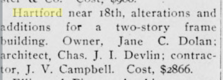
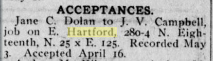

<https://opensfhistory.org/Display/wnp25.10516.jpg>

### 1905

> Hartford near 18th, alterations and additions for a two-story frame building. Owner, Jane C. Dolan; architect, Chas. J. I. Devlin; contrac- j tor. J. V. Campbell. Cost, $2866.
[Organized Labor, Volume 6, Number 44, 25 November 1905](https://cdnc.ucr.edu/?a=d&d=OLSF19051125.2.3&srpos=58&e=-------en--20-OLSF-41-byDA-txt-txIN-hartford-------)

### 1906

> Jane C. Dolan to J. V. Campbell, job on E. Hartford, 280-4 N. Eighteenth, N. 25 x E. 125. Recorded May 3. Accepted April 16.
[Organized Labor, Volume 7, Number 17, 19 May 1906](https://cdnc.ucr.edu/?a=d&d=OLSF19060519.2.24&srpos=60&e=-------en--20-OLSF-41-byDA-txt-txIN-hartford-------)
