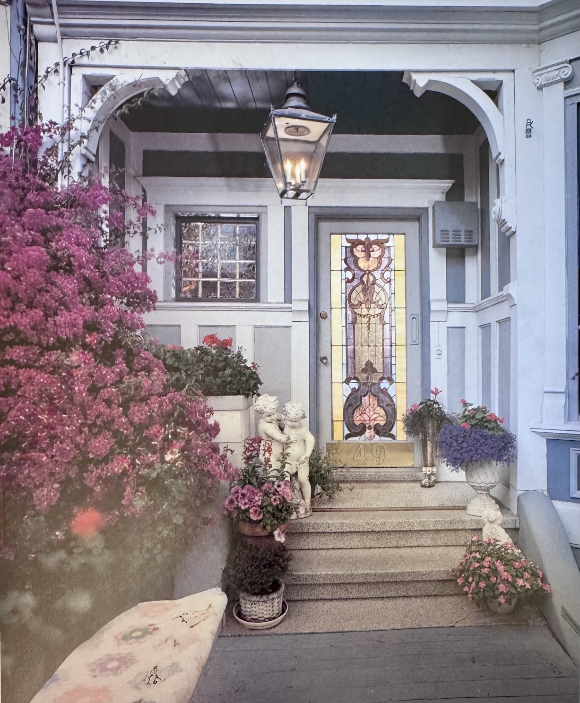
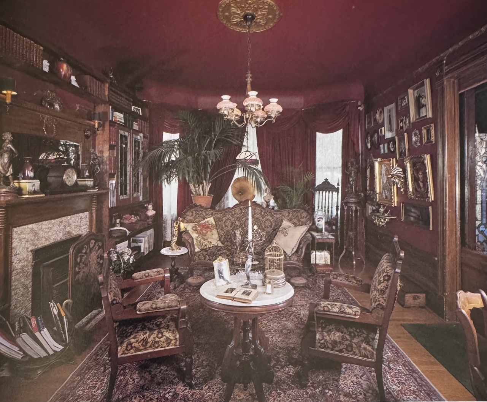
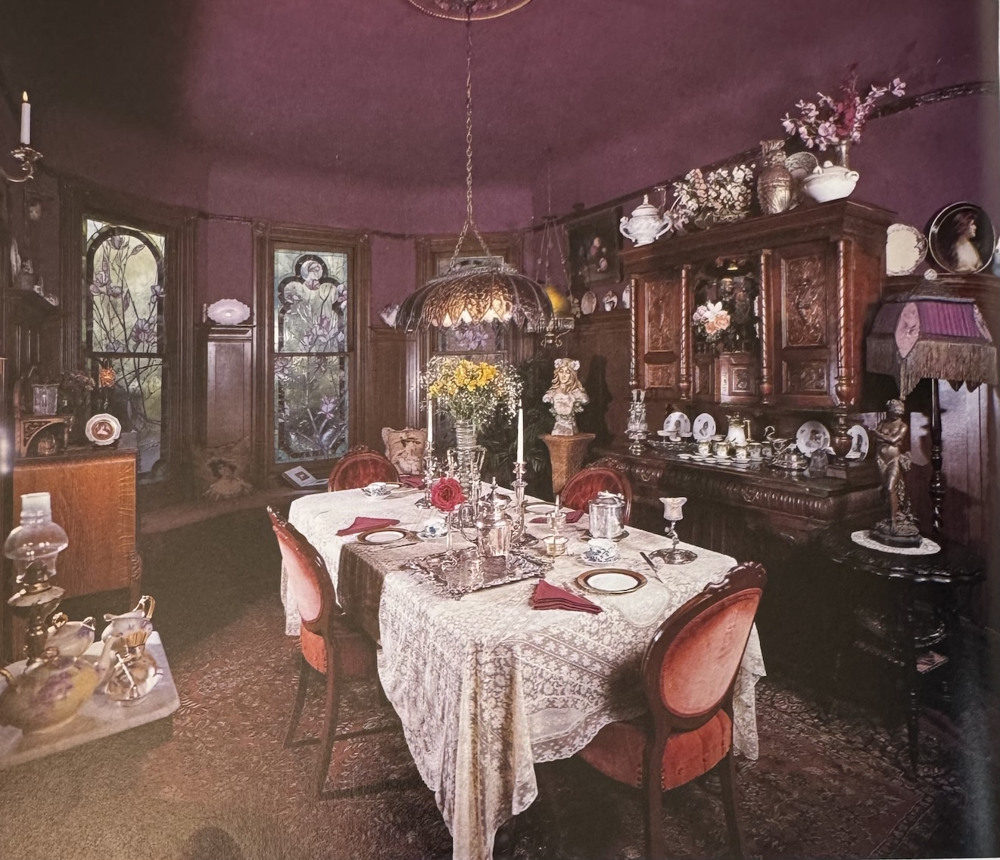
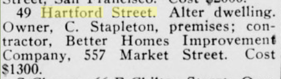

Owned from 1971 to May of 1994 by James (Jim) Raidl and Roy Little, the owners of the antiques shop Mammy Pleasant's Parlor. They did a lot of restoration and renovation, and had a medieval style beer hall in the lower floor. Roy was a stained glass artist who did many of the existing stained glass porch panels still on the street. He presented Jim with two giant magnolia stained glass panels as a birthday gift, and they remained in the house when the two moved to Gurneville.

49 Hartford in the Raidl-Little era is preserved in pictures in [The Painted Ladies Revisited](https://archive.org/details/paintedladiesrev0000poma/page/104/mode/1up), pages 104-108 ([ISBN  9780525485087](https://bookfinder.com/isbn/9780525485087/)).

Alas, all of the beautiful wallpaper and much of the original historical detail was destroyed or removed by 2021 by the voracious San Francisco housing market.

In 2025 the house began major foundation work in service of remodeling it into an eco-modern white box, and in the process some of the stained glass was returned to Jim.

#### 1902 Crocker Langley directory

Hawkins Olof, millhand Capitol Mills, r. 49 Hartford

#### 1933 "alterations"

> 49 Hartford Street. Alter dwelling. Owner, C. Stapleton, premises; contractor, Better Homes Improvement Company, 557 Market Street. Cost $1300.
[Organized Labor, Volume 34, Number 14, 8 April 1933](https://cdnc.ucr.edu/?a=d&d=OLSF19330408.2.25&srpos=16&e=-------en--20-OLSF-1-byDA-txt-txIN-%22hartford+street%22-------)
