The 0-100 block of Hartford St is _almost_ solely the work of "master builder" Fernando Nelson, who famously built thousands of homes in SF over the course of his half-century career, and acted as one-man savings and loan to many of his customers.

Hartford St North is an example of blue-collar Victorians in the "streetcar suburbs" growing in San Francisco at the turn of the century. These houses are the transition period between the vernacular, unprofessional infill housing in chaotically inclusive urban spaces, and the commissioned exclusive automobile-reliant suburbs of the 1920s and later. As non-status buildings - specifically meant to be _owned_ by blue-collar workers and not just rented to them - the buildings on Hartford St are a rare survival, and illustrate the incredible quality of life available to migrants willing to make the trip West.

## Block history

Hartford St North was originally listed as "Mission block 114", and only much later (when the City consolidated the previous different survey block numbers) became "Block 3582" as it's known today.

This was the last block in the area to be developed, due to the conflicting land claims, and the protracted probate battle (and intra-family strife) in the J.P. Treadwell estate. The middle and southerly blocks were parceled out in the Eureka Homestead Association much earlier. But also the Market/17th/Castro corner had a saloon on it long before - more research required there.

Due to this partitioning, Hartford St Central and South were weirdly numbered, consecutively upwards as you went south on the west side, then crossing the street and continuing as you went north. These were renumbered later to fit the SF municipal scheme, which is to say the house numbers increase by about 100 each block you get further away from Market, and odd numbers are on one side, even on the other.

When the third block was cut and it got closer to Market St, the blocks were renumbered _again_ to unify the number scheme, some time between 1900 and 1901. Hartford North became 0-99, Hartford Central became 100-199, and Hartford South became 200-299.

## The Treadwell heirs

Oh dear there are [_a lot_ of Treadwell listings in 1900](https://archive.org/details/mccords-edwards-abstract-from-records_1900-12-31_no-2610-no-2912/page/n552/mode/1up?q=treadwell). Though more than half appear to be just cases where A. B. Treadwell, attorney, is involved.

April a quit-claim?
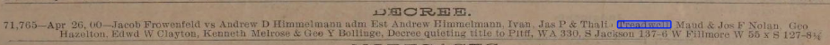

On 21 May 1900, the Treadwell court
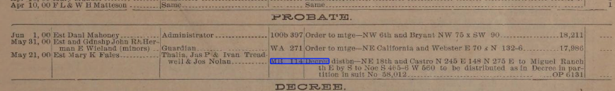
It looks like Thalia Treadwell held the land for less than a fortnight after probate distribution

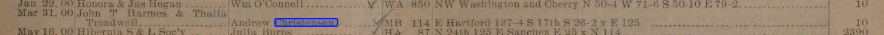
This deed was recorded [6 June 1900](https://archive.org/details/mccords-edwards-abstract-from-records_1900-12-31_no-2610-no-2912/page/n278/mode/1up?q=christensen), but was... backdated...? to 31 March 1900, before the probate distribution.  Hmmmm.  She'a also selling this with John T Harmes, who one _assumes_ is her spouse?

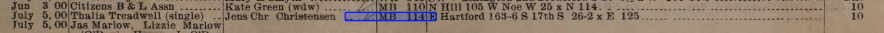
Interestingly, she sells this parcel separately.

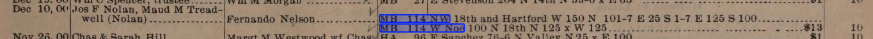

## Andrew Christensen swoops in

_(NB: all of this could probably be resolved by looking at the block book, I just haven't had time to do so.)_

It looks like Andrew Christensen was the first person to buy a lot on the newly-subdivided Mission 114 block per this SFCall notice from 9th June 1900. If that's the first house, then he must've started building nearly immediately since our "[first building on Hartford St](https://history.hartfordstreet.online/images/1900-06Jun-28-DHWulzen-hartford-1030am.png)" photo is dated 28 June 1900.

_The San Francisco Call for 9th June, 1900_

> John T. Harmes and Thalia Treadwell to Andrew Christensen, lot on E line of Hartford street, 137;4 S of Seventeenth, S 26:2 by E 125; $10.

It looks like his brother bought the adjacent lot a month later.

> Thalia Treadwell (single) to Jens Chr Christensen, lot on E line of Hartford street, 163:6 S of Seventeenth, S26:2 by E 123; $10.

_The San Francisco Call for 8th July, 1900_

The [first builder contract I found](https://cdnc.ucr.edu/?a=d&d=SFC19000620&dliv=userclipping&cliparea=1.13%2C3719%2C6091%2C885%2C569&factor=2&e=-------en--20-SFC-1--txt-txIN-%22line+of+hartford%22-------) shows Andrew Christensen commissioning a building on the lot that became 27/29/31 Hartford St, through Cotter and Jones (contractors), and W. McMillen (architect), which is interesting because in the course of my researches through [Edward's Abstracts](https://archive.org/details/mccords-edwards-abstract-from-records_1900-12-31_no-2610-no-2912), it sounds like Andrew Christensen _was himself a contractor_. Huh.

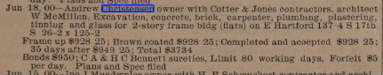
It's signed on 18th June, [recorded 19th June](https://archive.org/details/mccords-edwards-abstract-from-records_1900-12-31_no-2610-no-2912/page/n300/mode/1up?q=christensen), and reported the next day in the _Call_:

_The San Francisco Call for 20th June, 1900_

Interestingly, although Christensen's contract lists a two-story building, the first one to go in was the three-story building that we see already mostly framed out by June 28th. This lot, reading out the surveyor numbers, corresponds to parcel `3582/035`, or 27/29/31 Hartford. Huh.

The construction was accepted 30 August 1900:
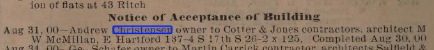

Andrew's brother's building next door didn't go up until after 1902, [based on the DS Wulzen photo from the old Corbett road](#the-1902-view-from-above). Knowing that it's not in the same year, I haven't had time to go search for it.

Regardless of what happened, and perhaps puzzlingly, both the three-story flats at 27/29/31, and the two-story flats at 33/35 have the same layouts, and all of the same trimmings and mouldings as other Nelsons on the block. Did Christensen fire his contractor and hire Nelson at a savings? Or were there just limited resources for interior decoration in 1900/1901?

## Nelson's purchases

At any rate, Fernando Nelson bought a Hartford chunk of the Treadwell block in November 1900, and it was a big enough deal to be in the newspaper [two days running](https://cdnc.ucr.edu/?a=d&d=SFC19001106.2.108.6&srpos=6&e=01-01-1899-01-12-1900--en--20--1-byDA-txt-txIN-%22fernando+nelson%22-------).

24th October, recorded 2nd Nov 1900:
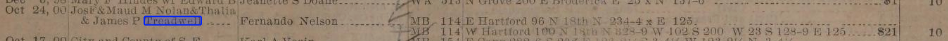

 [San Francisco Call, Volume 87, Number 158, 5 November 1900](https://cdnc.ucr.edu/?a=d&d=SFC19001105.2.104&srpos=5&e=01-01-1899-01-12-1900--en--20--1-byDA-txt-txIN-%22fernando+nelson%22-------)

He later bought up the other side of the block from 18th and Noe north:

_[San Francisco Call, Volume 87, Number 24, 24 December 1900](https://cdnc.ucr.edu/?a=d&d=SFC19001224.2.106&srpos=3&e=-------en--20--1-byDA-txt-txIN-%22fernando+nelson%22+treadwell-------)_

He gets the lot at the NW corner of 18th and Noe.

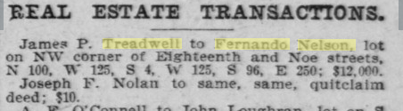

[San Francisco Call, Volume 87, Number 154, 3 May 1901](https://cdnc.ucr.edu/?a=d&d=SFC19010503.2.175&srpos=4&e=-------en--20--1-byDA-txt-txIN-%22fernando+nelson%22+treadwell-------)

So here's our San Francisco Block Book for 1901.

Nelson then (grudgingly?) buys the lot for the apartment building at the SE corner of 17th and Hartford, which becomes one of the sets of flats.
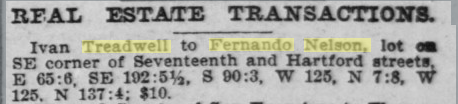
[San Francisco Call, Volume 87, Number 57, 26 January 1902](https://cdnc.ucr.edu/?a=d&d=SFC19020126.2.139&srpos=5&e=-------en--20--1-byDA-txt-txIN-%22fernando+nelson%22+treadwell-------)

## The 1902 view from above

On May 1st, 1902, [D.H. Wulzen scales Corbett and takes this amazing photo](https://digitalsf.org/record/10059), from which we can see the backs of the West side houses, and the tippy tops of the East siders, along with Meeter House, the windmill and water tank, and the Spaulding's paddock.

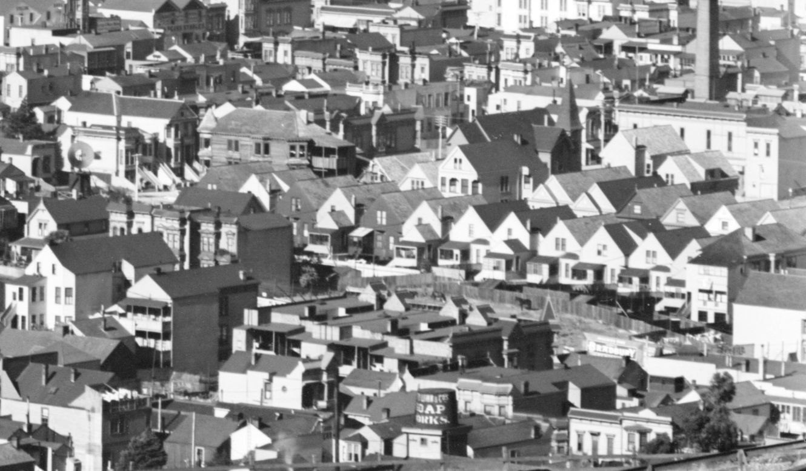

| West          | ___ | East          |
| ------------- | --- | ------------- |
| [nw-corner-apt](/buildings/north/nw-corner-apt/) |     | ne-corner-apt |
|               |     | 1, 5, 17      |
| 20            |     | 19            |
| 24            |     | 25            |
| 28            |     | 27, 29, 31    |
| 32            |     | 33, 35        |
| 36            |     | 37, 39        |
| 42            |     | 41, 43        |
| 44, 46        |     | 45            |
| 48            |     | 49            |
| 52            |     | 53            |
| 56            |     | 57-zen-center |
| 60            |     | 61            |
| 64            |     | 65            |
| 70, 72, 74    |     | 71, 73, 75    |
| sw-corner-apt |     | se-corner-apt |

---

<https://opensfhistory.org/Display/wnp13.006b.jpg> looking ne from 18th st, circa 1907
<https://opensfhistory.org/Display/wnp25.10866.jpg> east side, looking south to se-corner-apt, 1970s

### 1909 block book

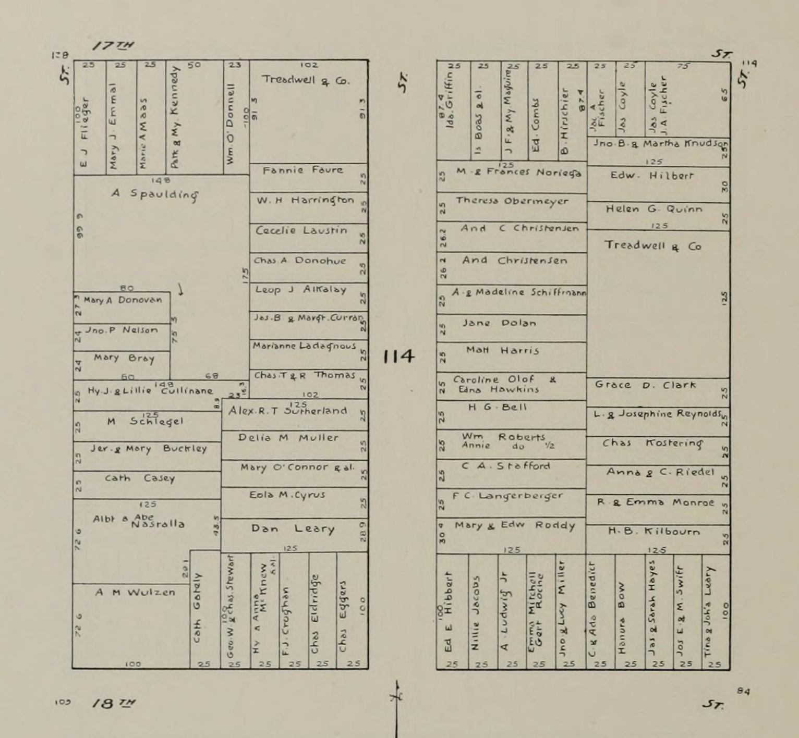

- [Neighbors 1902](./1902-north/) - Not all households and addresses are in here yet unfortunately.
- [Neighbors 1915](./1915-north/)
