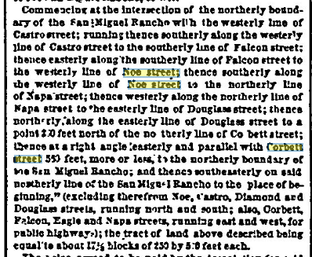
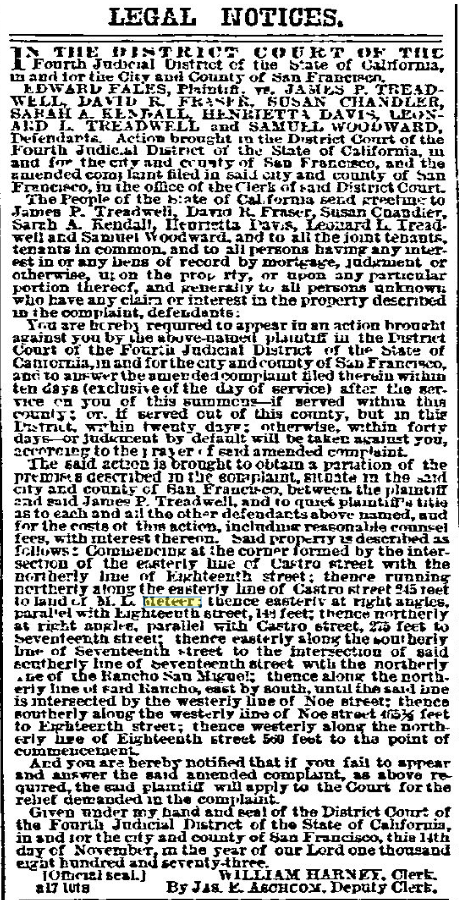
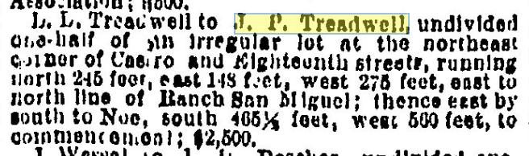
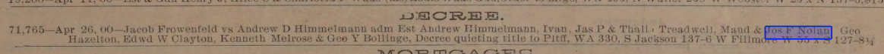

The 0-100 block of Hartford St is _almost_ solely the work of "master builder" Fernando Nelson, who famously built thousands of homes in SF over the course of his half-century career, and acted as one-man savings and loan to many of his customers.

Hartford St North is an example of blue-collar Victorians in the "streetcar suburbs" growing in San Francisco at the turn of the century. These houses are the transition period between the vernacular, unprofessional infill housing in chaotically inclusive urban spaces, and the commissioned exclusive automobile-reliant suburbs of the 1920s and later. As non-status buildings - specifically meant to be _owned_ by blue-collar workers and not just rented to them - the buildings on Hartford St are a rare survival, and illustrate the incredible quality of life available to migrants willing to make the trip West.

## Block history

Hartford St North was originally listed as "Mission block 114", and only much later (when the City consolidated the previous different survey block numbers) became "Block 3582" as it's known today.

Block 114 was part of J M Horner's purchase and Horner's Addition, and labeled 147 and 148. _However_, it wasn't part of the Eureka Homestead Association purchase, and we know Marshall Meeteer was listed as living at the corner of 17th and Castro in 1862. We _also_ know that the Market/17th/Castro corner had a saloon on it very early - more research required there.

The Eureka Homestead land included is so platted:

> Commencing at the intersection of the northerly boundary of the San Miguel Rancho with the westerly line of Castro street; running thence southerly along the westerly line of Castro street to the southerly line of Falcon street; thence easterly along the southerly line of Falcon street to the westerly line of Noe street; thence southerly along the westerly line of Noe street to the northerly line of Napa street; thence westerly along the northerly line of Napa street to the easterly line of Douglass street; thence northerly along the easterly line of Douglass street to a point 200 feet north of the northerly line of Corbett street; thence at a right angle easterly and parallel with Corbett street 550 feet, more or less, to the northerly boundary of the San Miguel Rancho; and thence southeasterly on said northerly line of the San Miguel Rancho to the place of beginning," (excluding therefrom Noe, Castro, Diamond and Douglass streets, running north and south; also, Corbett, Falcon, Eagle and Napa streets, running east and west, for public highways); the tract of land above described being equal to about 17 1/2 blocks of 250 by 550 feet each.
_NB: 17th St was known as Corbett, and 18th was called Falcon at the time of this writing._

The platting starts at the edge of block 114 and works its way back, continuing to exclude it. This means block 114 was definitely sold either by Pioche and Robinson, or Horner _before_ 13th of April, 1863.

Because of the protracted probate battle (and intra-family strife) in the J.P. Treadwell estate, the majority of this block was the last open space in the area waiting to be developed and the road cut.

The middle and southerly blocks were parceled out in the Eureka Homestead Association much earlier. Because of this, Hartford St Central and South were weirdly numbered, consecutively upwards as you went south (uphill) on the west side, then crossing the street and the numbers continuing to increment as you went north (downhill). The two existing blocks of Hartford were renumbered later to fit the SF municipal scheme, which is to say the house numbers increase by about 100 each block you get further away from Market, and odd numbers are on one side, even on the other.

Sometime between 1900 and 1901 block 114 got a north-south road to extend Hartford, rather than the planned east-west extension of Ford St. This third and final North block brought Hartford closer to Market St, so the blocks were renumbered _again_ to unify the number scheme. Hartford North became numbers 0-99, Hartford Central became 100-199, and Hartford South became 200-299.

## Noé and Rancho San Miguel

The first owner of the land was [Jose de Jesús Noé](/people/noe/), who was granted a patent by the Mexican Government after the dissolution of the Missions. For various reasons, he sold up his massive Rancho San Miguel and lived out the rest of his life on Elizabeth St near the Old San Jose road.

## Horner, Horner's Addition, and the Panic

John Miers Horner arrived with a group of Mormon settlers on the ship The Brooklyn with Sam Brannan et al, in 1846, when California was still part of Mexico. He began farming in Mission San Jose in 1847, made immense profits and invested them into more land.He founded Union City, and lived along its north edge - then known as Centerville.

In mid 1853 Horner bought part of Rancho San Miguel from Noé. This was after California was admitted to the Union, and after Noé's land claims was settled in his favor. Horner, for lack of a better name, called it "Horner's Addition", as it was fully in the "Outside lands" outside the City Charter.

[Via SF Genealogy](https://legacy.sfgenealogy.org/sf/history/hgoe04.htm):

> "In San Francisco county, we paid two hundred and eighty-five thousand dollars for five thousand two hundred and fifty acres of land adjoining the city of San Francisco, and expended nearly eight thousand dollars upon it in surveys, fences and other improvements. One thousand and fifty acres of these lands we surveyed and staked into streets, blocks, and lots, extending the streets of San Francisco over it. It is now, and has been for over thirty years, a part of that flourishing city." —John M. Horner

He says a large number of squatters devalued his property:
> [...] the closer these squatters could get to San Francisco, the better they liked it; and if the land was surveyed and staked into streets, blocks, and lots, the better, as then they could and did sell lots cheap to innocent parties.

Basically, with the owners living near Union City, there was little or nothing that could be done to prevent some random guy from setting up shop and selling the lots to unwary newcomers.

> There is an interesting account of the early days of the development of Horner's Addition in the writings of Caroline Barnes Crosby who lived with the Horner's during 1854 and 1855. One the accounts read:
>> "Sun 29th [January 1854] A beautiful pleasant morning. . .Alma Frances and myself took a walk over the hills, to take a view of br[other] Horner's new purchase, and to get a peep at the Spanish house where we expect to reside, after a few weeks. We admired the scenery very much; and think in short time it will be a great place. We walked from bluff to bluff until we arrived at the top of a high one nearly in front of the dobie [NB: adobe] house where the spaniard resides of whom Mr H bought the land [NB: Noé]. We then sat down to admire the prospect. And we came to the conclusion that altho it was not quite retired, yet it was a most beautiful and romantic place. . ." [pages 239-240]

Horner sold off a number of lots, but not with great success. The Panic of 1857 wiped him out, and he was forced to sell almost all of his worldly goods, including his San Francisco property.

## Pioche and Robinson, the Eureka Homestead Association

More research is required here as I haven't found the trail here yet.

I'm not sure who Horner sold it to, and what that person did with it. I do know that on April 15, 1863, Pioche and Robinson sold a chunk of Horner's Addition to become the Eureka Homestead Association. Again, this association specifically _excluded_ Block 114. We don't know who bought it from under them, or when.

We DO know that Marshall M Meeteer, and LL Treadwell were the two owners of 114 for a good long while. Meeteer sold off chunks of his original homestead as normal city lots, then sold off the rest of the property to Andrew Spaulding.

We don't know how LL Treadwell came by the rest of the block, but it was... dramatic.

## Treadwell inter-family drama begins

> LEGAL NOTICES.
> IN THE DISTRICT COURT OF THE Fourth Judicial District of the State of California, in and for the City and County of San Francisco.
> EDWARD FALES, Plaintiff, vs. JAMES P. TREADWELL, DAVID R. FRASER, SUSAN CHANDLER, SARAH A. KENDALL, HENRIETTA DAVIS, LEONARD L. TREADWELL and SAMUEL WOODWARD, Defendants. Action brought in the District Court of the Fourth Judicial District of the State of California, in and for the city and county of San Francisco, and the amended complaint filed in said city and county of San Francisco, in the office of the Clerk of said District Court.
> The People of the State of California send greeting to James P. Treadwell, David R. Fraser, Susan Chandler, Sarah A. Kendall, Henrietta Davis, Leonard L. Treadwell and Samuel Woodward, and to all the joint tenants, tenants in common, and to all persons having any interest in or any liens of record by mortgage, judgment or otherwise, upon the property, or upon any particular portion thereof, and generally to all persons unknown who have any claim or interest in the property described in the complaint, defendants:
> You are hereby required to appear in an action brought against you by the above-named plaintiff in the District Court of the Fourth Judicial District of the State of California, in and for the city and county of San Francisco, and to answer the amended complaint filed therein within ten days (exclusive of the day of service) after the service on you of this summons—if served within this county; or, if served out of this county, but in this District, within twenty days; otherwise, within forty days, or judgment by default will be taken against you, according to the prayer of said amended complaint.  
> The said action is brought to obtain a partition of the premises described in the complaint, situate in the said city and county of San Francisco, between the plaintiff and said James P. Treadwell, and to quiet plaintiff’s title as to each and all the other defendants above named, and for the costs of this action, including reasonable counsel fees, with interest thereon. Said property is described as follows: Commencing at the corner formed by the intersection of the easterly line of Castro street with the northerly line of Eighteenth street; thence running northerly along the easterly line of Castro street 245 feet to land of M. L. Meeteer; thence easterly at right angles, parallel with Eighteenth street, 148 feet; thence northerly at right angles, parallel with Castro street, 275 feet to Seventeenth street; thence easterly along the southerly line of Seventeenth street to the intersection of said southerly line of Seventeenth street with the northerly line of the Rancho San Miguel; thence along the northerly line of said Rancho, east by south, until the said line is intersected by the westerly line of Noe street; thence southerly along the westerly line of Noe street 465½ feet to Eighteenth street; thence westerly along the northerly line of Eighteenth street 560 feet to the point of commencement.
> And you are hereby notified that if you fail to appear and answer the said amended complaint, as above required, the said plaintiff will apply to the Court for the relief demanded in the complaint.
> Given under my hand and seal of the District Court of the Fourth Judicial District of the State of California, in and for the city and county of San Francisco, this 14th day of November, in the year of our Lord one thousand eight hundred and seventy-three.
> [Official seal.]
> WILLIAM HARNEY, Clerk.
> By JAS. E. ASCHCOM, Deputy Clerk.
Published at least three times - Jan 24, Jan 31, Feb 28
[San Francisco Bulletin - January 24, 1874](https://infoweb-newsbank-com.ezproxy.sfpl.org/apps/news/openurl?ctx_ver=z39.88-2004&rft_id=info%3Asid/infoweb.newsbank.com&svc_dat=WORLDNEWS&req_dat=C4A791F4197B4BD28C27A2A6A0C93929&rft_val_format=info%3Aofi/fmt%3Akev%3Amtx%3Actx&rft_dat=document_id%3Aimage%252Fv2%253A113ACFC4DAF84818%2540EANX-NB-119BFEF220A00D00%25402405548-119BFEF262286668%25402-119BFEF347F5EB08%2540Advertisement/hlterms%3Ameteer)

## Treadwell to Treadwell

In 1875, LL Treadwell, JP's brother, sold him the "irregular lot" that is the portion shown. We have to go further back to try to find the purchases of the corner pieces that were already bought and built on by that time. LL died in Feb of the next year.

_San Francisco Chronicle - May 15, 1875, pg 3 Real Estate Transactions_

## The Treadwell heirs

Oh dear there are [_a lot_ of Treadwell listings in 1900](https://archive.org/details/mccords-edwards-abstract-from-records_1900-12-31_no-2610-no-2912/page/n552/mode/1up?q=treadwell). Though more than half appear to be just cases where A. B. Treadwell, attorney, is involved.

April 21 1900, a quit-claim on a different parcel. Huh.

April 26 1900, Decree

> 71,765—Apr 26, 00—Jacob Frowenfeld vs Andrew D Himmelmann adm Hst Andrew Himmelmann, Ivan, Jas P & Thali: Treadwell, Maud & Jos F Nolan, Geo Hazelton, Bdwd W Clayton, Kenneth Melrose & Gee Y Bollinge, Decree quieting title to Pltff, WA 330,S Jackson 137-6 W Fillmore W 55 x § 127-8

On 21 May 1900, the Treadwell court

It looks like Thalia Treadwell held the land for less than a fortnight after probate distribution

This deed was recorded [6 June 1900](https://archive.org/details/mccords-edwards-abstract-from-records_1900-12-31_no-2610-no-2912/page/n278/mode/1up?q=christensen), but was... backdated...? to 31 March 1900, before the probate distribution.  Hmmmm.  She'a also selling this with John T Harmes, who one _assumes_ is her spouse?

Interestingly, she sells this parcel separately.

4 Dec 1900, Decree of Divorce between

## Andrew Christensen swoops in

_(NB: all of this could probably be resolved by looking at the block book, I just haven't had time to do so.)_

It looks like Andrew Christensen was the first person to buy a lot on the newly-subdivided Mission 114 block per this SFCall notice from 9th June 1900. If that's the first house, then he must've started building nearly immediately since our "[first building on Hartford St](https://history.hartfordstreet.online/images/1900-06Jun-28-DHWulzen-hartford-1030am.png)" photo is dated 28 June 1900.

_The San Francisco Call for 9th June, 1900_

> John T. Harmes and Thalia Treadwell to Andrew Christensen, lot on E line of Hartford street, 137;4 S of Seventeenth, S 26:2 by E 125; $10.

It looks like his brother bought the adjacent lot a month later.

> Thalia Treadwell (single) to Jens Chr Christensen, lot on E line of Hartford street, 163:6 S of Seventeenth, S26:2 by E 123; $10.

_The San Francisco Call for 8th July, 1900_

The [first builder contract I found](https://cdnc.ucr.edu/?a=d&d=SFC19000620&dliv=userclipping&cliparea=1.13%2C3719%2C6091%2C885%2C569&factor=2&e=-------en--20-SFC-1--txt-txIN-%22line+of+hartford%22-------) shows Andrew Christensen commissioning a building on the lot that became 27/29/31 Hartford St, through Cotter and Jones (contractors), and W. McMillen (architect), which is interesting because in the course of my researches through [Edward's Abstracts](https://archive.org/details/mccords-edwards-abstract-from-records_1900-12-31_no-2610-no-2912), it sounds like Andrew Christensen _was himself a contractor_. Huh.

It's signed on 18th June, [recorded 19th June](https://archive.org/details/mccords-edwards-abstract-from-records_1900-12-31_no-2610-no-2912/page/n300/mode/1up?q=christensen), and reported the next day in the _Call_:

_The San Francisco Call for 20th June, 1900_

Interestingly, although Christensen's contract lists a two-story building, the first one to go in was the three-story building that we see already mostly framed out by June 28th. This lot, reading out the surveyor numbers, corresponds to parcel `3582/035`, or 27/29/31 Hartford. Huh.

The construction was accepted 30 August 1900:

Andrew's brother's building next door didn't go up until after 1902, [based on the DS Wulzen photo from the old Corbett road](#the-1902-view-from-above). Knowing that it's not in the same year, I haven't had time to go search for it.

Regardless of what happened, and perhaps puzzlingly, both the three-story flats at 27/29/31, and the two-story flats at 33/35 have the same layouts, and all of the same trimmings and mouldings as other Nelsons on the block. Did Christensen fire his contractor and hire Nelson at a savings? Or were there just limited resources for interior decoration in 1900/1901?

## Nelson's purchases

At any rate, Fernando Nelson bought a Hartford chunk of the Treadwell block in November 1900, and it was a big enough deal to be in the newspaper [two days running](https://cdnc.ucr.edu/?a=d&d=SFC19001106.2.108.6&srpos=6&e=01-01-1899-01-12-1900--en--20--1-byDA-txt-txIN-%22fernando+nelson%22-------).

24th October, recorded 2nd Nov 1900:

 [San Francisco Call, Volume 87, Number 158, 5 November 1900](https://cdnc.ucr.edu/?a=d&d=SFC19001105.2.104&srpos=5&e=01-01-1899-01-12-1900--en--20--1-byDA-txt-txIN-%22fernando+nelson%22-------)

He later bought up the other side of the block from 18th and Noe north:

_[San Francisco Call, Volume 87, Number 24, 24 December 1900](https://cdnc.ucr.edu/?a=d&d=SFC19001224.2.106&srpos=3&e=-------en--20--1-byDA-txt-txIN-%22fernando+nelson%22+treadwell-------)_

He gets the lot at the NW corner of 18th and Noe.

[San Francisco Call, Volume 87, Number 154, 3 May 1901](https://cdnc.ucr.edu/?a=d&d=SFC19010503.2.175&srpos=4&e=-------en--20--1-byDA-txt-txIN-%22fernando+nelson%22+treadwell-------)

So here's our San Francisco Block Book for 1901.

Nelson then (grudgingly?) buys the lot for the apartment building at the SE corner of 17th and Hartford, which becomes one of the sets of flats.

[San Francisco Call, Volume 87, Number 57, 26 January 1902](https://cdnc.ucr.edu/?a=d&d=SFC19020126.2.139&srpos=5&e=-------en--20--1-byDA-txt-txIN-%22fernando+nelson%22+treadwell-------)

## The 1902 view from above

On May 1st, 1902, [D.H. Wulzen scales Corbett and takes this amazing photo](https://digitalsf.org/record/10059), from which we can see the backs of the West side houses, and the tippy tops of the East siders, along with Meeter House, the windmill and water tank, and the Spaulding's paddock.

| West          | ___ | East          |
| ------------- | --- | ------------- |
| [nw-corner-apt](/buildings/north/nw-corner-apt/) |     | ne-corner-apt |
|               |     | 1, 5, 17      |
| 20            |     | 19            |
| 24            |     | 25            |
| 28            |     | 27, 29, 31    |
| 32            |     | 33, 35        |
| 36            |     | 37, 39        |
| 42            |     | 41, 43        |
| 44, 46        |     | 45            |
| 48            |     | 49            |
| 52            |     | 53            |
| 56            |     | 57-zen-center |
| 60            |     | 61            |
| 64            |     | 65            |
| 70, 72, 74    |     | 71, 73, 75    |
| sw-corner-apt |     | se-corner-apt |

---

<https://opensfhistory.org/Display/wnp13.006b.jpg> looking ne from 18th st, circa 1907
<https://opensfhistory.org/Display/wnp25.10866.jpg> east side, looking south to se-corner-apt, 1970s

### 1909 block book

- [Neighbors 1902](./1902-north/) - Not all households and addresses are in here yet unfortunately.
- [Neighbors 1915](./1915-north/)
