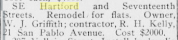

17th St west side of block 114 was a mess - Treadwells owned part of it, then there was the slice that belonged to Olivet church.

At some point this building was built nearly in the Olivet backyard as seen in the 1902 picture of the block. It was later moved over to the corner of 17th and Hartford, so that beautiful tower was facing out. Lost its hat though at some point. Back covered laundry porches expanded quite a bit, became three units on Hartford and also condo converted.

3945 17th St
3941 17th St

5 Hartford St
15 Hartford St
17 Hartford St

Was originally about 100 feet east of current location, and moved to the corner some time after 1902.

### 1927

> SE Hartford and Seventeenth Streets. Remodel for flats. Owner, W. J. Griffith; contractor, R. H. Kelly, 21 San Pablo Avenue. Cost $2OOO.
[Organized Labor, Volume 28, Number 17, 23 April 1927](https://cdnc.ucr.edu/?a=d&d=OLSF19270423.2.70&srpos=224&e=-------en--20-OLSF-221-byDA-txt-txIN-hartford-------)
