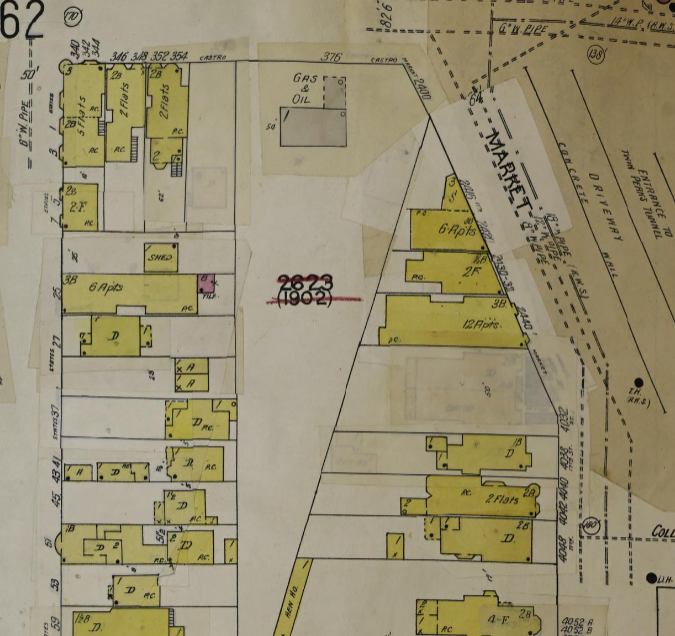

3955 17th St

This building was originally located across Market St where Castro Gas is today. It was moved some time around 1917 when the Twin Peaks tunnel began construction. You can see it on the right side in the [Open SF History photo](https://opensfhistory.org/Display/wnp27.0740.jpg) of the area below:

It appears this building was constructed during the post-earthquake building boom, between 1906-1912. So it makes sense that the owner, when faced with the eminent domain-ing of a fairly new building, would cast around for some way to save it being demolished. The empty corner on Hartford and 17th, about 400 feet away, would've fit the bill _and_ minimized moving costs.

### 1899

Nothing there yet but some previous structures. Of interest, the weird diagonal lot-line crossing the block is the original San Francisco city boundary, marking the edge of "the outside lands" and Rancho San Miguel, originally owned by Noé.

[Sanborn Map to 1899](https://www.loc.gov/resource/g4364sm.g4364sm_g00813189904/?sp=42&st=image&r=-0.135,0.524,1.101,0.995,0)

### 1905

The [1905 Sanborn Map in the David Rumsey collection](https://www.davidrumsey.com/luna/servlet/detail/RUMSEY~8~1~214094~5501447:Vol--4,-Page-411-412--San-Francisco?sort=Pub_List_No_InitialSort%2CPub_Date%2CPub_List_No%2CSeries_No) shows no building there. This book was damaged by the 1906 earthquake which is why the edges are so spotty.

### 1913

By 1913 you can see the the very fancy new apartment building on the corner. Remember that weird lot line? Yeah, that's why the construction is such an odd shape.

Also by this date, the City has started to try to unify the block books - previously they were composed of the different "surveys" by the original Californios, as well as any homestead group, and well... They were hard to navigate.
At this point the block goes from being block #1902, to being 2623, the number it still bears today.

[Sanborn Map to 1913](https://www.loc.gov/resource/g4364sm.g4364sm_g00813191304/?sp=65&st=image)

The notation on the building says it's a 4-story wood framed building on the corner, and a 3-story with basement wood framed building to the , containing 20 dwelling units. It has a composition (probably asphalt shingle) roof, and 1-story slate or metal coverings over the lightwells. It _looks_ like it also has a central elevator, open to the air - it would've been very modern and probably quite expensive. It also notes two S for stores, presumably on the ground floor, two PC patent safety chimneys, and the two FEs for Fire Escape.

Close up:

## 1905-1910ish

A photo from the [SFPL shows "Knupfer Groceries at 17th and Harford[sic] Streets"](https://digitalsf.org/record/55370). So at least some of the stores remained after the move. The photo isn't well dated, so more research is warranted!

### 1948

In the original location you can see the big chunk that was taken out of that corner lot with the widening of Market St and the construction of the tunnel. Also, you can see that the new weird-shaped corner lot has been a gas station for a very long time!

[Sanborn Map to 1948](https://www.loc.gov/resource/g4364sm.g4364sm_g00813195004/?sp=67&st=image&r=0.44,-0.067,0.629,0.569,0)

At the building's new and current location at the top of Hartford, you can see the outline of the same building, but somewhat diminished. There are no stores, no elevator, no mention of the chimneys, and the fire escapes have been removed from the map. (The fire escapes are very much still in place!)
Additionally, there are an extra 8 dwellings - presumably on the ground floor, but who's to say they didn't subdivide some of the upper units?

[Sanborn Map for Hartford North](https://www.loc.gov/resource/g4364sm.g4364sm_g00813195007/?sp=13&r=0.138,0.44,0.436,0.394,0)