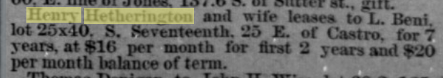
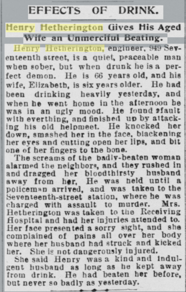
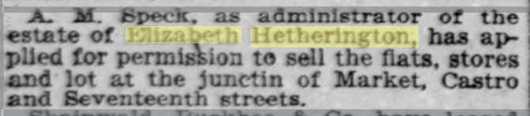
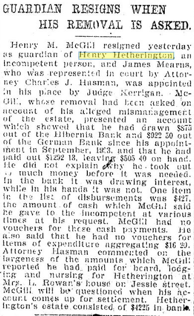
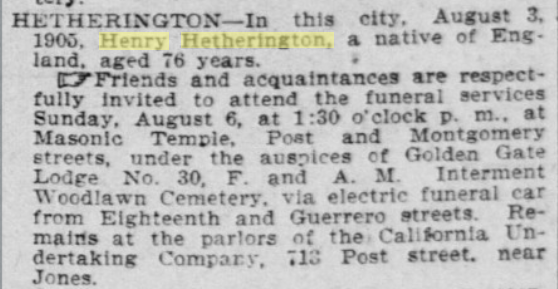

401 Castro/3999 17th
Some sort of building on that site going back to the 1860s.
1894 Block book shows the owners as Henry & Elizabeth Hetherington. That's our jumping off place for research.

1857, Henry Hetherington is in a marine disaster, the sinking of the California Mail Steamer _Central America_ (formerly the _George Law_) by hurricane 11th Sept 1856 off the coast of Havana. He and 54 others (of the original ~450 pax) were picked up at sea by the brig _Maine_, and returned to New York in October.

[Daily Alta California, Volume 42, Number 13788, 1 June 1887](https://cdnc.ucr.edu/?a=d&d=DAC18870601.2.67&srpos=2&e=-------en--20--1-byDA-txt-txIN-%22henry+Hetherington%22-------)
> Henry Hetherington and wife leases to L. Beni lot 25x40 S Seventeenth, 25 E of Castro, for 7 years, at $16 per month of first 2 years and $20 per month balance of term.

This means that it was set to be leased by Beni until 1894.

Langley 1890:
> Hetherington Henry, engineer, r. cor Seventeenth and Castro
> Hetherington John J., bartender Joyce & Orndorff, r. 219 Franklin
> Hetherington Joseph H., r. 219 Franklin
> Hetherington Robert, compositor H. S. Crocker & Co., r. 1019 Ellis

JH is bartending at the Peerless Saloon...
> Peerless Saloon, John M. Chenoweth proprietor, 90i-904 Market and 3-5 Ellis
On Jan 30th 1890 when [D. H. Arnold walks in and shoots a man](https://cdnc.ucr.edu/?a=d&d=SFC18900514.2.65&srpos=1&e=-------en--20-SFC-1-byDA-txt-txIN-Hetherington-------). He moves to San Jose.

Langley for 1893:
> Hetherlugton Henry, engineer, r. 949, 17th, rear
> Hetherington Joseph H., bartender, r. 741 Ellis
> Hetherington Robert, compositor, r. 20, 12th

Langley directory for 1894:
> Hetherington Henry, seaman, r. 949,17th, rear
> Hetherington Joseph H., bartender, r. 741 Ellis

[San Francisco Call, Volume 76, Number 4, 4 June 1894](https://cdnc.ucr.edu/?a=d&d=SFC18940604.2.117&srpos=4&e=-------en--20--1-byDA-txt-txIN-%22henry+Hetherington%22-------)
> EFFECTS OF DRINK.
> Henry Hetherington Gives His Aged Wife an Unmerciful Beating.
> Henry Hetherington, engineer, MB Seventeenth street, is a quiet, peaceable man when sober, but when drunk he is a perfect demon. He is 66 years old, and his wife, Elizabeth, is six years older. He had been drinking heavily yesterday, and when be went home In the afternoon be was in an ugly mood. He found tfault with everthing, and finished no by attacking his old helpmeet. He knocked her down, smashed her in the face, blackening her eyes and cutting open her lips, and bit one of her fingers to the bans. The screams of the badly-beaten woman alarmed the neighbor*, and they rushed in and dragged her bloodthirsty husband away from h#r, He was neld until a policern»n arrived, and was taken to the Seventeenth-street station, where he was fharged with assault to murder. Mrs. Hetherington was taken to tne Receiving Hospital and had her injuries attended to. Her face presented a sorry sight, and she complained of pains all over her body where her husband had struck and kicked her. She is not dangerously injured. She said Henry was a kind anil Indulgent husband as long as ho kept away from drmk. He had beaten her before, but never so badly as yesterday.

For 1895: No sign of Henry
> Hetherington John, r. 2484 Market
> Hetheringtou Joseph H., liquor dealer, r. 338 Eddy
> Hetherington Mary J. Miss, r. 2484 Market

1896: Henry is back but not in the Castro
> Hetherington Henry, marine engineer, r, 704 1/2 Mission
> " Joseph C, r. 308 Leavenworth
> " Robert, compositor H. S. Crocker Co., r. 905 Market

[San Francisco Call, Volume 83, Number 8, 8 December 1897](https://cdnc.ucr.edu/?a=d&d=SFC18971208.1.11&srpos=26&e=-------en--20-SFC-21-byDA-txt-txIN-%22j+hough%22+-------)
Grocer J Hough, 3997 Seventeenth St, arrested for selling impure oil.

[San Francisco Call, Volume 84, Number 29, 29 June 1898](https://cdnc.ucr.edu/?a=d&d=SFC18980629.2.91&srpos=1&e=-------en--20--1-byDA-txt-txIN-%223999+seventeenth%22-------) Grocer J Howe[sic] is arrested and charged with selling cottonseed oil as olive oil.
1898 Crocker Langley gives us: "Hough John, groceries and liquors, 3999, 17th"

[San Francisco Call, Volume 87, Number 47, 16 January 1900](https://cdnc.ucr.edu/?a=d&d=SFC19000116.2.71&srpos=10&e=-------en--20--1-byDA-txt-txIN-%22charles+joyce%22----1900---)
> DUEL TO THE DEATH FOR ROUND OF DRINKS
> Tom Dillon and Charles Joyce Blaze Away With Revolvers,
> Saloon-Keeper Expires on the Operating Table, While His Slayer's Life Hangs on a Slender Thread,
> A ROW last evening over drinks in Charles Joyce's saloon and grocery on Castro and Seventeenth streets cost Joyce his life and Thomas Dillon, a retired police officer, his liberty. Joyce died of his wounds on the operating table in the City and County Hospital and Dillon, probably fatally wounded, is under arrest in the Receiving Hospital.
> The row started late yesterday afternoon. Dillon had been drinking heavily and had entered Joyce's saloon about half past 3 o'clock. Joseph Reedy, Charles Taylor, James Downey, Herman Ryforge and P. Haynes were In the saloon at different times, and they all say Dillon was drunk and very quarrelsome. He finally got into an argument with Joyce over the payment, for a round of drinks. Joyce told him to drop the matter, to get out and not to return. One word followed another, Joyce finally going to the place where Dillon had left his hat and handing it to him told him to go. Dillon retorted angrily and drew a revolver. Joyce jumped behind the counter and brought his own weapon to boar, both commencing to shoot.
> In all seven shots were fired. Joyce went down soon after the first shot. As he did so he called to Dillon, "For God's sake, Tom, don't shoot."
> Reedy says Dillon then went up to the prostrate man and fired at him again. As Reedy ran up the street in search of a policeman he heard another shot.
> When the police arrived Joyce was found unconscious, lying behind his counter. Patrolman R. F. Graham took him to the ambulance at once and hurried him over to the City and County Hospital, where he died just as he was placed on the operating table. Joyce was shot twice through the abdomen and once through the arm.
> In the meantime Sergeant Shaw and Patrolman J. A. Fitzgerald hunted up Dillon, whom they found in a neighboring saloon. Shaw placed him under arrest and took him in a buggy to the County Hospital. Dillon was shot once in the face, the bullet passing through his nose and lodging in his mouth, whence he spat it out recovering it and putting it in his pocket. Another bullet had struck his head, inflicting a scalp wound. His revolver had five chambers discharged, and Joyce's had three, one of which was an old shot. s'.ii
> While the quarrel over drinks was the direct cause of the shooting, there has been bad blood between the two men since September last, when, on complaint of Joyce. Dillon was haled before the Commissioners on a charge of drunkenness. The charges were made by Captain Gillin upon the report of Sergeant Perrin, but it was upon information furnished by Joyce that they were made, and Dillon knew this. He lives at 4084 Seventeenth street, close to Joyce's place, and was a frequent visitor there. The two men have often had high words over their differences, but the quarrel never assumed anything like a serious aspect unless Dillon was drUnk, and even then no one ever suspected it would end in murder.
> Dillon was retired by the old Police Commission just before it went out of office at the beginning of this year and was placed on the pension list. He had been on the force for twenty-one years, and was known as a good officer, with only one falling— drink. He was four times before the Commissioners within a year and a half after his appointment, but since then he settled down and gave no further trouble until last September.
> Joyce lived with his wife and daughter over the grocery. Dillon lived Just up the street. He is a widower with a son and a daughter, both grown. As soon as Dillon's wound was dressed at the County Hospital he was taken to the Receiving Hospital, where he could be keptN under guard. His life hangs on a slender thread.

[San Francisco Call, Volume 87, Number 65, 3 February 1900](https://cdnc.ucr.edu/?a=d&d=SFC19000203.2.46&srpos=7&e=-------en--20-SFC-1-byDA-txt-txIN-%22charles+joyce%22----1900---)
> SURPRISE IN THE JOYCE CASE.
> Joseph Reedy Testifies That the Murdered Man Fired First.
> The preliminary examination of ex-Policeman Thomas H Dillon, charged with the murder of Charles Joyce, grocer, Seventeenth and Castro streets, on January 15, was commenced before Judge Conlan yesterday. He was represented by Attorney Reddy; Prosecuting Attorney Weller conducted the prosecution.
> The evidence of Joseph Reedy, the principal witness for the prosecution. was a complete surprise. He testified that Joyce fired two shots at Dillon before Dillon commenced firing, which would the supposition that Dillon acted in self-defense. His testimony was in effect that after Joyce and Dillon had some words Joyce remarked that he was going to the toilet room, and when he returned he pulled a revolver out of his pocket, and taking hold of Dillon told him to get out, as he did not want either his trade or his presence. Dillon remarked "That's assault  with a deadly weapon, and I'll have you fixed for it." Joyce said "You drew a gun on me once before, but if you draw a gun on me this time I'll fill you full of holes." Joyce pointed at Dillon's face, and then put it on the drainer behind the bar.
> They shook hands after that, but soon had some more words. Dillon attempted to draw, but Joyce stepped toward where he had put his revolver and fired twice at Dillon, and then Dillon fired a shot or two at Joyce, who ducked behind the bar. Joyce. then retreated the toward the bar and fell, saying "Don't shoot, Tom; I've got it." At the same time Dillon fired another shot and Reedy ran out of the saloon.
> Charles Taylor, 38 Diamond street, corroborated Reedy up to the time of the shooting: He did not know who fired the first shot, as he ran out of the side entrance on to Castro street before the first shot was fired. The examination will be continued this morning.

[Oct 6th 1901](https://cdnc.ucr.edu/?a=d&d=SFC19011006.2.136.6&srpos=1&e=-------en--20--1-byDA-txt-txIN-%223999+17th%22-------) - 3999 17th is advertised as a complete grocery store and bar for rent.

[San Francisco Call, Volume 87, Number 48, 17 January 1900](https://cdnc.ucr.edu/?a=d&d=SFC19000117.2.58&srpos=2&e=-------en--20--1-byDA-txt-txIN-%223999+seventeenth%22-------)
> Thomas H. Dillon, the ex-policeman who shot and killed Charles Joyce, grocer, 3999 Seventeenth street, Monday evening, was removed from the Receiving Hospital to the Waldeck Sanatorium yesterday with the consent of acting Chief Biggy. He is in a critical condition, and it is doubtful if he will live to' answer for his crime.

[San Francisco Call, Volume 87, Number 2, 2 June 1901](https://cdnc.ucr.edu/?a=d&d=SFC19010602.2.171&srpos=3&e=-------en--20--1-byDA-txt-txIN-%22elizabeth+Hetherington%22-------)
> A. M. Speck. as administrator of the estate of Elizabeth Hetherington; has applied for permission to sell the flats, stores and' lot at the Junctin of Market. Castro and Seventeenth streets.

[San Francisco Chronicle April 23, 1904](https://infoweb-newsbank-com.ezproxy.sfpl.org/apps/news/openurl?ctx_ver=z39.88-2004&rft_id=info%3Asid/infoweb.newsbank.com&svc_dat=WORLDNEWS&req_dat=C4A791F4197B4BD28C27A2A6A0C93929&rft_val_format=info%3Aofi/fmt%3Akev%3Amtx%3Actx&rft_dat=document_id%3Aimage%252Fv2%253A142051F45F422A02%2540EANX-NB-15343B71A680D330%25402416594-1531AF8242B66282%25408-1531AF8242B66282%2540/hlterms%3A%2522henry%2520Hetherington%2522)

Henry Hetherington dies Aug 3rd 1905.
[San Francisco Call, Volume 98, Number 67, 6 August 1905](https://cdnc.ucr.edu/?a=d&d=SFC19050806.2.101.6&srpos=5&e=-------en--20--1-byDA-txt-txIN-%22henry+Hetherington%22-------)
> HETHERINGTON— In this city, August 3, 1900. Henry Hetherington. a native of England, aged 76 years. * CTFrlends and acquaintances are respectfully invited to attend the funeral services Sunday, August 6, at 1:30 o'clock p. m.. at Masonic Temple, Post and Montgomery streets, under the auspices of Golden Gate Lodpe No. 30, F. and A. M. Interment Woodlawn Cemetery, via electric funeral car from Eighieenth and Guerrero streets. Remains at the parlors of the. California undertaking Compary, 713 Post street near Jones.

1908 - 3999 17th is a grocery store
Crocker Langley for 1908:
> Flieger Enos I, groceries, 403 Castro and liquors, 3997, 17th
> Flieger William P H, elk E I Flieger, r 3997, 17th

[SF Chronicle May 13 1917](https://infoweb-newsbank-com.ezproxy.sfpl.org/apps/news/openurl?ctx_ver=z39.88-2004&rft_id=info%3Asid/infoweb.newsbank.com&svc_dat=WORLDNEWS&req_dat=C4A791F4197B4BD28C27A2A6A0C93929&rft_val_format=info%3Aofi/fmt%3Akev%3Amtx%3Actx&rft_dat=document_id%3Aimage%252Fv2%253A142051F45F422A02%2540EANX-NB-14EB6DC163BDB4DE%25402421362-14EB658E92E3DD4F%254036-14EB658E92E3DD4F%2540/hlterms%3A%25223997%252017th%2522) - List of saloons shows:
> SLIEGER, E. I., The Castro Bar. 3997 17th st. Market 2302  
(Is that a typo?) (Yeah, definitely a typo.)

Crocker Langley for 1917:
> Flieger Arthur E H student r 3997, 17th
> Flieger Enos I (Minnie S) liquors 39S7 17th
> Flieger Wm P bartndr 3999, 17th
... and also...
> Richter Reinhold F (Emilia F) cigars, 3999, 17th h 2 Spaulding Ct

[SF Chron Dec 31 1918](https://infoweb-newsbank-com.ezproxy.sfpl.org/apps/news/openurl?ctx_ver=z39.88-2004&rft_id=info%3Asid/infoweb.newsbank.com&svc_dat=WORLDNEWS&req_dat=C4A791F4197B4BD28C27A2A6A0C93929&rft_val_format=info%3Aofi/fmt%3Akev%3Amtx%3Actx&rft_dat=document_id%3Aimage%252Fv2%253A142051F45F422A02%2540EANX-NB-14ED648BB033B2A5%25402421959-14EAB4A6E71D6044%25403-14EAB4A6E71D6044%2540/hlterms%3A%25223997%2520seventeenth%2522), Marriage licenses:
> Arthur E Flieger, 21, 3997 Seventeenth st, and Alice E. McGlynn, 20, 4167 Twenty-fourth st.

[SF Chron Feb 12 1922](https://infoweb-newsbank-com.ezproxy.sfpl.org/apps/news/openurl?ctx_ver=z39.88-2004&rft_id=info%3Asid/infoweb.newsbank.com&svc_dat=WORLDNEWS&req_dat=C4A791F4197B4BD28C27A2A6A0C93929&rft_val_format=info%3Aofi/fmt%3Akev%3Amtx%3Actx&rft_dat=document_id%3Aimage%252Fv2%253A142051F45F422A02%2540EANX-NB-14EF67D912159D60%25402423098-14EC5D184BACC802%254089-14EC5D184BACC802%2540/hlterms%3A%25223997%2520seventeenth%2522) - Anna D. Flieger wins an honorable mention in a Chronicle writing contest.

[1921](https://infoweb-newsbank-com.ezproxy.sfpl.org/apps/news/openurl?ctx_ver=z39.88-2004&rft_id=info%3Asid/infoweb.newsbank.com&svc_dat=WORLDNEWS&req_dat=C4A791F4197B4BD28C27A2A6A0C93929&rft_val_format=info%3Aofi/fmt%3Akev%3Amtx%3Actx&rft_dat=document_id%3Aimage%252Fv2%253A142051F45F422A02%2540EANX-NB-14EF0A62C31DCED9%25402422946-14EC5CFDDDCCC10C%25401-14EC5CFDDDCCC10C%2540/hlterms%3A%25223999%2520seventeenth%2522):

> In San Francisco yesterday afternoon Tom Brown, assistant to Mitchell, headed a raiding party that brought five dealers in illicit liquor to justice. An alleged $65 bribe did not interest the prohibition men when tendered by J. L Leonard, 3999 Seventeenth street, whose saloon was the object of one of the raids. Leonard was arrested on evidence collected in spite of difficulties, and is charged® with illegal possession of liquor.
> Leonard had arranged, it is said, a clever scheme for disposing of evidence in case of the coming of prohibition raiders. Bottles from which the sales aro alleged to have been made were placed on a trap door behind the bar. From the trap, a chute led to a pile of bricks in the cellar. Along the length of the bar a wire had been stretched connecting with the trap.
> When the government agents entered, Leonard pulled the wire with his foot, precipitating the booze on to the pile of bricks in the basement, breaking the bottles, and allowing the booze to escape With handkerchiefs, on the floor. The dry men mopped up about six ounces of jackass brandy which is held as evidence.
> 

[San Francisco Call, Volume 111, Number 109, 12 May 1922](https://cdnc.ucr.edu/?a=d&d=SFC19220512.2.38&srpos=4&e=-------en--20--1-byDA-txt-txIN-%223999+seventeenth%22-------)

---

In the 1930s (during prohibition) it was a Chatterton Bakery, and I guess a candy store?

_San Francisco Chronicle January 15, 1933_
> CANDY store and lunch. 401 Castro. Inquire 1089 Market st.

1942, in trouble for selling liquor to a minor:
> Gus Fagerline and Osborne Bye, 401 Castro, sale to a minor.

[SF Chronicle - Feb 20 1946](https://infoweb-newsbank-com.ezproxy.sfpl.org/apps/news/openurl?ctx_ver=z39.88-2004&rft_id=info%3Asid/infoweb.newsbank.com&svc_dat=WORLDNEWS&req_dat=C4A791F4197B4BD28C27A2A6A0C93929&rft_val_format=info%3Aofi/fmt%3Akev%3Amtx%3Actx&rft_dat=document_id%3Aimage%252Fv2%253A142051F45F422A02%2540EANX-NB-14EB6DC163BDB4DE%25402421362-14EB658E92E3DD4F%254036-14EB658E92E3DD4F%2540/hlterms%3A%25223997%252017th%2522), Marriage license:
> Legan-Tisdale - Robert Legan, 25, and Lucille Tisdale, 21, both of 3997 17th st.
