Profile of the Association, written in 1867:

28 Oct 1867 - Local Intelligence: Homestead Associations in San Francisco, Number Five
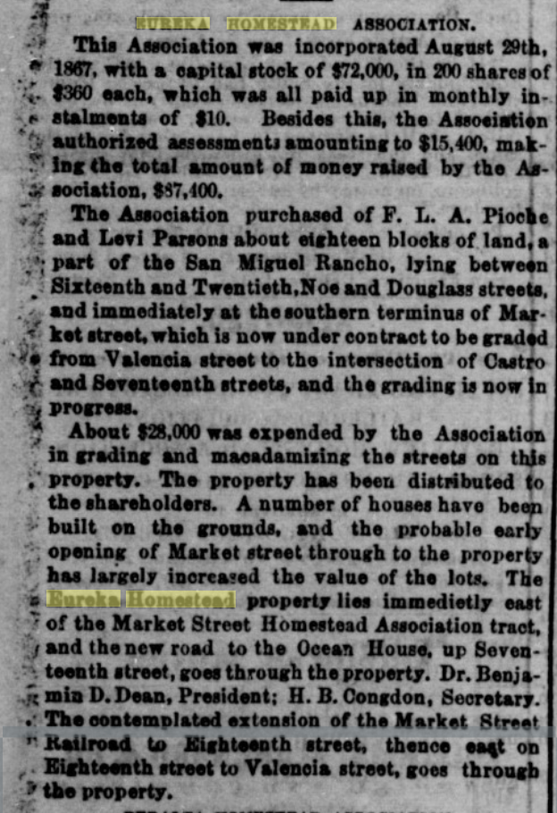
> EUREKA HOMESTEAD ASSOCIATION.
> This Association was incorporated August 29th, 1867, with a capital stock of $72,000 in 200 shares of $360 each, which was all paid up in monthly in installments of $10. Besides this, the Association authorized assessments amounting to $15,400, making the total amount of money raised by the Association $87,100.
> The Association purchased of F. L. A. Pioche and Levi Parsons about eighteen blocks of land, a part of the San Miguel Rancho, lying between Sixteenth and Twentieth, Noe and Douglass streets, and immediately at the southern terminus of Market street, which is now under contract to be graded from Valencia street to the intersection of Castro and Seventeenth streets, and the grading is now in progress.
> About $28,000 was expended by the Association in grading and macadamizing the streets on this property. The property has been distributed to the shareholders. A number of houses have been built on the grounds, and the probable early opening of Market street through to the property has largely increased the value of the lots. The Eureka Homestead property lies immediately east of the Market Street Homestead Association tract, and the new road to the Ocean House, up Seventeenth street, goes through the property. Dr. Benjamin D. Dean, President; H. B. Congdon, Secretary. The contemplated extension of the Market Street Railroad to Eighteenth street, thence east on Eighteenth street to Valencia street, goes through the property.
[Daily Alta California, Volume 19, Number 6435, 28 October 1867](https://cdnc.ucr.edu/?a=d&d=DAC18671028.2.2&srpos=77&e=-------en--20--61-byDA-txt-txIN-%22eureka+homestead%22-------)

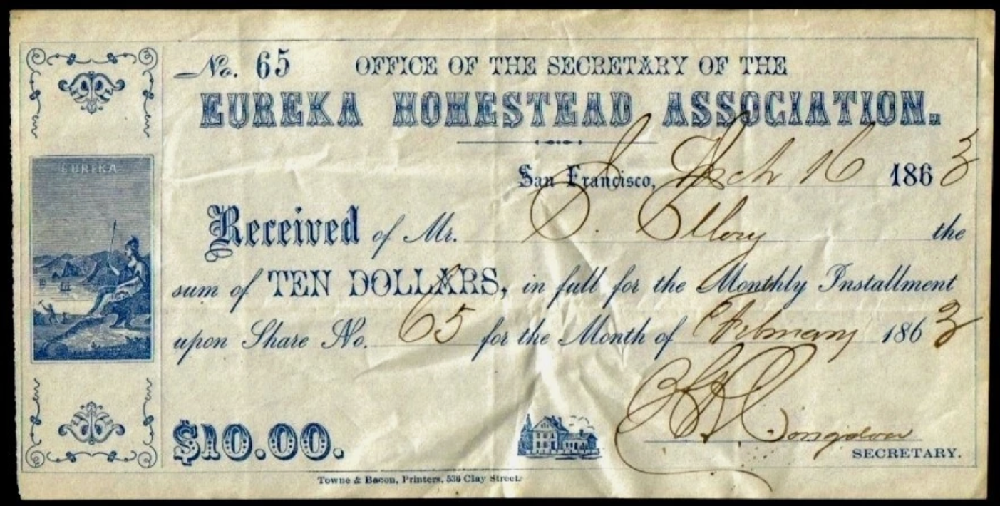

Via eBay:

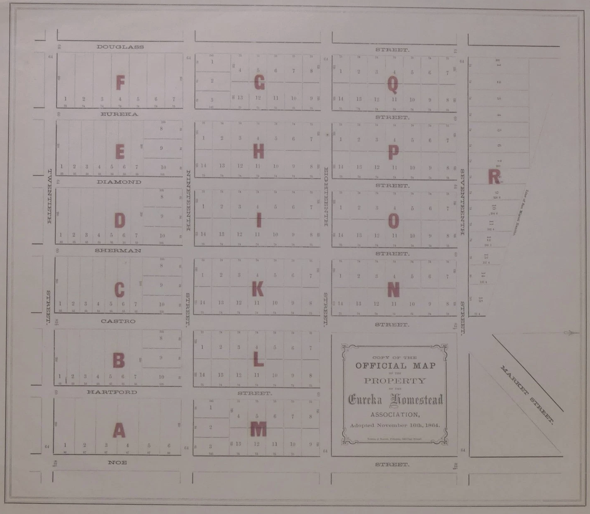

A very unusual original (not a copy, despite the title) promotional real estate map for San Francisco's Castro district. While this map has been described as a lithograph (see PBA Galleries, April 21, 2022, $1,375), it is actually letterpress printed entirely from type elements (the bite of the type can be distinctly felt on the verso of the paper). It shows the lots in the neighborhood bounded by Douglas, 17th, Noe, and 20th Streets. This map reproduces the original hand-drawn map filed with the County of San Francisco Assessor to establish property boundaries. The present map was undoubtedly printed to promote sales of the lots.

The Eureka Homestead Association was one of many speculative real estate ventures sweeping San Francisco in the early 1860s. In 1863, the Alta California newspaper reported on homestead association, including the Eureka Homestead Association:

"These societies are nominally formed for the purpose of supplying the members with homesteads but a homestead implies a dwelling which none intend or attempt to furnish. The real purpose is to purchase land in a large tract and subdivide it among the members and thus enable them to get lots suitable for homesteads at a less price than they would have to pay if they should buy separately. Most of the members have no intention of making their homes on the lots and the object of the organization of the companies therefore is mainly a land speculation. In most of the companies there is a monthly assessment of ten dollars and by these payments continued regularly for several years poor men are enabled to invest their savings in real estate which bill almost certainly prove profitable in time." (Quoted in the Sacramento Bee, 5 January 1863).

---

1862

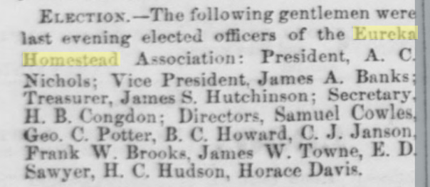
> Election. — The following gentlemen were last evening elected officers of the Eureka Homestead Association: President, A. C. Nichols; Vice President. James A. Banks; Treasurer, James S. Hutchinson; Secretary, H. B. Congdon; Directors, Samuel Cowles, Geo. C. Potter, B. C. Howard, C. J. Jannon, Frank W. Brooks, James W. Towne, E. D. Sawyer, H. C. Hudson, Horace Davis.
[Daily Alta California, Volume XIV, Number 4569, 26 August 1862](https://cdnc.ucr.edu/?a=d&d=DAC18620826.2.2&srpos=1&e=-------en--20--1-byDA-txt-txIN-%22eureka+homestead%22-------)

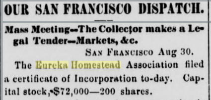
> SAN FRANCISCO Aug 30. The Eureka Homestead Association filed a certificate of Incorporation to-day. Capital stock, $72,000 - 200 shares.
[Marysville Daily Appeal, Volume VI, Number 50, 31 August 1862](https://cdnc.ucr.edu/?a=d&d=MDA18620831.2.14&srpos=2&e=-------en--20--1-byDA-txt-txIN-%22eureka+homestead%22-------)

This gem from the Sacramento Daily Union, Jan 1 1863

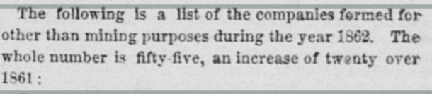
> The following is a list of the companies formed for other than mining purposes during the year 1863, The whole number is fifty five, an increase of twenty over 1861:
(and it goes on to list the EHA)
[Sacramento Daily Union, Volume 24, Number 3676, 1 January 1863](https://cdnc.ucr.edu/?a=d&d=SDU18630101.2.3.4&srpos=4&e=-------en--20--1-byDA-txt-txIN-%22eureka+homestead%22-------)

(First) Sale of lots

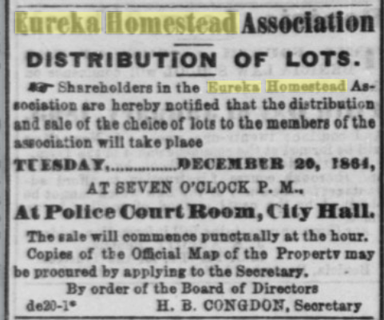
> Eureka Homestead Association DISTRIBUTION OF LOTS.
> Shareholders in the Eureka Homestead Association are hereby notified that the distribution and sale of the choice of lots to the members of the association will take place
> TUESDAY, DECEMBER 20, 1864, AT SEVEN O'CLOCK P. M, At Police Court Room, City Hall.
> The sale will commence punctually at the hour. Copies of the Official Map of the Property may be procured by applying to the Secretary. By order of the Board of Directors H. B. CONGDON. Secretary

[Daily Alta California, Volume 16, Number 5404, 20 December 1864](https://cdnc.ucr.edu/?a=d&d=DAC18641220.2.12.3&srpos=5&e=-------en--20--1-byDA-txt-txIN-%22eureka+homestead%22-------)

Clearly they didn't all sell, because...

> EDWARDS, OLNEY & CO. REAL ESTATE STOCK AND GENERAL AUCTION AND COMMISSION HOUSE. NO 626 MONTGOMERY ST, Montgomery Block. JAMES N. OLNEY, Auctioneer
> TO-MORROW. TUESDAY January 31., 1865, At 12 o'clock N, at Salesrooms, REAL ESTATE AT AUCTION. Consisting, among other Property, of lots in HOMESTEAD ASSOCIATIONS, VIZ., IN THE Pacific Homestead Association, IN THE San Francisco Homestead Association, IN THE Eureka Homestead Association, IN THE ...
[Daily Alta California, Volume 17, Number 5443, 30 January 1865](https://cdnc.ucr.edu/?a=d&d=DAC18650130.2.17.6&srpos=6&e=-------en--20--1-byDA-txt-txIN-%22eureka+homestead%22-------)

Hooo boy, 1865 - the first real estate bidding war for this area, but not the last.

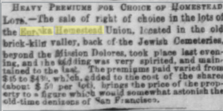
> HEAVY PREMIUMS FOR CHOICE OF HOMESTEAD LOTS.—The sale of right of choice in the lots of the Eureka Homestead Union, located in the old brick-kiln valley, back of the Jewish Cemeteries, beyond the Mission Delores, took place last evening, and the bidding was very spirited, and maintained to the last. The premiums paid varied from $15 to $48_, which, added to the cost of the shares (about $50 per lot), brings the price of the property to a figure which would somewhat astonish old-time denizens of San Francisco.
[Daily Alta California, Volume 17, Number 5458, 14 February 1865](https://cdnc.ucr.edu/?a=d&d=DAC18650214.2.2&srpos=7&e=-------en--20--1-byDA-txt-txIN-%22eureka+homestead%22-------)

Misc -
> Protest of the Eureka Homestead Association against the closing of Market street.
[Daily Alta California, Volume 17, Number 5507, 4 April 1865](https://cdnc.ucr.edu/?a=d&d=DAC18650404.2.6&srpos=8&e=-------en--20--1-byDA-txt-txIN-%22eureka+homestead%22-------)

1865 - now we're "elegant" and the land nearby is desirable for comparison
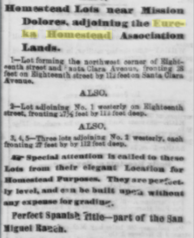
[Daily Alta California, Volume 17, Number 5536, 3 May 1865](https://cdnc.ucr.edu/?a=d&d=DAC18650503.2.15.9&srpos=9&e=-------en--20--1-byDA-txt-txIN-%22eureka+homestead%22-------)
(ad repeats until sale day, May 8th)

20 June 1865:
> Board of Supervisors
> The Board met last evening, pursuant to adjournment, the Mayor presiding, and ten members present. Petition from Eureka Homestead Association to order Castro street graded.
[Daily Alta California, Volume 17, Number 5584, 20 June 1865](https://cdnc.ucr.edu/?a=d&d=DAC18650620.2.5&srpos=14&e=-------en--20--1-byDA-txt-txIN-%22eureka+homestead%22-------)

26 June 1865
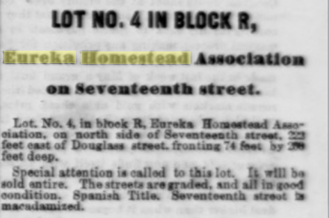
> LOT NO. 4 IN BLOCK R, Eureka Homestead Auoclatloa on seventeenth street. Lot. No. 4. la brock R. Enreka Bam«*t*ad Aasaou tun. oa aorta std*ot" 3ntath mm, ±3 feet tut of Dou«las* st re«c frontiac 74 fs*t ky -Jt feat Jeep. Special attentioa is sailed to this lot. It wtD fe> sold antire. Th* streets are rradad. tad all ia t on 4 ooaditiOD. Spaaiski Titla. a*Ts«ifeiith str** ta BucadamiMd.
[Daily Alta California, Volume 18, Number 5951, 26 June 1866](https://cdnc.ucr.edu/?a=d&d=DAC18660626.2.19.9&srpos=16&e=-------en--20--1-byDA-txt-txIN-%22eureka+homestead%22-------)

8 Aug 1866
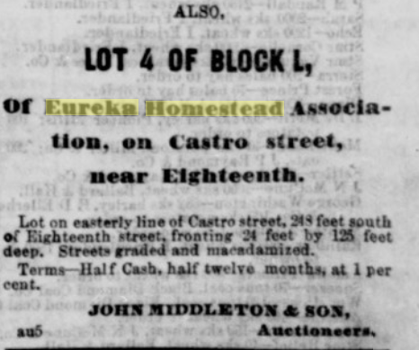
> LOT 4 OF BLOCK L, or Eureka Homestead Association, on Castro street, near Eighteenth. Lot on ea.«terly line of Castro street, »■< fe«t south o. Eighteenth xtreet, frontinr .'4 feet by 12S feet deep. Street" graded and mi -mlaraized. Terms Half Cash, hall' Main months, at 1 per <*cut. J(ill\ "IDDLETON* BOS, an6 Auctioneers.
[Daily Alta California, Volume 18, Number 5993, 8 August 1866](https://cdnc.ucr.edu/?a=d&d=DAC18660808.2.23.9&srpos=17&e=-------en--20--1-byDA-txt-txIN-%22eureka+homestead%22-------)
(ad repeats until sale date Aug 13)

10 Jan 1867 - Real Estate Transactions recorded Jan 8th 1867
Wm Jones to Catharine, his wife and to his children....
Also, lots 3, 4, 5, and 6, in block H EHA,
Also lot 4, block I, EHA.
Also lot 4 in block P, EHA.
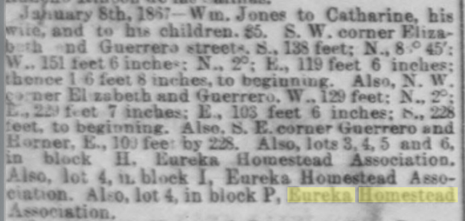
[Daily Alta California, Volume 19, Number 7047, 10 January 1867](https://cdnc.ucr.edu/?a=d&d=DAC18670110.2.22&srpos=19&e=-------en--20--1-byDA-txt-txIN-%22eureka+homestead%22-------)

8 Feb 1867
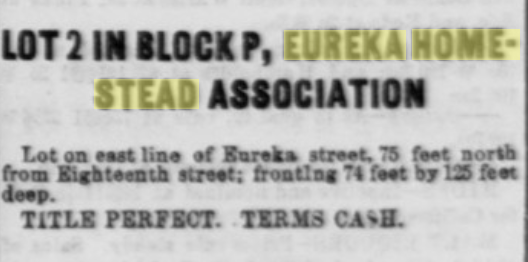
> LOT 2 IN BLOCK P, EUREKA HOMESTEAD ASSOCIATION Lot on eaat line ef Enreka street. 75 feet north from Kigkteentk itreet: (roatlag "4 feet by 13 feet deep. TIILK PERFECT. TERMS CA>E.
[Daily Alta California, Volume 19, Number 7075, 8 February 1867](https://cdnc.ucr.edu/?a=d&d=DAC18670208.2.20.8&srpos=20&e=-------en--20--1-byDA-txt-txIN-%22eureka+homestead%22-------)
(ad repeats until sale date Feb 18)

11 April 1867
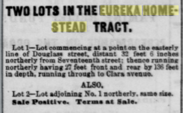
> TWO LOTS IN THE EUREKA HOMESTEAD TRACT. Lot I—Lot1 — Lot commencing at a point on the easterly line of Donclasa street, distant 33 feet 6 inch*, northerly from Seventeenth street: thence ranainc northerly havinc 27 feet front and rear by 136 feet in depth, running through to Clara vrsnuo.
[Daily Alta California, Volume 19, Number 6236, 11 April 1867](https://cdnc.ucr.edu/?a=d&d=DAC18670411.2.21.7&srpos=58&e=-------en--20--41-byDA-txt-txIN-%22eureka+homestead%22-------)
(ad repeats until sale date April 17)
And I guess it didn't sell, because it's back on the market 13th June for an auction on the 19th.

15 Sept 1867 - Property for sale:
> LOT 14, block 11, in Eureka Homestead Association, being northwest corner of Nineteenth and Diamond streets; one of the best locations in the tract.
[Daily Alta California, Volume 19, Number 6392, 15 September 1867](https://cdnc.ucr.edu/?a=d&d=DAC18670915.2.24.4&srpos=71&e=-------en--20--61-byDA-txt-txIN-%22eureka+homestead%22-------)

24 May 1868 - for a probate auction June 17th
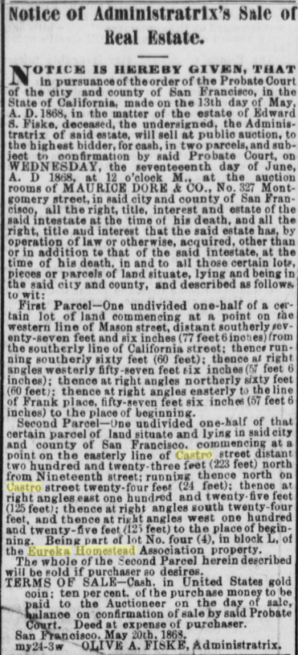
> Notice or Administratrix's Stile of Heal Estate. NO TICK IS lIKUKUY QIVHN, THAT in pursuance of the order of the Probate Court of the oity and county of San Francisco, in the State of California, made on the 13th day of May, A. D. 1868, in the matter of the estate of Edward IS. Fiske, deceased, the undersigned, the Administratrix of said estate, will sell at publio auction, to the highest bidder, for cash, in two parcels, and subject to confirmation by said Probate Court, on WEDNESDAY, the seventeeenth day of June, A. D 1868, at 12 o'clock M., at the auction rooms of MAURICE DORK & CO., No. 327 Montgomery street, in said city and county of San Francisoo, all the right, title, interest and estate of the said intestate at the time of his death, and all the right, title aud interest that the said estate has. by operation of law or otherwise, acquired, other than or in addition to that of the said intestate, at the time of his death, in and to all those certain lot.*. i pieces or parcels of land situate, lying and being in the said city and county, and described as follow*, to wit: First Parcel— One undivided one-half of a c«itain lot of land commencing at a point on the western line of Mason street, distant southerly #ev-enty-seven feet and six inches (77 feot6inoaes)froui the southerly line of California street: thence running southerly sixty feet (60 feet); thence at right angles westerly fifty-seven feet fix inches (57 feet 6 inches); thence at right angles northerly sixty feet (60 feetK thence at right angles easterly to the line of Frank place, tifty-seven feet six inches (57 feet 6 inches) to the place of beginning. Second Parcel— One undivided one-half of that certain paroel of laud situate and lying in said city and county of San Francisco, commencing at a point on the easterly line of Castro street distant two hundred and twenty-three f»et (223 feet) north from Nineteenth street; running thence north on Castro street twenty-four feet (24 feet); th*noe at right angles east one hundred and twenty-five leot (125 feet): thence at right angles south twenty-four feet, and thence at rinkt angles west one hundred and twenty-five feet (12) feet) to the place of beginning. Being part of lot No. four (4), in block L, of the Eureka Homestead Association property. The whole of the -eoond Parcel herein described will be Fold if purchaser bo desires. TERMS OF SALE-Cash. in United States gold ooin; ten per cent, of the purchase money to he „ paid to the Auctioneer on the day of sale, iiiil:nif<" on confirmation of sale by said Probate Court. Deed at expense of purchaser. San Francisco. May 20th, 186 S. my24-3w OI4IVK A. FIbKE, Administratrix.
[Daily Alta California, Volume 20, Number 6644, 24 May 1868](https://cdnc.ucr.edu/?a=d&d=DAC18680524.2.27.5&srpos=5&e=-------en--20--1-byDA-txt-txIN-%22eureka+homestead%22+castro-------)

1869
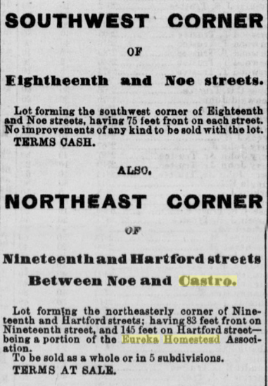
> SOUTHWEST CORNER OF Elghtneenth and Noe streets. Lot forming the southwest oorner of Eighteenth and Noe streets, having 75 feet front on each street. No improvements of any kind to be sold with the lot. TERMS CASH. . ALSO. NORTHEAST CORNER i \ oF I Nineteenth and Hartford streets Between Noe and Castro. Lot forming the northeasterly oorner of Nineteenth and Hartford streets; having 83 feet front on Nineteenth street, and 145 feet on Hartford streetbeing a portion of the Eureka Homestead Association. To be sold as a whole or in 5 subdivisions. TERMS AT SALE
[Daily Alta California, Volume 21, Number 6915, 23 February 1869](https://cdnc.ucr.edu/?a=d&d=DAC18690223.2.28.7&srpos=31&e=-------en--20--21-byDA-txt-txIN-%22eureka+homestead%22+castro-------)

1871, Market st cut
1877 - fees for continuing to cut Market st [Daily Alta California, Volume 29, Number 9826, 3 March 1877](https://cdnc.ucr.edu/?a=d&d=DAC18770303.2.25&srpos=3&e=-------en--20--1-byDA-txt-txIN-%22market+and+seventeenth%22-------)
