Profile of the Association, written in 1867:

28 Oct 1867 - Local Intelligence: Homestead Associations in San Francisco, Number Five

> EUREKA HOMESTEAD ASSOCIATION.
> This Association was incorporated August 29th, 1867, with a capital stock of $72,000 in 200 shares of $360 each, which was all paid up in monthly in installments of $10. Besides this, the Association authorized assessments amounting to $15,400, making the total amount of money raised by the Association $87,100.
> The Association purchased of F. L. A. Pioche and Levi Parsons about eighteen blocks of land, a part of the San Miguel Rancho, lying between Sixteenth and Twentieth, Noe and Douglass streets, and immediately at the southern terminus of Market street, which is now under contract to be graded from Valencia street to the intersection of Castro and Seventeenth streets, and the grading is now in progress.
> About $28,000 was expended by the Association in grading and macadamizing the streets on this property. The property has been distributed to the shareholders. A number of houses have been built on the grounds, and the probable early opening of Market street through to the property has largely increased the value of the lots. The Eureka Homestead property lies immediately east of the Market Street Homestead Association tract, and the new road to the Ocean House, up Seventeenth street, goes through the property. Dr. Benjamin D. Dean, President; H. B. Congdon, Secretary. The contemplated extension of the Market Street Railroad to Eighteenth street, thence east on Eighteenth street to Valencia street, goes through the property.
[Daily Alta California, Volume 19, Number 6435, 28 October 1867](https://cdnc.ucr.edu/?a=d&d=DAC18671028.2.2&srpos=77&e=-------en--20--61-byDA-txt-txIN-%22eureka+homestead%22-------)

Via eBay:

A very unusual original (not a copy, despite the title) promotional real estate map for San Francisco's Castro district. While this map has been described as a lithograph (see PBA Galleries, April 21, 2022, $1,375), it is actually letterpress printed entirely from type elements (the bite of the type can be distinctly felt on the verso of the paper). It shows the lots in the neighborhood bounded by Douglas, 17th, Noe, and 20th Streets. This map reproduces the original hand-drawn map filed with the County of San Francisco Assessor to establish property boundaries. The present map was undoubtedly printed to promote sales of the lots.

The Eureka Homestead Association was one of many speculative real estate ventures sweeping San Francisco in the early 1860s. In 1863, the Alta California newspaper reported on homestead association, including the Eureka Homestead Association:

"These societies are nominally formed for the purpose of supplying the members with homesteads but a homestead implies a dwelling which none intend or attempt to furnish. The real purpose is to purchase land in a large tract and subdivide it among the members and thus enable them to get lots suitable for homesteads at a less price than they would have to pay if they should buy separately. Most of the members have no intention of making their homes on the lots and the object of the organization of the companies therefore is mainly a land speculation. In most of the companies there is a monthly assessment of ten dollars and by these payments continued regularly for several years poor men are enabled to invest their savings in real estate which bill almost certainly prove profitable in time." (Quoted in the Sacramento Bee, 5 January 1863).

---

1862

> Election. — The following gentlemen were last evening elected officers of the Eureka Homestead Association: President, A. C. Nichols; Vice President. James A. Banks; Treasurer, James S. Hutchinson; Secretary, H. B. Congdon; Directors, Samuel Cowles, Geo. C. Potter, B. C. Howard, C. J. Jannon, Frank W. Brooks, James W. Towne, E. D. Sawyer, H. C. Hudson, Horace Davis.
[Daily Alta California, Volume XIV, Number 4569, 26 August 1862](https://cdnc.ucr.edu/?a=d&d=DAC18620826.2.2&srpos=1&e=-------en--20--1-byDA-txt-txIN-%22eureka+homestead%22-------)

> SAN FRANCISCO Aug 30. The Eureka Homestead Association filed a certificate of Incorporation to-day. Capital stock, $72,000 - 200 shares.
[Marysville Daily Appeal, Volume VI, Number 50, 31 August 1862](https://cdnc.ucr.edu/?a=d&d=MDA18620831.2.14&srpos=2&e=-------en--20--1-byDA-txt-txIN-%22eureka+homestead%22-------)

Some folks immediately started having trouble keeping up with payments...
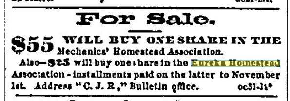
> For Sale.
> $55 WILL BUY ONE SHARE IN THE Mechanics' Homestead Association.
> Also-$25 will buy one share in the Eureka Homestead Association - installments paid on the latter to November 1st. Address "C. J. R," Bulletin office. oc31-1t*
[San Francisco Bulletin - October 31, 1862](https://infoweb-newsbank-com.ezproxy.sfpl.org/apps/news/openurl?ctx_ver=z39.88-2004&rft_id=info%3Asid/infoweb.newsbank.com&svc_dat=EANX-NB&req_dat=C4A791F4197B4BD28C27A2A6A0C93929&rft_val_format=info%3Aofi/fmt%3Akev%3Amtx%3Actx&rft_dat=document_id%3Aimage%252Fv2%253A113ACFC4DAF84818%2540EANX-NB-117B33ED2BF95AD0%25402401445-117B33ED71B05E10%25401-117B33EE765F1140%2540Advertisement/hlterms%3A%2522eureka%2520homestead%2522)

This gem from the Sacramento Daily Union, Jan 1 1863

> The following is a list of the companies formed for other than mining purposes during the year 1863, The whole number is fifty five, an increase of twenty over 1861:
(and it goes on to list the EHA)
[Sacramento Daily Union, Volume 24, Number 3676, 1 January 1863](https://cdnc.ucr.edu/?a=d&d=SDU18630101.2.3.4&srpos=4&e=-------en--20--1-byDA-txt-txIN-%22eureka+homestead%22-------)

[San Francisco Bulletin - September 24, 1863](https://infoweb-newsbank-com.ezproxy.sfpl.org/apps/news/openurl?ctx_ver=z39.88-2004&rft_id=info%3Asid/infoweb.newsbank.com&svc_dat=EANX-NB&req_dat=C4A791F4197B4BD28C27A2A6A0C93929&rft_val_format=info%3Aofi/fmt%3Akev%3Amtx%3Actx&rft_dat=document_id%3Aimage%252Fv2%253A113ACFC4DAF84818%2540EANX-NB-1184AED7DED4CAB0%25402401773-1184AED82C508F08-1184AED942187BD8/hlterms%3A%2522eureka%2520homestead%2522)
> The Association was incorporated August 29, 1862; the term of its existence limited to three years; and the monthly installments fixed at $10 per month, making the par value of shares $360 each. The Directors have the power of levying assessments not exceeding in amount $25 per share. The whole number of shares (200) were taken at the time of organization. No shares have been forfeited for nonpayment of assessments or installments.
> An “initiation fee” of two dollars per share was collected at the date of organization, and paid into the General Fund, for the purpose of paying the current expenses of the Association, and an assessment of two dollars per share was levied May 4, 1863, for the same purpose.
> On the 13th of April, 1863, the Association entered into an agreement with F. L. A. Pioche and Levi Parsons, whereby said Pioche and Parsons agreed, in consideration of the sum of $27,000, to be them thereafter paid by the Association, to convey to the Association, by deed of grant, bargain and sale, free from all incumbrances when said sum shall be fully paid, the following blocks of land lying in the City and County of San Francisco, the same being a portion of the San Miguel Rancho, viz: Blocks 211, 212, 213, 214, 215, 216, 219, 220, 221, 222, 223, 149, 150, 151, fractional Block 217, and a sufficient quantity of Block 152 to make said Fractional Block 217 equal to a whole block—making fifteen blocks of 228 by 560 feet each, laying between Noe, Napa, Douglas and Center streets, possession thereof to be given the Association on or before January 1, 1864. The price agreed to be paid was $1,800 per block, or $27,000 for the whole; payable, $12,000 on the execution and delivery of the agreement, and $2,000 on the 15th of each month thereafter, until fully paid.
> By said agreement the Association also have the privilege of purchasing Blocks 218 and 224, and the remaining portion of Block 152 at the same rate, viz: $1,800 for each full block, if the Association shall, on or before January 1, 1864, decide to make the purchase, payment therefor to be made after the payments are fully made upon the property first mentioned, and in the same manner.
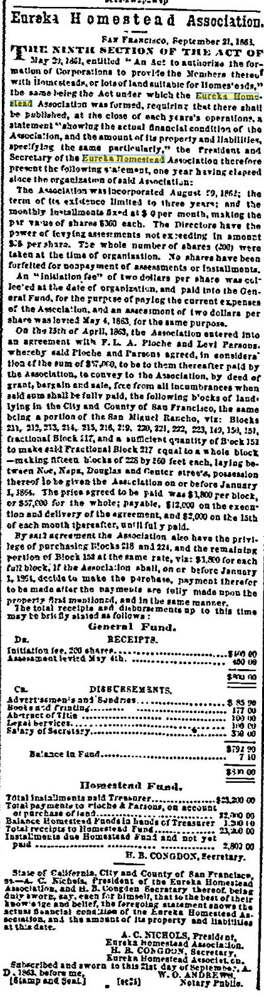

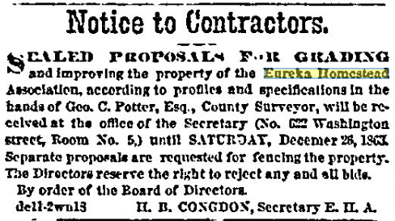
> Notice to Contractors.
> SEALED PROPOSALS FOR GRADING and improving the property of the Eureka Homestead Association, according to profiles and specifications in the hands of Geo. C. Potter, Esq., County Surveyor, will be received at the office of the Secretary (No. 622 Washington street, Room No. 5,) until SATURDAY, December 26, 1863. Separate proposals are requested for fencing the property. The Directors reserve the right to reject any and all bids.
> By order of the Board of Directors.
> de11-2wn13   H. B. CONGDON, Secretary E. H. A.
[San Francisco Bulletin - December 11, 1863](https://infoweb-newsbank-com.ezproxy.sfpl.org/apps/news/openurl?ctx_ver=z39.88-2004&rft_id=info%3Asid/infoweb.newsbank.com&svc_dat=EANX-NB&req_dat=C4A791F4197B4BD28C27A2A6A0C93929&rft_val_format=info%3Aofi/fmt%3Akev%3Amtx%3Actx&rft_dat=document_id%3Aimage%252Fv2%253A113ACFC4DAF84818%2540EANX-NB-1184AE36DDE171D0%25402401851-1184AE372850B978-1184AE38C0795A68/hlterms%3A%2522eureka%2520homestead%2522)

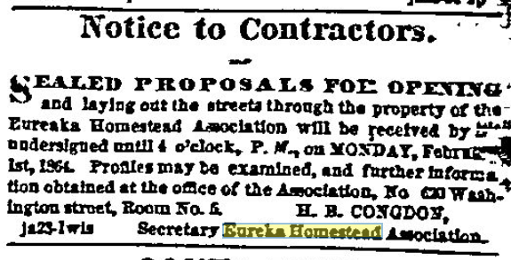
> Notice to Contractors.
> SEALED PROPOSALS FOR OPENING and laying out the streets through the property of the Eureka Homestead Association will be received by the undersigned until 4 o'clock, P. M., on MONDAY, February 1st, 1864. Profiles may be examined, and further information obtained at the office of the Association, No 620 Washington street, Room No. 5.      H. B. CONGDON,
> ja25-1wis    Secretary Eureka Homestead Association
[San Francisco Bulletin - January 25, 1864](https://infoweb-newsbank-com.ezproxy.sfpl.org/apps/news/openurl?ctx_ver=z39.88-2004&rft_id=info%3Asid/infoweb.newsbank.com&svc_dat=EANX-NB&req_dat=C4A791F4197B4BD28C27A2A6A0C93929&rft_val_format=info%3Aofi/fmt%3Akev%3Amtx%3Actx&rft_dat=document_id%3Aimage%252Fv2%253A113ACFC4DAF84818%2540EANX-NB-117B3059C9E7F708%25402401896-117B305B47E1AF58%25401-117B305D8566B890%2540Advertisement/hlterms%3A%2522eureka%2520homestead%2522)

---

Trying to get subscribers to pay up...
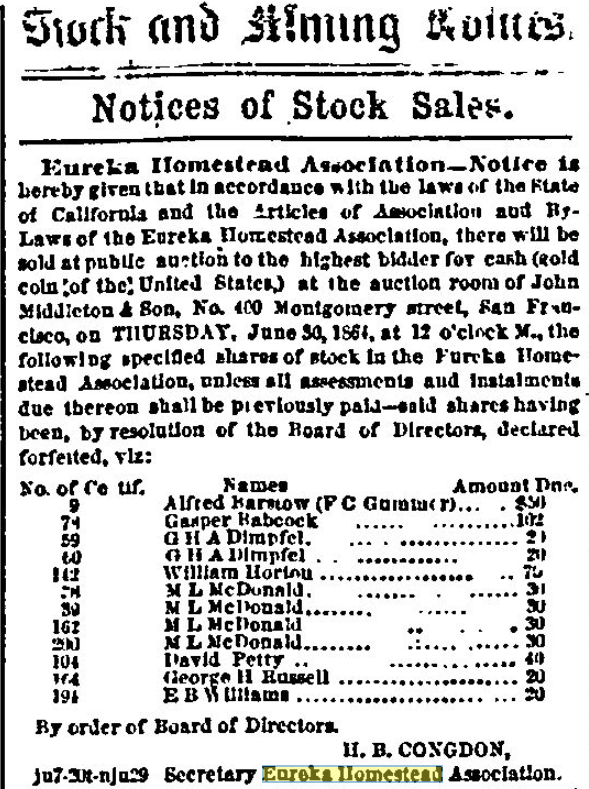
> Eureka Homestead Association—Notice is hereby given that in accordance with the laws of the State of California and the Articles of Association and By-Laws of the Eureka Homestead Association, there will be sold at public auction to the highest bidder for cash (gold coin of the United States,) at the auction room of John Middleton & Son, No. 400 Montgomery street, San Francisco, on THURSDAY, June 30, 1864, at 12 o'clock M., the following specified shares of stock in the Eureka Homestead Association, unless all assessments and instalments due thereon shall be previously paid—said shares having been, by resolution of the Board of Directors, declared forfeited, viz:
> No. of Certif.   Names                          Amount Due.
> 9              Alfred Barstow (F C Gummer)...    $50
> 74              Gasper Babcock ...............    102
> 59              G H A Dimpfel ................     20
> 60              G H A Dimpfel ................     20
> 142              William Horton ...............     70
> 28              M L McDonald .................     30
> 39              M L McDonald .................     30
> 162              M L McDonald .................     30
> 200              M L McDonald .................     30
> 104              David Petty ..................     40
> 164              George H Russell .............     20
> 191              E B Williams .................     20
> By order of Board of Directors.
> H. B. CONGDON,
> ju7-20t-nju29   Secretary Eureka Homestead Association.
[San Francisco Bulletin - June 9, 1864](https://infoweb-newsbank-com.ezproxy.sfpl.org/apps/news/openurl?ctx_ver=z39.88-2004&rft_id=info%3Asid/infoweb.newsbank.com&svc_dat=EANX-NB&req_dat=C4A791F4197B4BD28C27A2A6A0C93929&rft_val_format=info%3Aofi/fmt%3Akev%3Amtx%3Actx&rft_dat=document_id%3Aimage%252Fv2%253A113ACFC4DAF84818%2540EANX-NB-11931EE0C891A638%25402402032-11931EE0F6266570%25402-11931EE1C65202F0%2540Advertisement/hlterms%3A%2522eureka%2520homestead%2522)

Still trying...
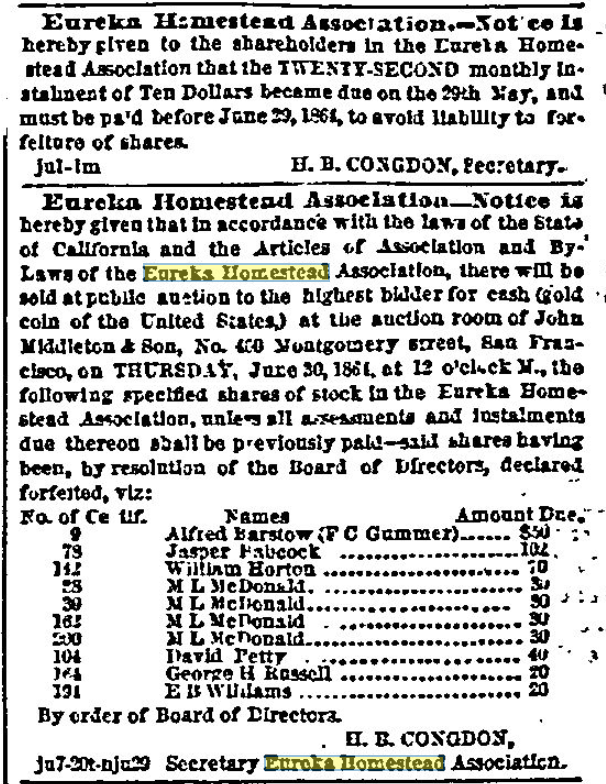
> Eureka Homestead Association.—Notice is hereby given to the shareholders in the Eureka Homestead Association that the TWENTY-SECOND monthly instalment of Ten Dollars became due on the 29th May, and must be paid before June 29, 1864, to avoid liability to forfeiture of shares.
> jul-1m                          H. B. CONGDON, Secretary.
>
> Eureka Homestead Association—Notice is hereby given that in accordance with the laws of the State of California and the Articles of Association and By-Laws of the Eureka Homestead Association, there will be sold at public auction to the highest bidder for cash (gold coin of the United States,) at the auction room of John Middleton & Son, No. 400 Montgomery street, San Francisco, on THURSDAY, June 30, 1864, at 12 o'clock M., the following specified shares of stock in the Eureka Homestead Association, unless all assessments and instalments due thereon shall be previously paid—said shares having been, by resolution of the Board of Directors, declared forfeited, viz:
> No. of Certif.   Names                          Amount Due.
> 9              Alfred Barstow (F C Gummer).....  $50
> 78              Jasper Babcock .................  102
> 142              William Horton .................   70
> 28              M L McDonald....................   30
> 39              M L McDonald....................   30
> 162              M L McDonald ...................   30
> 200              M L McDonald....................   30
> 104              David Petty ....................   40
> 164              George H Russell ...............   20
> 191              E B Williams ...................   20
> By order of Board of Directors.
> H. B. CONGDON,
> ju7-20t-nju29   Secretary Eureka Homestead Association.
[San Francisco Bulletin - June 13, 1864](https://infoweb-newsbank-com.ezproxy.sfpl.org/apps/news/openurl?ctx_ver=z39.88-2004&rft_id=info%3Asid/infoweb.newsbank.com&svc_dat=EANX-NB&req_dat=C4A791F4197B4BD28C27A2A6A0C93929&rft_val_format=info%3Aofi/fmt%3Akev%3Amtx%3Actx&rft_dat=document_id%3Aimage%252Fv2%253A113ACFC4DAF84818%2540EANX-NB-11931F198561DA78%25402402036-11931F1998FC6490%25400-11931F1A087446B0%2540Advertisement/hlterms%3A%2522eureka%2520homestead%2522)

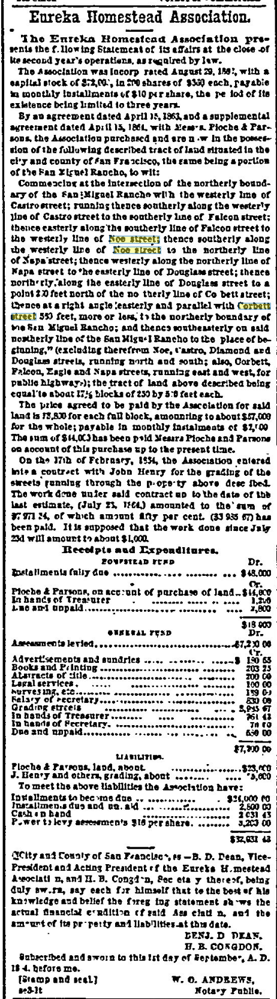
> Eureka Homestead Association.
> The Eureka Homestead Association presents the following Statement of its affairs at the close of its second year's operations, as required by law.
> The Association was incorporated August 29, 1862, with a capital stock of $72,000, in 200 shares of $360 each, payable in monthly installments of $10 per share, the period of its existence being limited to three years.
> By an agreement dated April 15, 1863, and a supplemental agreement dated April 15, 1864, with Messrs. Pioche & Parsons, the Association purchased and are now in the possession of the following described tract of land situated in the city and county of San Francisco, the same being a portion of the San Miguel Rancho, to wit:
> Commencing at the intersection of the northerly boundary of the San Miguel Rancho with the westerly line of Castro street; running thence southerly along the westerly line of Castro street to the southerly line of Falcon street; thence easterly along the southerly line of Falcon street to the westerly line of Noe street; thence southerly along the westerly line of Noe street to the northerly line of Napa street; thence westerly along the northerly line of Napa street to the easterly line of Douglass street; thence northerly along the easterly line of Douglass street to a point 200 feet north of the northerly line of Corbett street; thence at a right angle easterly and parallel with Corbett street 550 feet, more or less, to the northerly boundary of the San Miguel Rancho; and thence southeasterly on said northerly line of the San Miguel Rancho to the place of beginning," (excluding therefrom Noe, Castro, Diamond and Douglass streets, running north and south; also, Corbett, Falcon, Eagle and Napa streets, running east and west, for public highways); the tract of land above described being equal to about 17 1/2 blocks of 250 by 550 feet each.
> The price agreed to be paid by the Association for said land is $3,500 for each full block, amounting to about $57,000 for the whole; payable in monthly installments of $1,000. The sum of $44,000 has been paid Messrs Pioche and Parsons on account of this purchase up to the present time.
> On the 17th of February, 1864, the Association entered into a contract with John Henry for the grading of the streets running through the property above described. The work done under said contract up to the date of the last estimate, (July 23, 1864,) amounted to the sum of $7,971.34, of which amount fifty per cent. ($3,985.67) has been paid. It is supposed that the work done since July 23d will amount to about $4,000.
[San Francisco Bulletin - September 3, 1864](https://infoweb-newsbank-com.ezproxy.sfpl.org/apps/news/openurl?ctx_ver=z39.88-2004&rft_id=info%3Asid/infoweb.newsbank.com&svc_dat=EANX-NB&req_dat=C4A791F4197B4BD28C27A2A6A0C93929&rft_val_format=info%3Aofi/fmt%3Akev%3Amtx%3Actx&rft_dat=document_id%3Aimage%252Fv2%253A113ACFC4DAF84818%2540EANX-NB-11931E953960DF90%25402402118-11931E9563C41120%25401-11931E95F1DA0A08%2540Advertisement/hlterms%3A%2522corbett%2520street%2522%2520%2522noe%2520street%2522)

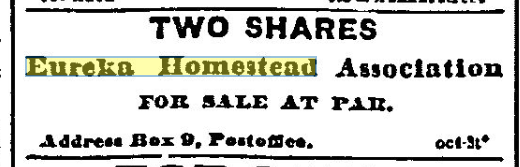
> TWO SHARES
> Eureka Homestead Association
> FOR SALE AT PAR.
> Address Box 9, Postoffice.        oct-3t*
[San Francisco Bulletin -  October 4, 1864](https://infoweb-newsbank-com.ezproxy.sfpl.org/apps/news/openurl?ctx_ver=z39.88-2004&rft_id=info%3Asid/infoweb.newsbank.com&svc_dat=EANX-NB&req_dat=C4A791F4197B4BD28C27A2A6A0C93929&rft_val_format=info%3Aofi/fmt%3Akev%3Amtx%3Actx&rft_dat=document_id%3Aimage%252Fv2%253A113ACFC4DAF84818%2540EANX-NB-11931EC7AB810DF0%25402402149-11931EC7DDC4A2D0-11931EC8382F6858/hlterms%3A%2522eureka%2520homestead%2522)

Still trying and more are falling behind...
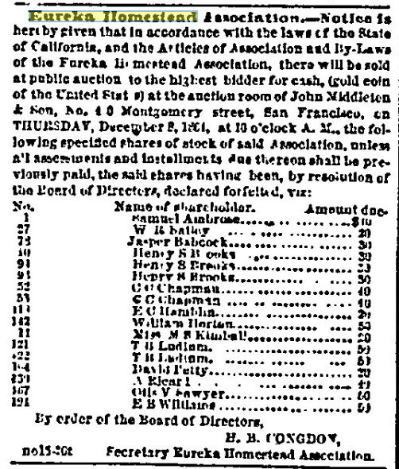
> Eureka Homestead Association.—Notice is hereby given that in accordance with the laws of the State of California, and the Articles of Association and By-Laws of the Eureka Homestead Association, there will be sold at public auction to the highest bidder for cash, (gold coin of the United States) at the auction room of John Middleton & Son, No. 400 Montgomery street, San Francisco, on THURSDAY, December 8, 1864, at 10 o'clock A. M., the following specified shares of stock of said Association, unless all assessments and installments due thereon shall be previously paid, the said shares having been, by resolution of the Board of Directors, declared forfeited, viz:
> No.            Name of shareholder.            Amount due.
> 1            Samuel Ambrose ................    $10
> 27            W H Bailey ....................     20
> 78            Jasper Babcock ................     30
> 10            Henry S Brooks ................     30
> 91            Henry S Brooks ................     30
> 93            Henry S Brooks ................     30
> 52            C C Chapman ...................     40
> 53            C C Chapman ...................     40
> 114            E C Hamblin ...................     20
> 142            William Horton ................     50
> 11            Miss M F Kimball ..............     20
> 121            T H Ludlum ....................     50
> 122            T H Ludlum ....................     50
> 104            David Petty ...................     20
> 259            A Rjearl ......................     40
> 167            Otis V Sawyer .................     60
> 191            E B Williams ..................     50
> By order of the Board of Directors,
> H. B. CONGDON,
> no15-20t       Secretary Eureka Homestead Association.
[San Francisco Bulletin - November 15, 1864](https://infoweb-newsbank-com.ezproxy.sfpl.org/apps/news/openurl?ctx_ver=z39.88-2004&rft_id=info%3Asid/infoweb.newsbank.com&svc_dat=EANX-NB&req_dat=C4A791F4197B4BD28C27A2A6A0C93929&rft_val_format=info%3Aofi/fmt%3Akev%3Amtx%3Actx&rft_dat=document_id%3Aimage%252Fv2%253A113ACFC4DAF84818%2540EANX-NB-11A1D04098FB5320%25402402191-11A1D04132215408-11A1D042E35C1020/hlterms%3A%2522eureka%2520homestead%2522)

---
Here we gooooo....(First) Sale of lots

> Eureka Homestead Association DISTRIBUTION OF LOTS.
> Shareholders in the Eureka Homestead Association are hereby notified that the distribution and sale of the choice of lots to the members of the association will take place
> TUESDAY, DECEMBER 20, 1864, AT SEVEN O'CLOCK P. M, At Police Court Room, City Hall.
> The sale will commence punctually at the hour. Copies of the Official Map of the Property may be procured by applying to the Secretary. By order of the Board of Directors H. B. CONGDON. Secretary

[Daily Alta California, Volume 16, Number 5404, 20 December 1864](https://cdnc.ucr.edu/?a=d&d=DAC18641220.2.12.3&srpos=5&e=-------en--20--1-byDA-txt-txIN-%22eureka+homestead%22-------)

Reelections...
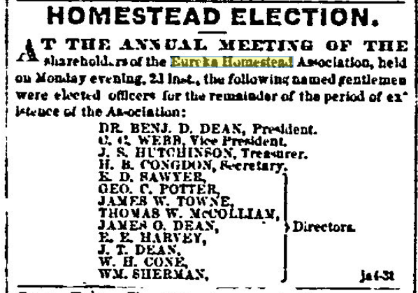
> HOMESTEAD ELECTION.
> AT THE ANNUAL MEETING OF THE shareholders of the Eureka Homestead Association, held on Monday evening, 2d inst., the following named gentlemen were elected officers for the remainder of the period of existence of the Association:
> DR. BENJ. D. DEAN, President.
> C. C. WEBB, Vice President.
> J. S. HUTCHINSON, Treasurer.
> H. B. CONGDON, Secretary.
> E. D. SAWYER,        \
> GEO. C. POTTER,       |
> JAMES W. TOWNE,       |
> THOMAS W. McCOLLIAN,  > Directors.
> JAMES O. DEAN,        |
> E. E. HARVEY,         |
> J. T. DEAN,           |
> W. H. CONE,           |
> WM. SHERMAN,         /
> ja4-3t
[San Francisco Bulletin - January 4, 1865](https://infoweb-newsbank-com.ezproxy.sfpl.org/apps/news/openurl?ctx_ver=z39.88-2004&rft_id=info%3Asid/infoweb.newsbank.com&svc_dat=EANX-NB&req_dat=C4A791F4197B4BD28C27A2A6A0C93929&rft_val_format=info%3Aofi/fmt%3Akev%3Amtx%3Actx&rft_dat=document_id%3Aimage%252Fv2%253A113ACFC4DAF84818%2540EANX-NB-11A1CFC55107F088%25402402241-11A1CFC5ABF737F0%25401-11A1CFC65F574120%2540Advertisement/hlterms%3A%2522eureka%2520homestead%2522)

Clearly they didn't all sell, because...

> EDWARDS, OLNEY & CO. REAL ESTATE STOCK AND GENERAL AUCTION AND COMMISSION HOUSE. NO 626 MONTGOMERY ST, Montgomery Block. JAMES N. OLNEY, Auctioneer
> TO-MORROW. TUESDAY January 31., 1865, At 12 o'clock N, at Salesrooms, REAL ESTATE AT AUCTION. Consisting, among other Property, of lots in HOMESTEAD ASSOCIATIONS, VIZ., IN THE Pacific Homestead Association, IN THE San Francisco Homestead Association, IN THE Eureka Homestead Association, IN THE ...
[Daily Alta California, Volume 17, Number 5443, 30 January 1865](https://cdnc.ucr.edu/?a=d&d=DAC18650130.2.17.6&srpos=6&e=-------en--20--1-byDA-txt-txIN-%22eureka+homestead%22-------)

Second distro, hmmm...
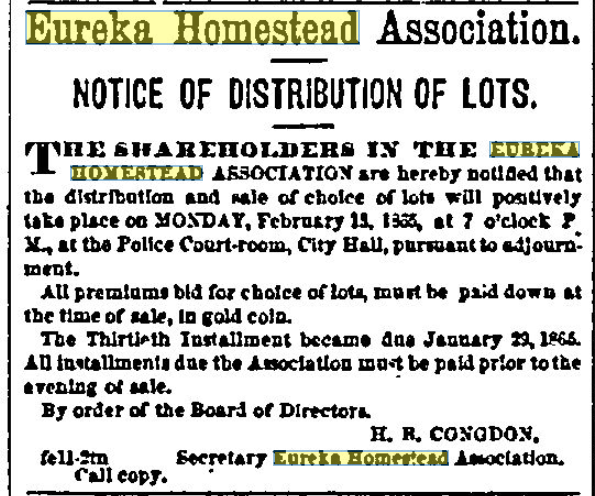
> Eureka Homestead Association.
> NOTICE OF DISTRIBUTION OF LOTS.
> THE SHAREHOLDERS IN THE EUREKA HOMESTEAD ASSOCIATION are hereby notified that the distribution and sale of choice of lots will positively take place on MONDAY, February 13, 1865, at 7 o'clock P. M., at the Police Court-room, City Hall, pursuant to adjournment.
> All premiums bid for choice of lots, must be paid down at the time of sale, in gold coin.
> The Thirtieth Installment became due January 29, 1865.
> All installments due the Association must be paid prior to the evening of sale.
> By order of the Board of Directors.
> H. B. CONGDON,
> fe11-2tn            Secretary Eureka Homestead Association.
> Call copy.
[San Francisco Bulletin - February 11, 1865](https://infoweb-newsbank-com.ezproxy.sfpl.org/apps/news/openurl?ctx_ver=z39.88-2004&rft_id=info%3Asid/infoweb.newsbank.com&svc_dat=EANX-NB&req_dat=C4A791F4197B4BD28C27A2A6A0C93929&rft_val_format=info%3Aofi/fmt%3Akev%3Amtx%3Actx&rft_dat=document_id%3Aimage%252Fv2%253A113ACFC4DAF84818%2540EANX-NB-11A1D0E2518AA190%25402402279-11A1D0E2AD476288%25401-11A1D0E3719B99A8%2540Advertisement/hlterms%3A%2522eureka%2520homestead%2522)

Hooo boy, 1865 - the first real estate bidding war for this area, but not the last.

> HEAVY PREMIUMS FOR CHOICE OF HOMESTEAD LOTS.—The sale of right of choice in the lots of the Eureka Homestead Union, located in the old brick-kiln valley, back of the Jewish Cemeteries, beyond the Mission Delores, took place last evening, and the bidding was very spirited, and maintained to the last. The premiums paid varied from $15 to $48_, which, added to the cost of the shares (about $50 per lot), brings the price of the property to a figure which would somewhat astonish old-time denizens of San Francisco.
[Daily Alta California, Volume 17, Number 5458, 14 February 1865](https://cdnc.ucr.edu/?a=d&d=DAC18650214.2.2&srpos=7&e=-------en--20--1-byDA-txt-txIN-%22eureka+homestead%22-------)

A better description of the sale
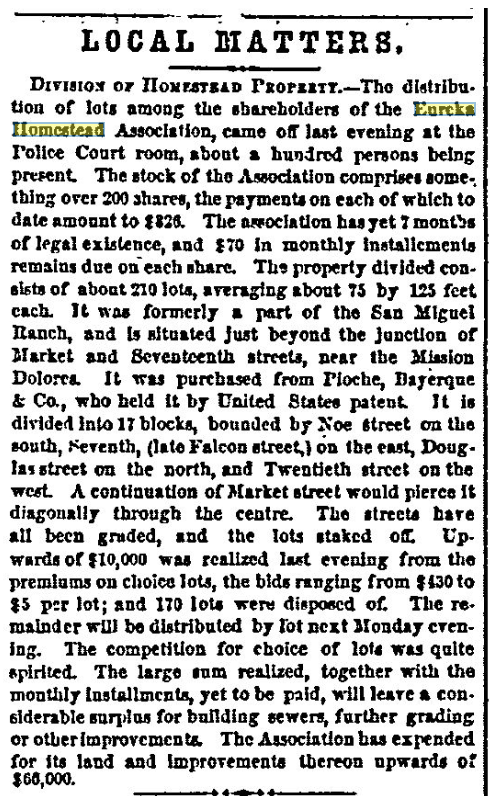
> LOCAL MATTERS.
> DIVISION OF HOMESTEAD PROPERTY.—The distribution of lots among the shareholders of the Eureka Homestead Association, came off last evening at the Police Court room, about a hundred persons being present. The stock of the Association comprises something over 200 shares, the payments on each of which to date amount to $326. The association has yet 7 months of legal existence, and $70 in monthly installments remains due on each share. The property divided consists of about 210 lots, averaging about 75 by 125 feet each. It was formerly a part of the San Miguel Ranch, and is situated just beyond the junction of Market and Seventeenth streets, near the Mission Dolores. It was purchased from Pioche, Bayerque & Co., who held it by United States patent. It is divided into 17 blocks, bounded by Noe street on the south, Seventh, (late Falcon street,) on the east, Douglass street on the north, and Twentieth street on the west. A continuation of Market street would pierce it diagonally through the centre. The streets have all been graded, and the lots staked off. Upwards of $10,000 was realized last evening from the premiums on choice lots, the bids ranging from $430 to $5 per lot; and 170 lots were disposed of. The remainder will be distributed by lot next Monday evening. The competition for choice of lots was quite spirited. The large sum realized, together with the monthly installments, yet to be paid, will leave a considerable surplus for building sewers, further grading or other improvements. The Association has expended for its land and improvements thereon upwards of $66,000.
[San Francisco Bulletin - February 14, 1865](https://infoweb-newsbank-com.ezproxy.sfpl.org/apps/news/openurl?ctx_ver=z39.88-2004&rft_id=info%3Asid/infoweb.newsbank.com&svc_dat=EANX-NB&req_dat=C4A791F4197B4BD28C27A2A6A0C93929&rft_val_format=info%3Aofi/fmt%3Akev%3Amtx%3Actx&rft_dat=document_id%3Aimage%252Fv2%253A113ACFC4DAF84818%2540EANX-NB-11A1CFB5EC28C388%25402402282-11A1CFB666EA5B48%25402-11A1CFB746CA3478%2540Local%252BMatters/hlterms%3A%2522eureka%2520homestead%2522)

Last same maybe?
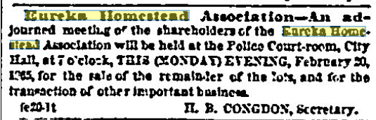
> Eureka Homestead Association.—An adjourned meeting of the shareholders of the Eureka Homestead Association will be held at the Police Court-room, City Hall, at 7 o'clock, THIS (MONDAY) EVENING, February 20, 1865, for the sale of the remainder of the lots, and for the transaction of other important business.
> fe20-1t                         H. B. CONGDON, Secretary.
[San Francisco Bulletin - February 20, 1865](https://infoweb-newsbank-com.ezproxy.sfpl.org/apps/news/openurl?ctx_ver=z39.88-2004&rft_id=info%3Asid/infoweb.newsbank.com&svc_dat=EANX-NB&req_dat=C4A791F4197B4BD28C27A2A6A0C93929&rft_val_format=info%3Aofi/fmt%3Akev%3Amtx%3Actx&rft_dat=document_id%3Aimage%252Fv2%253A113ACFC4DAF84818%2540EANX-NB-11A1D0CD5919D3B8%25402402288-11A1D0CDB509B688%25401-11A1D0CE80898ED8%2540Advertisement/hlterms%3A%2522eureka%2520homestead%2522)

Two lots left, I guess? What happened to that brisk bidding...
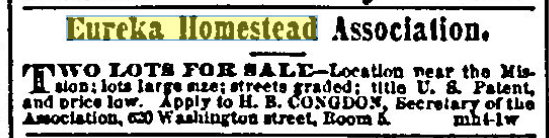
> Eureka Homestead Association.
> TWO LOTS FOR SALE—Location near the Mission; lots large size; streets graded; title U. S. Patent, and price low. Apply to H. B. CONGDON, Secretary of the Association, 620 Washington street, Room 5.     mh4-1w
[San Francisco Bulletin - March 6, 1865](https://infoweb-newsbank-com.ezproxy.sfpl.org/apps/news/openurl?ctx_ver=z39.88-2004&rft_id=info%3Asid/infoweb.newsbank.com&svc_dat=EANX-NB&req_dat=C4A791F4197B4BD28C27A2A6A0C93929&rft_val_format=info%3Aofi/fmt%3Akev%3Amtx%3Actx&rft_dat=document_id%3Aimage%252Fv2%253A113ACFC4DAF84818%2540EANX-NB-11A1D036D22A40D8%25402402302-11A1D03768395D00%25403-11A1D038A371FD68%2540Advertisement/hlterms%3A%2522eureka%2520homestead%2522)

Lot 14 block R, Lots 6 and 7 block B
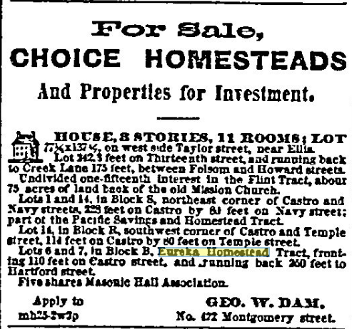
> For Sale,
> CHOICE HOMESTEADS
> And Properties for Investment.
> HOUSE, 3 STORIES, 11 ROOMS; LOT 77 1/2x137 1/2, on west side Taylor street, near Ellis.
> Lot 242.3 feet on Thirteenth street, and running back to Creek Lane 175 feet, between Folsom and Howard streets.
> Undivided one-fifteenth interest in the Flint Tract, about 75 acres of land back of the old Mission Church.
> Lots 1 and 14, in Block S, northeast corner of Castro and Navy streets, 228 feet on Castro by 80 feet on Navy street; part of the Pacific Savings and Homestead Tract.
> Lot 14, in Block R, southwest corner of Castro and Temple street, 114 feet on Castro by 80 feet on Temple street.
> Lots 6 and 7, in Block B, Eureka Homestead Tract, fronting 110 feet on Castro street, and running back 250 feet to Hartford street.
> Five shares Masonic Hall Association.
> Apply to                            GEO. W. DAM,
> mh25-2w?p                 No. 422 Montgomery street.
[San Francisco Bulletin - March 27, 1865](https://infoweb-newsbank-com.ezproxy.sfpl.org/apps/news/openurl?ctx_ver=z39.88-2004&rft_id=info%3Asid/infoweb.newsbank.com&svc_dat=EANX-NB&req_dat=C4A791F4197B4BD28C27A2A6A0C93929&rft_val_format=info%3Aofi/fmt%3Akev%3Amtx%3Actx&rft_dat=document_id%3Aimage%252Fv2%253A113ACFC4DAF84818%2540EANX-NB-11A1D00A3AA56D80%25402402323-11A1D00AA82EA2E8-11A1D00B69C9C4E8/hlterms%3A%2522eureka%2520homestead%2522)

Misc -
> Protest of the Eureka Homestead Association against the closing of Market street.
[Daily Alta California, Volume 17, Number 5507, 4 April 1865](https://cdnc.ucr.edu/?a=d&d=DAC18650404.2.6&srpos=8&e=-------en--20--1-byDA-txt-txIN-%22eureka+homestead%22-------)

1865 - now we're "elegant" and the land nearby is desirable for comparison

[Daily Alta California, Volume 17, Number 5536, 3 May 1865](https://cdnc.ucr.edu/?a=d&d=DAC18650503.2.15.9&srpos=9&e=-------en--20--1-byDA-txt-txIN-%22eureka+homestead%22-------)
(ad repeats until sale day, May 8th)

Assessment (taxes) and dues
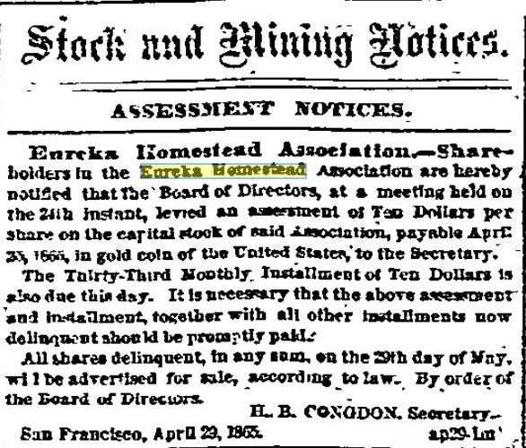
> Stock and Mining Notices.
> ASSESSMENT NOTICES.
> Eureka Homestead Association.—Shareholders in the Eureka Homestead Association are hereby notified that the Board of Directors, at a meeting held on the 24th instant, levied an assessment of Ten Dollars per share on the capital stock of said Association, payable April 25, 1865, in gold coin of the United States, to the Secretary.
> The Thirty-Third Monthly Installment of Ten Dollars is also due this day. It is necessary that the above assessment and installment, together with all other installments now delinquent should be promptly paid.
> All shares delinquent, in any sum, on the 29th day of May, will be advertised for sale, according to law. By order of the Board of Directors.
> H. B. CONGDON, Secretary.
> San Francisco, April 29, 1865.                      ap29-1m'
[San Francisco Bulletin - May 5, 1865](https://infoweb-newsbank-com.ezproxy.sfpl.org/apps/news/openurl?ctx_ver=z39.88-2004&rft_id=info%3Asid/infoweb.newsbank.com&svc_dat=EANX-NB&req_dat=C4A791F4197B4BD28C27A2A6A0C93929&rft_val_format=info%3Aofi/fmt%3Akev%3Amtx%3Actx&rft_dat=document_id%3Aimage%252Fv2%253A113ACFC4DAF84818%2540EANX-NB-119D0D36409CB918%25402402362-119D0D365DB78B40%25400-119D0D36D12BF730%2540Advertisement/hlterms%3A%2522eureka%2520homestead%2522)

20 June 1865:
> Board of Supervisors
> The Board met last evening, pursuant to adjournment, the Mayor presiding, and ten members present. Petition from Eureka Homestead Association to order Castro street graded.
[Daily Alta California, Volume 17, Number 5584, 20 June 1865](https://cdnc.ucr.edu/?a=d&d=DAC18650620.2.5&srpos=14&e=-------en--20--1-byDA-txt-txIN-%22eureka+homestead%22-------)

Not everyone could hang on until the end...
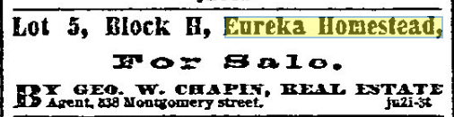
> Lot 5, Block H, Eureka Homestead,
> For Sale.
> BY GEO. W. CHAPIN, REAL ESTATE Agent, 338 Montgomery street.    ju2i-5t
[San Francisco Bulletin - June 21, 1865](https://infoweb-newsbank-com.ezproxy.sfpl.org/apps/news/openurl?ctx_ver=z39.88-2004&rft_id=info%3Asid/infoweb.newsbank.com&svc_dat=EANX-NB&req_dat=C4A791F4197B4BD28C27A2A6A0C93929&rft_val_format=info%3Aofi/fmt%3Akev%3Amtx%3Actx&rft_dat=document_id%3Aimage%252Fv2%253A113ACFC4DAF84818%2540EANX-NB-119D0DDA43554968%25402402409-119D0DDA812A7258-119D0DDB1EC1B7E0/hlterms%3A%2522eureka%2520homestead%2522)

26 June 1865

> LOT NO. 4 IN BLOCK R, Eureka Homestead Auoclatloa on seventeenth street. Lot. No. 4. la brock R. Enreka Bam«*t*ad Aasaou tun. oa aorta std*ot" 3ntath mm, ±3 feet tut of Dou«las* st re«c frontiac 74 fs*t ky -Jt feat Jeep. Special attentioa is sailed to this lot. It wtD fe> sold antire. Th* streets are rradad. tad all ia t on 4 ooaditiOD. Spaaiski Titla. a*Ts«ifeiith str** ta BucadamiMd.
[Daily Alta California, Volume 18, Number 5951, 26 June 1866](https://cdnc.ucr.edu/?a=d&d=DAC18660626.2.19.9&srpos=16&e=-------en--20--1-byDA-txt-txIN-%22eureka+homestead%22-------)

Sale notices...
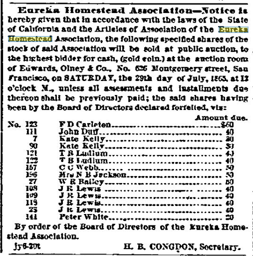
> Eureka Homestead Association—Notice is hereby given that in accordance with the laws of the State of California and the Articles of Association of the Eureka Homestead Association, the following specified shares of the stock of said Association will be sold at public auction, to the highest bidder for cash, (gold coin,) at the auction room of Edwards, Olney & Co., No. 626 Montgomery street, San Francisco, on SATURDAY, the 29th day of July, 1865, at 12 o'clock M., unless all assessments and installments due thereon shall be previously paid; the said shares having been by the Board of Directors declared forfeited, viz:
> No.  123        F D Carleton..............................$60
> 111        John Duff................................. 40
> 7        Kate Kelly................................ 20
> 90        Kate Kelly................................ 30
> 121        T H Ludlum................................ 40
> 122        T H Ludlum................................ 40
> 157        C C Webb.................................. 50
> 196        Mrs N B Jackson........................... 50
> 27        W H Bailey................................ 50
> 108        J R Lewis................................. 40
> 109        J R Lewis................................. 40
> 119        J R Lewis................................. 40
> 23        J R Lewis................................. 40
> 141        Peter White............................... 20
> By order of the Board of Directors of the Eureka Homestead Association.
> jy6-20t                              H. B. CONGDON, Secretary.
[San Francisco Bulletin - July 6, 1865](https://infoweb-newsbank-com.ezproxy.sfpl.org/apps/news/openurl?ctx_ver=z39.88-2004&rft_id=info%3Asid/infoweb.newsbank.com&svc_dat=EANX-NB&req_dat=C4A791F4197B4BD28C27A2A6A0C93929&rft_val_format=info%3Aofi/fmt%3Akev%3Amtx%3Actx&rft_dat=document_id%3Aimage%252Fv2%253A113ACFC4DAF84818%2540EANX-NB-119D0D0D5FBCE0C0%25402402424-119D0D0D98017E18-119D0D0E46E8A958/hlterms%3A%2522eureka%2520homestead%2522)

Looks like it was effective - a bunch of folks paid up. But the ad runs in this form until July 28, so we assume those did get auctioned off.
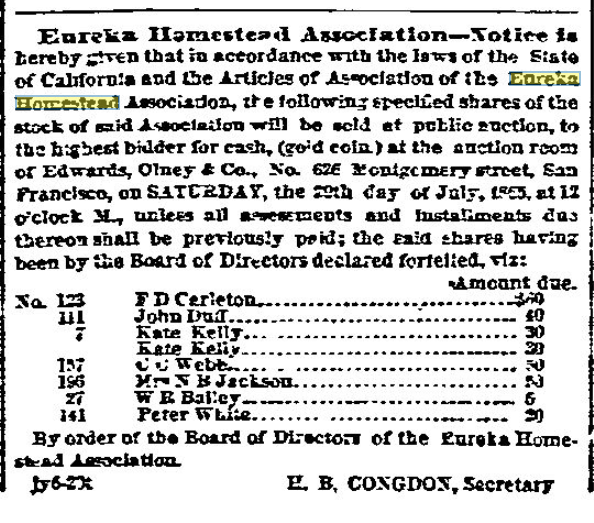
>
[San Francisco Bulletin - July 7, 1865](https://infoweb-newsbank-com.ezproxy.sfpl.org/apps/news/openurl?ctx_ver=z39.88-2004&rft_id=info%3Asid/infoweb.newsbank.com&svc_dat=EANX-NB&req_dat=C4A791F4197B4BD28C27A2A6A0C93929&rft_val_format=info%3Aofi/fmt%3Akev%3Amtx%3Actx&rft_dat=document_id%3Aimage%252Fv2%253A113ACFC4DAF84818%2540EANX-NB-119D0D3A833C4710%25402402425-119D0D3AA25E37C0%25400-119D0D3B1542F670%2540Advertisement/hlterms%3A%2522eureka%2520homestead%2522)

8 Aug 1866

> LOT 4 OF BLOCK L, or Eureka Homestead Association, on Castro street, near Eighteenth. Lot on ea.«terly line of Castro street, »■< fe«t south o. Eighteenth xtreet, frontinr .'4 feet by 12S feet deep. Street" graded and mi -mlaraized. Terms Half Cash, hall' Main months, at 1 per <*cut. J(ill\ "IDDLETON* BOS, an6 Auctioneers.
[Daily Alta California, Volume 18, Number 5993, 8 August 1866](https://cdnc.ucr.edu/?a=d&d=DAC18660808.2.23.9&srpos=17&e=-------en--20--1-byDA-txt-txIN-%22eureka+homestead%22-------)
(ad repeats until sale date Aug 13)

The directors are clearly sick of this shit...
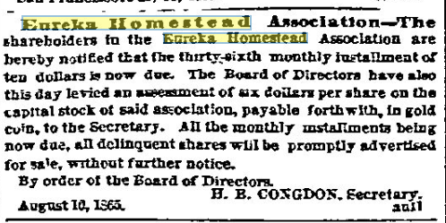
> Eureka Homestead Association.—The shareholders in the Eureka Homestead Association are hereby notified that the thirty-sixth monthly installment of ten dollars is now due. The Board of Directors have also this day levied an assessment of six dollars per share on the capital stock of said association, payable forthwith, in gold coin, to the Secretary. All the monthly installments being now due, all delinquent shares will be promptly advertised for sale, without further notice.
> By order of the Board of Directors.
> H. B. CONGDON, Secretary.
> August 10, 1865.                                          au11
[San Francisco Bulletin - August 17, 1865](https://infoweb-newsbank-com.ezproxy.sfpl.org/apps/news/openurl?ctx_ver=z39.88-2004&rft_id=info%3Asid/infoweb.newsbank.com&svc_dat=EANX-NB&req_dat=C4A791F4197B4BD28C27A2A6A0C93929&rft_val_format=info%3Aofi/fmt%3Akev%3Amtx%3Actx&rft_dat=document_id%3Aimage%252Fv2%253A113ACFC4DAF84818%2540EANX-NB-119D0DB9A1DC6560%25402402466-119D0DB9CB9E7CC0-119D0DBA4C0312C0/hlterms%3A%2522eureka%2520homestead%2522)

And they keep adding assessments.
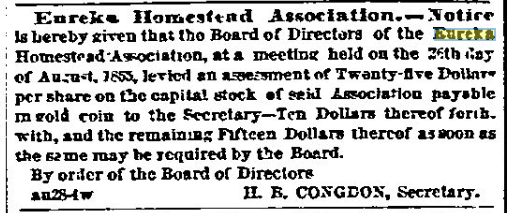
> Eureka Homestead Association.—Notice is hereby given that the Board of Directors of the Eureka Homestead Association, at a meeting held on the 26th day of August, 1865, levied an assessment of Twenty-five Dollars per share on the capital stock of said Association payable in gold coin to the Secretary—Ten Dollars thereof forthwith, and the remaining Fifteen Dollars thereof as soon as the same may be required by the Board.
> By order of the Board of Directors
> au28-4w                              H. B. CONGDON, Secretary.
[San Francisco Bulletin - August 28, 1865](https://infoweb-newsbank-com.ezproxy.sfpl.org/apps/news/openurl?ctx_ver=z39.88-2004&rft_id=info%3Asid/infoweb.newsbank.com&svc_dat=EANX-NB&req_dat=C4A791F4197B4BD28C27A2A6A0C93929&rft_val_format=info%3Aofi/fmt%3Akev%3Amtx%3Actx&rft_dat=document_id%3Aimage%252Fv2%253A113ACFC4DAF84818%2540EANX-NB-119D0D8DE27BFCD8%25402402477-119D0D8E1B13A400%25401-119D0D8EB9A366D0%2540Advertisement/hlterms%3Aeureka)

And more auction threats. These same folks stay on the list to the 25th of Nov.
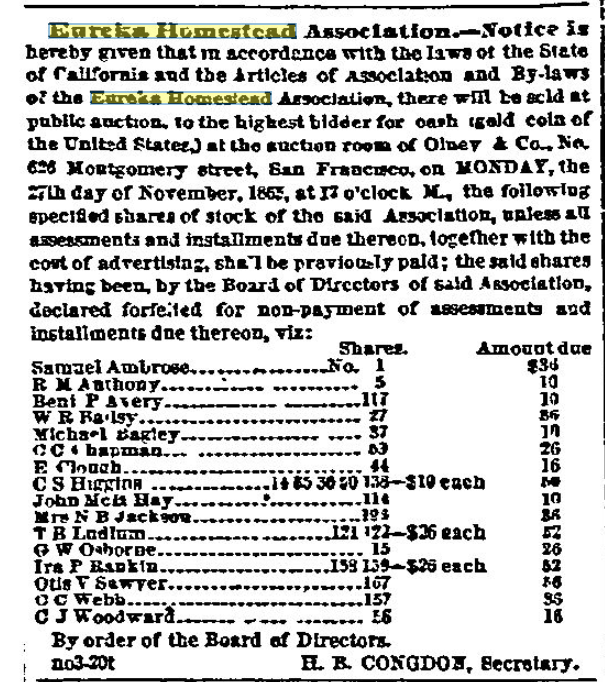
> Eureka Homestead Association.—Notice is hereby given that in accordance with the laws of the State of California and the Articles of Association and By-laws of the Eureka Homestead Association, there will be sold at public auction, to the highest bidder for cash (gold coin of the United States,) at the auction room of Olney & Co., No. 626 Montgomery street, San Francisco, on MONDAY, the 27th day of November, 1865, at 12 o'clock M., the following specified shares of stock of the said Association, unless all assessments and installments due thereon, together with the cost of advertising, shall be previously paid; the said shares having been, by the Board of Directors of said Association, declared forfeited for non-payment of assessments and installments due thereon, viz:
> Shares.           Amount due
> Samuel Ambrose.......................No. 1                    $36
> R M Anthony..........................    5                     10
> Benj P Avery.........................  117                     10
> W H Bailey...........................   27                     86
> Michael Bagley.......................   37                     10
> C C Chapman..........................   53                     26
> E Clough.............................   44                     16
> C S Higgins..........................14 35 36 50 138—$10 each  50
> John McIl Hay........................  114                     10
> Mrs N B Jackson......................  196                     86
> T H Ludlum...........................  121 122—$26 each        52
> G W Osborne..........................   15                     26
> Ira P Rankin.........................  138 139—$26 each        52
> Otis V Sawyer........................  167                     86
> C C Webb.............................  157                     35
> C J Woodward.........................   56                     16
> By order of the Board of Directors.
> no3-20t                              H. B. CONGDON, Secretary.
[San Francisco Bulletin - November 3, 1865](https://infoweb-newsbank-com.ezproxy.sfpl.org/apps/news/openurl?ctx_ver=z39.88-2004&rft_id=info%3Asid/infoweb.newsbank.com&svc_dat=EANX-NB&req_dat=C4A791F4197B4BD28C27A2A6A0C93929&rft_val_format=info%3Aofi/fmt%3Akev%3Amtx%3Actx&rft_dat=document_id%3Aimage%252Fv2%253A113ACFC4DAF84818%2540EANX-NB-119D0E9E721B6C50%25402402544-119D0E9EAF583D40%25401-119D0E9F68398BE0%2540Advertisement/hlterms%3A%2522eureka%2520homestead%2522)

Clearly they're still not quite set.
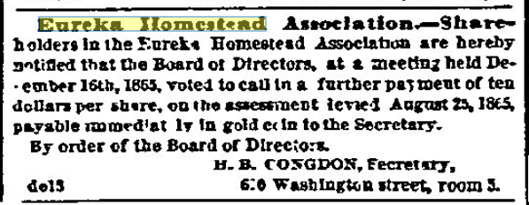
> Eureka Homestead Association.—Shareholders in the Eureka Homestead Association are hereby notified that the Board of Directors, at a meeting held December 16th, 1865, voted to call in a further payment of ten dollars per share, on the assessment levied August 25, 1865, payable immediately in gold coin to the Secretary.
> By order of the Board of Directors.
> H. B. CONGDON, Secretary,
> de15                                 620 Washington street, room 5.
[San Francisco Bulletin - December 18, 1865](https://infoweb-newsbank-com.ezproxy.sfpl.org/apps/news/openurl?ctx_ver=z39.88-2004&rft_id=info%3Asid/infoweb.newsbank.com&svc_dat=EANX-NB&req_dat=C4A791F4197B4BD28C27A2A6A0C93929&rft_val_format=info%3Aofi/fmt%3Akev%3Amtx%3Actx&rft_dat=document_id%3Aimage%252Fv2%253A113ACFC4DAF84818%2540EANX-NB-119D0EDFE4406928%25402402589-119D0EE01CC22308%25401-119D0EE10D20BBA8%2540Advertisement/hlterms%3A%2522eureka%2520homestead%2522)

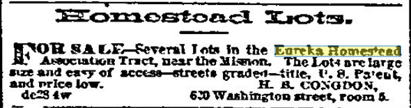
> Homestead Lots.
> FOR SALE—Several Lots in the Eureka Homestead Association Tract, near the Mission. The Lots are large size and easy of access—streets graded—title, U. S. Patent, and price low.                            H. B. CONGDON,
> de28 4w                              620 Washington street, room 5.
[San Francisco Bulletin - January 3, 1866](https://infoweb-newsbank-com.ezproxy.sfpl.org/apps/news/openurl?ctx_ver=z39.88-2004&rft_id=info%3Asid/infoweb.newsbank.com&svc_dat=EANX-NB&req_dat=C4A791F4197B4BD28C27A2A6A0C93929&rft_val_format=info%3Aofi/fmt%3Akev%3Amtx%3Actx&rft_dat=document_id%3Aimage%252Fv2%253A113ACFC4DAF84818%2540EANX-NB-119D0EE790DA7018%25402402605-119D0EE801604F68%25403-119D0EE941752758%2540Advertisement/hlterms%3A%2522eureka%2520homestead%2522)

10 Jan 1867 - Real Estate Transactions recorded Jan 8th 1867
Wm Jones to Catharine, his wife and to his children....
Also, lots 3, 4, 5, and 6, in block H EHA,
Also lot 4, block I, EHA.
Also lot 4 in block P, EHA.

[Daily Alta California, Volume 19, Number 7047, 10 January 1867](https://cdnc.ucr.edu/?a=d&d=DAC18670110.2.22&srpos=19&e=-------en--20--1-byDA-txt-txIN-%22eureka+homestead%22-------)

8 Feb 1867

> LOT 2 IN BLOCK P, EUREKA HOMESTEAD ASSOCIATION Lot on eaat line ef Enreka street. 75 feet north from Kigkteentk itreet: (roatlag "4 feet by 13 feet deep. TIILK PERFECT. TERMS CA>E.
[Daily Alta California, Volume 19, Number 7075, 8 February 1867](https://cdnc.ucr.edu/?a=d&d=DAC18670208.2.20.8&srpos=20&e=-------en--20--1-byDA-txt-txIN-%22eureka+homestead%22-------)
(ad repeats until sale date Feb 18)

11 April 1867

> TWO LOTS IN THE EUREKA HOMESTEAD TRACT. Lot I—Lot1 — Lot commencing at a point on the easterly line of Donclasa street, distant 33 feet 6 inch*, northerly from Seventeenth street: thence ranainc northerly havinc 27 feet front and rear by 136 feet in depth, running through to Clara vrsnuo.
[Daily Alta California, Volume 19, Number 6236, 11 April 1867](https://cdnc.ucr.edu/?a=d&d=DAC18670411.2.21.7&srpos=58&e=-------en--20--41-byDA-txt-txIN-%22eureka+homestead%22-------)
(ad repeats until sale date April 17)
And I guess it didn't sell, because it's back on the market 13th June for an auction on the 19th.

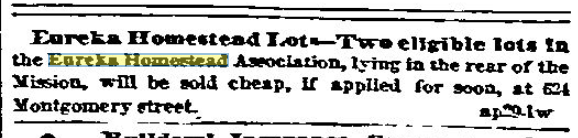
> Eureka Homestead Lots.—Two eligible lots in the Eureka Homestead Association, lying in the rear of the Mission, will be sold cheap, if applied for soon, at 624 Montgomery street.                           ap29-1w
[San Francisco Bulletin - April 29, 1867](https://infoweb-newsbank-com.ezproxy.sfpl.org/apps/news/openurl?ctx_ver=z39.88-2004&rft_id=info%3Asid/infoweb.newsbank.com&svc_dat=EANX-NB&req_dat=C4A791F4197B4BD28C27A2A6A0C93929&rft_val_format=info%3Aofi/fmt%3Akev%3Amtx%3Actx&rft_dat=document_id%3Aimage%252Fv2%253A113ACFC4DAF84818%2540EANX-NB-119BFD1B76A53648%25402403086-119BFD1BA75F6FF0%25401-119BFD1C606021B8%2540Advertisement/hlterms%3A%2522eureka%2520homestead%2522)

Clearly the ones near the mission just weren't that interesting to buyers?
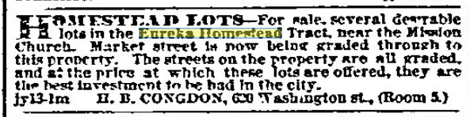
> HOMESTEAD LOTS.—For sale, several desirable lots in the Eureka Homestead Tract, near the Mission Church. Market street is now being graded through to this property. The streets on the property are all graded, and at the price at which these lots are offered, they are the best investment to be had in the city.
> jy13-1m      H. B. CONGDON, 620 Washington st., (Room 5.)
[San Francisco Bulletin - July 18, 1867](https://infoweb-newsbank-com.ezproxy.sfpl.org/apps/news/openurl?ctx_ver=z39.88-2004&rft_id=info%3Asid/infoweb.newsbank.com&svc_dat=EANX-NB&req_dat=C4A791F4197B4BD28C27A2A6A0C93929&rft_val_format=info%3Aofi/fmt%3Akev%3Amtx%3Actx&rft_dat=document_id%3Aimage%252Fv2%253A113ACFC4DAF84818%2540EANX-NB-119BFC1B995DD1F8%25402403166-119BFC1C0F52F170%25403-119BFC1D46C202D0%2540Advertisement/hlterms%3A%2522eureka%2520homestead%2522)

15 Sept 1867 - Property for sale:
> LOT 14, block 11, in Eureka Homestead Association, being northwest corner of Nineteenth and Diamond streets; one of the best locations in the tract.
[Daily Alta California, Volume 19, Number 6392, 15 September 1867](https://cdnc.ucr.edu/?a=d&d=DAC18670915.2.24.4&srpos=71&e=-------en--20--61-byDA-txt-txIN-%22eureka+homestead%22-------)

A whole block up for sale, huh
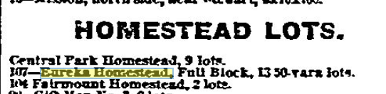
>
[San Francisco Bulletin - February 11, 1868](https://infoweb-newsbank-com.ezproxy.sfpl.org/apps/news/openurl?ctx_ver=z39.88-2004&rft_id=info%3Asid/infoweb.newsbank.com&svc_dat=EANX-NB&req_dat=C4A791F4197B4BD28C27A2A6A0C93929&rft_val_format=info%3Aofi/fmt%3Akev%3Amtx%3Actx&rft_dat=document_id%3Aimage%252Fv2%253A113ACFC4DAF84818%2540EANX-NB-116E8C3A363A89B0%25402403374-116E8C3A95D7E758%25401-116E8C3BBB5D20D8%2540Advertisement/hlterms%3A%2522eureka%2520homestead%2522)

24 May 1868 - for a probate auction June 17th

> Notice or Administratrix's Stile of Heal Estate. NO TICK IS lIKUKUY QIVHN, THAT in pursuance of the order of the Probate Court of the oity and county of San Francisco, in the State of California, made on the 13th day of May, A. D. 1868, in the matter of the estate of Edward IS. Fiske, deceased, the undersigned, the Administratrix of said estate, will sell at publio auction, to the highest bidder, for cash, in two parcels, and subject to confirmation by said Probate Court, on WEDNESDAY, the seventeeenth day of June, A. D 1868, at 12 o'clock M., at the auction rooms of MAURICE DORK & CO., No. 327 Montgomery street, in said city and county of San Francisoo, all the right, title, interest and estate of the said intestate at the time of his death, and all the right, title aud interest that the said estate has. by operation of law or otherwise, acquired, other than or in addition to that of the said intestate, at the time of his death, in and to all those certain lot.*. i pieces or parcels of land situate, lying and being in the said city and county, and described as follow*, to wit: First Parcel— One undivided one-half of a c«itain lot of land commencing at a point on the western line of Mason street, distant southerly #ev-enty-seven feet and six inches (77 feot6inoaes)froui the southerly line of California street: thence running southerly sixty feet (60 feet); thence at right angles westerly fifty-seven feet fix inches (57 feet 6 inches); thence at right angles northerly sixty feet (60 feetK thence at right angles easterly to the line of Frank place, tifty-seven feet six inches (57 feet 6 inches) to the place of beginning. Second Parcel— One undivided one-half of that certain paroel of laud situate and lying in said city and county of San Francisco, commencing at a point on the easterly line of Castro street distant two hundred and twenty-three f»et (223 feet) north from Nineteenth street; running thence north on Castro street twenty-four feet (24 feet); th*noe at right angles east one hundred and twenty-five leot (125 feet): thence at right angles south twenty-four feet, and thence at rinkt angles west one hundred and twenty-five feet (12) feet) to the place of beginning. Being part of lot No. four (4), in block L, of the Eureka Homestead Association property. The whole of the -eoond Parcel herein described will be Fold if purchaser bo desires. TERMS OF SALE-Cash. in United States gold ooin; ten per cent, of the purchase money to he „ paid to the Auctioneer on the day of sale, iiiil:nif<" on confirmation of sale by said Probate Court. Deed at expense of purchaser. San Francisco. May 20th, 186 S. my24-3w OI4IVK A. FIbKE, Administratrix.
[Daily Alta California, Volume 20, Number 6644, 24 May 1868](https://cdnc.ucr.edu/?a=d&d=DAC18680524.2.27.5&srpos=5&e=-------en--20--1-byDA-txt-txIN-%22eureka+homestead%22+castro-------)

NE corner 20th and Castro, 55x250 feet, all the way through to Hartford st - only $1000, wow.
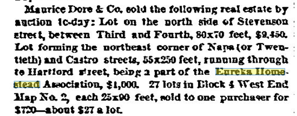
> Maurice Dore & Co. sold the following real estate by auction to-day: Lot on the north side of Stevenson street, between Third and Fourth, 80x70 feet, $9,450. Lot forming the northeast corner of Napa (or Twentieth) and Castro streets, 55x250 feet, running through to Hartford street, being a part of the Eureka Homestead Association, $1,000. 27 lots in Block 4 West End Map No. 2, each 25x90 feet, sold to one purchaser for $720—about $27 a lot.
[San Francisco Bulletin - July 1, 1868](https://infoweb-newsbank-com.ezproxy.sfpl.org/apps/news/openurl?ctx_ver=z39.88-2004&rft_id=info%3Asid/infoweb.newsbank.com&svc_dat=EANX-NB&req_dat=C4A791F4197B4BD28C27A2A6A0C93929&rft_val_format=info%3Aofi/fmt%3Akev%3Amtx%3Actx&rft_dat=document_id%3Aimage%252Fv2%253A113ACFC4DAF84818%2540EANX-NB-119BFFDE1F099A38%25402403515-119BFFDE595536D8%25402-119BFFDEF443E5E8%2540Prices/hlterms%3A%2522eureka%2520homestead%2522)

I guess 20th and Castro was just not a desirable hillside? Because this one wants $8k
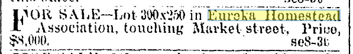
> FOR SALE—Lot 300x250 in Eureka Homestead Association, touching Market street. Price, $8,000.                                 se8-3t
[San Francisco Chronicle - September 8, 1868](https://infoweb-newsbank-com.ezproxy.sfpl.org/apps/news/openurl?ctx_ver=z39.88-2004&rft_id=info%3Asid/infoweb.newsbank.com&svc_dat=EANX-NB&req_dat=C4A791F4197B4BD28C27A2A6A0C93929&rft_val_format=info%3Aofi/fmt%3Akev%3Amtx%3Actx&rft_dat=document_id%3Aimage%252Fv2%253A142051F45F422A02%2540EANX-NB-16044D4588691F30%25402403584-1604366E4637E84F%25401-1604366E4637E84F%2540/hlterms%3A%2522eureka%2520homestead%2522)

Or maybe they just keep coming up again and again
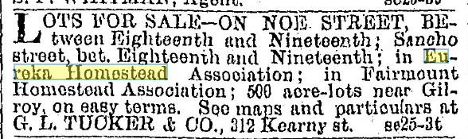
> LOTS FOR SALE—ON NOE STREET, BEtween Eighteenth and Nineteenth; Sancho street, bet. Eighteenth and Nineteenth; in Eureka Homestead Association; in Fairmount Homestead Association; 500 acre-lots near Gilroy, on easy terms. See maps and particulars at G. L. TUCKER & CO., 312 Kearny st.   se25-3t
[San Francisco Chronicle - September 25, 1868](https://infoweb-newsbank-com.ezproxy.sfpl.org/apps/news/openurl?ctx_ver=z39.88-2004&rft_id=info%3Asid/infoweb.newsbank.com&svc_dat=EANX-NB&req_dat=C4A791F4197B4BD28C27A2A6A0C93929&rft_val_format=info%3Aofi/fmt%3Akev%3Amtx%3Actx&rft_dat=document_id%3Aimage%252Fv2%253A142051F45F422A02%2540EANX-NB-16044D510C74F355%25402403601-1604366E81602F3C%25401-1604366E81602F3C%2540/hlterms%3A%2522eureka%2520homestead%2522)

Or maybe that $8k guy is dreaming because...
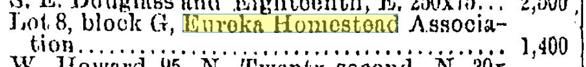
> Lot 8, block G, Eureka Homestead Association...................................... 1,400
[San Francisco Chronicle - October 25, 1868](https://infoweb-newsbank-com.ezproxy.sfpl.org/apps/news/openurl?ctx_ver=z39.88-2004&rft_id=info%3Asid/infoweb.newsbank.com&svc_dat=EANX-NB&req_dat=C4A791F4197B4BD28C27A2A6A0C93929&rft_val_format=info%3Aofi/fmt%3Akev%3Amtx%3Actx&rft_dat=document_id%3Aimage%252Fv2%253A142051F45F422A02%2540EANX-NB-16044D674D0E2F4F%25402403631-1604366EF1980D9B%25402-1604366EF1980D9B%2540/hlterms%3A%2522eureka%2520homestead%2522)

1869

> SOUTHWEST CORNER OF Elghtneenth and Noe streets. Lot forming the southwest oorner of Eighteenth and Noe streets, having 75 feet front on each street. No improvements of any kind to be sold with the lot. TERMS CASH. . ALSO. NORTHEAST CORNER i \ oF I Nineteenth and Hartford streets Between Noe and Castro. Lot forming the northeasterly oorner of Nineteenth and Hartford streets; having 83 feet front on Nineteenth street, and 145 feet on Hartford streetbeing a portion of the Eureka Homestead Association. To be sold as a whole or in 5 subdivisions. TERMS AT SALE
[Daily Alta California, Volume 21, Number 6915, 23 February 1869](https://cdnc.ucr.edu/?a=d&d=DAC18690223.2.28.7&srpos=31&e=-------en--20--21-byDA-txt-txIN-%22eureka+homestead%22+castro-------)

1871, Market st cut
1877 - fees for continuing to cut Market st [Daily Alta California, Volume 29, Number 9826, 3 March 1877](https://cdnc.ucr.edu/?a=d&d=DAC18770303.2.25&srpos=3&e=-------en--20--1-byDA-txt-txIN-%22market+and+seventeenth%22-------)
