What’s up with Hartford, Ford, Dorland?

Tl;dr: Dorland parallels the Rancho San Miguel border, on the outside.
Hartford south of 18th was in the Eureka Homestead, but city block 114
wasn’t; observe that block 114 is where the 1851 city charter
overlaps Rancho San Miguel.

1858 Map of Western Addition Land Claims: (Ford goes two blocks, but stops at the old Rancho border)
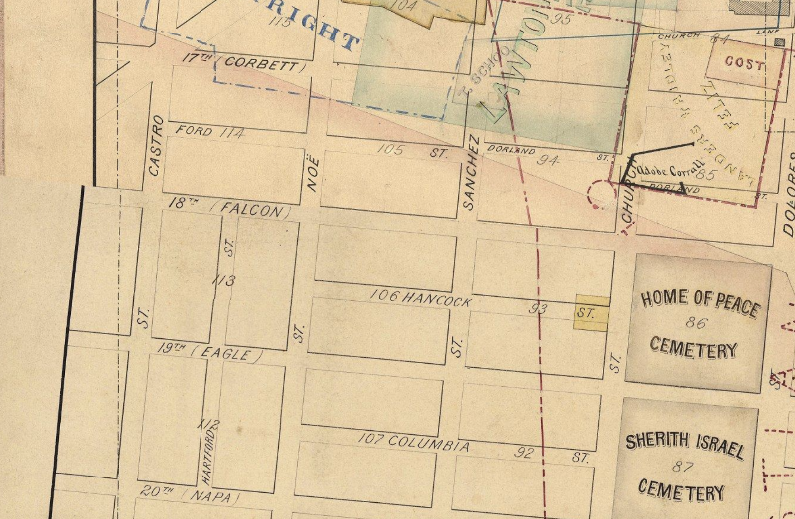

On Goddard’s 1868 Bird's Eye View of San Francisco and the
Surrounding Country, developed land ends at the blocks west of Dolores St (for reference:
Mission Dolores sits at the dead end of 16th St in the top left
corner):

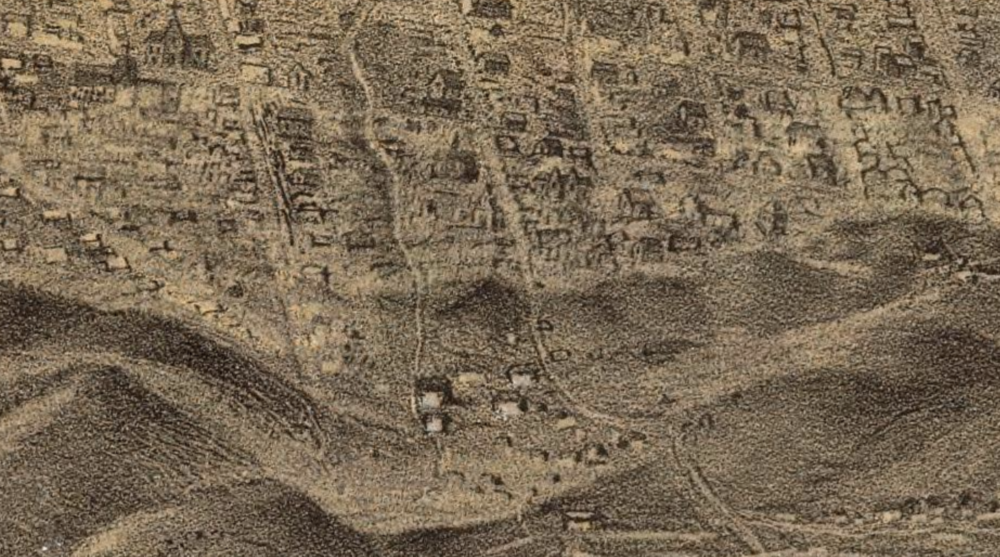

1876 Humphrey’s Plate 35: (leaving that block empty to be safe)
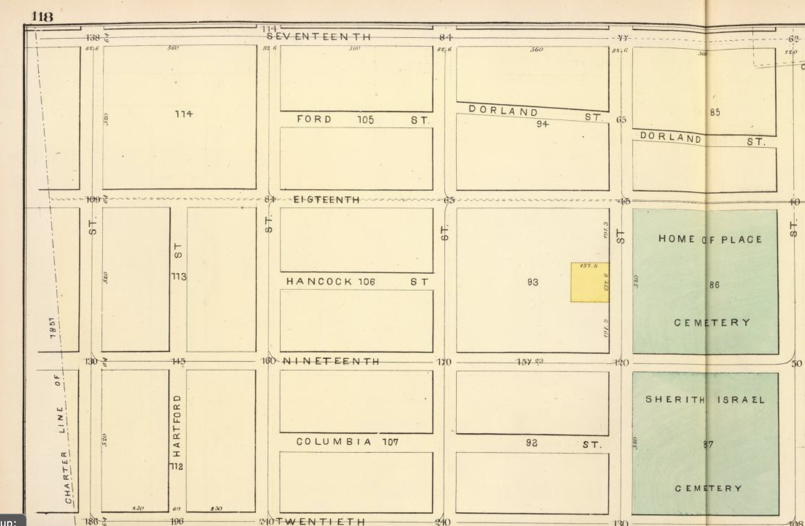

1876 "Birdseye view of San Francisco and surrounding
country" shows Hartford St:
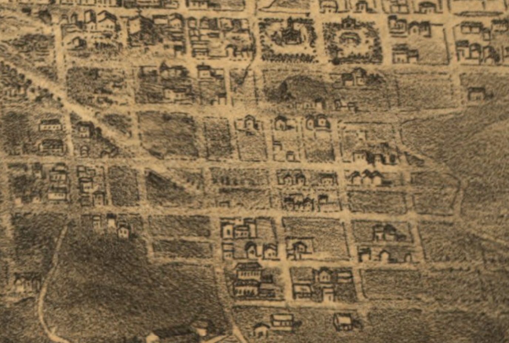

      1882 Faust’s Map & Guide of San Francisco: (unnamed streets)
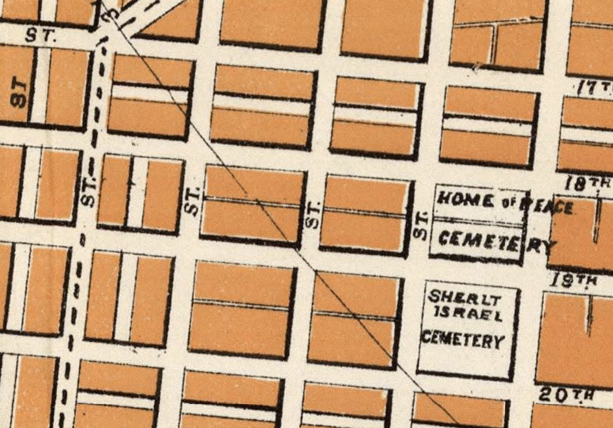

The 1886 Sanborn map shows ford going all the way through and touching Spaulding Ct.

That’s Matear House and its tank, right up against the edge of the
street. I suspect that Mr. Spaulding didn’t like the thought of a
street dead ending into his backyard, and either he or JP Treadwell (who
owned the rest of the block) paid to get it removed.

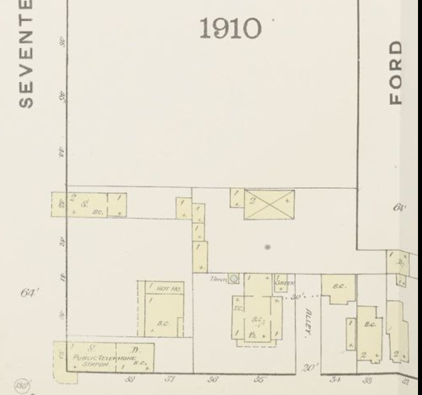

      1901 SF Block Book: missing from overview, but block 114 shows it
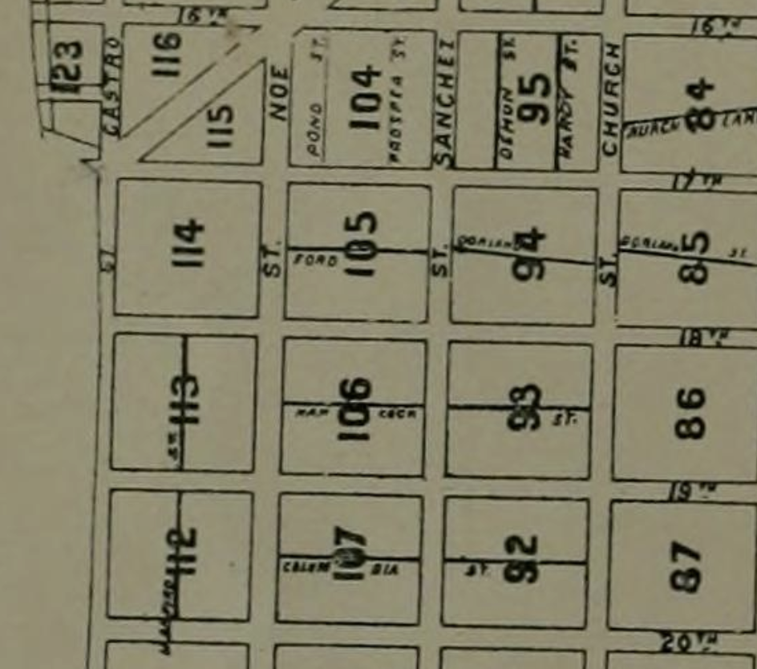

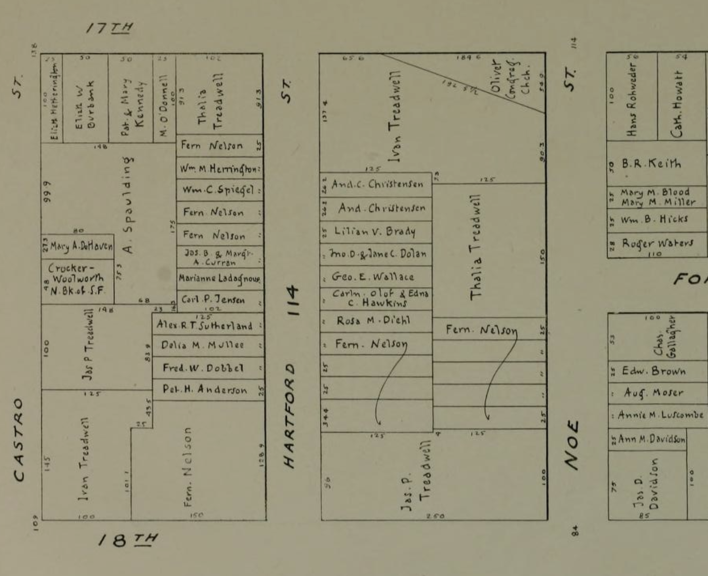

      Faust 1903: (when in doubt, put in both streets, and an intersection)
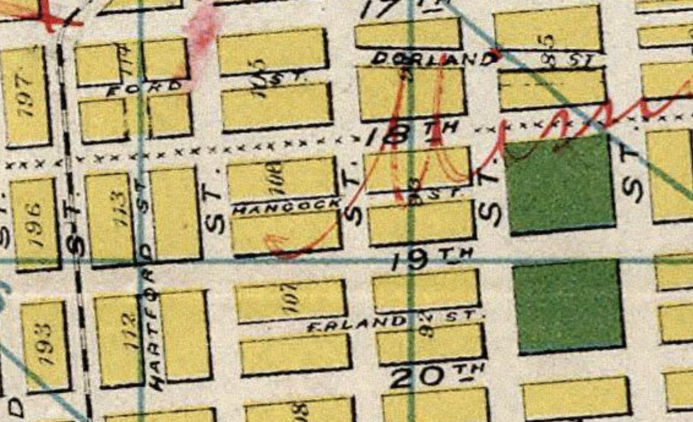

      1904, August Chevalier: (presumably based on old data)
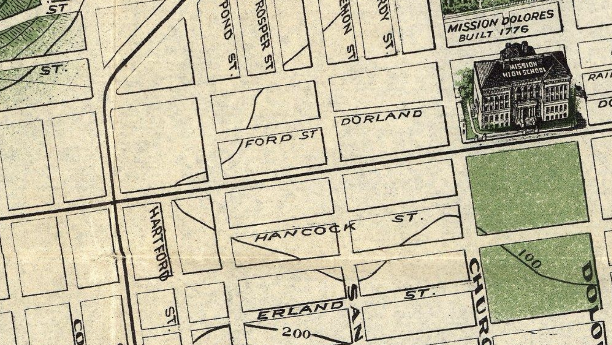

      1916 election precincts:
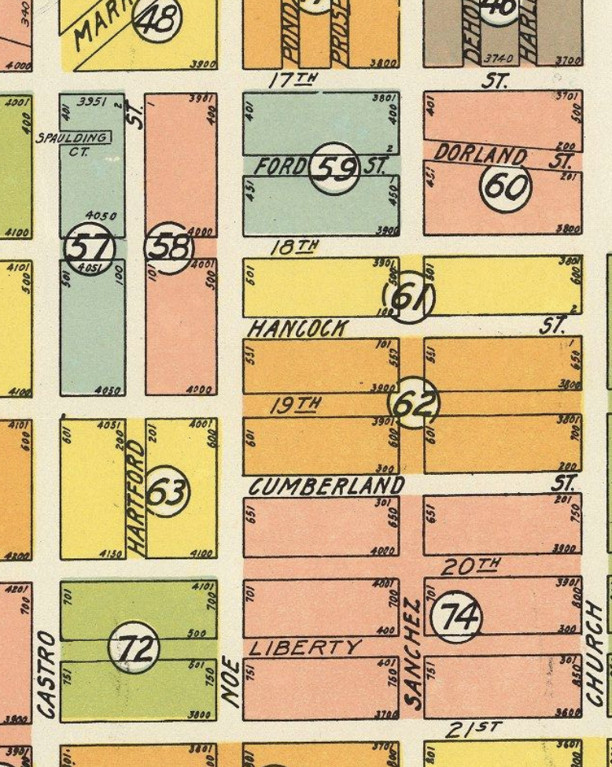
