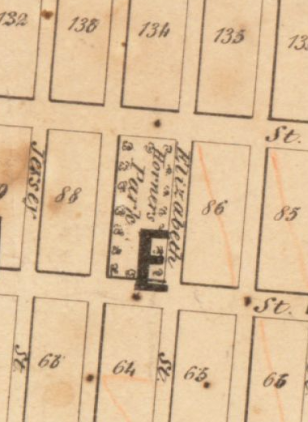
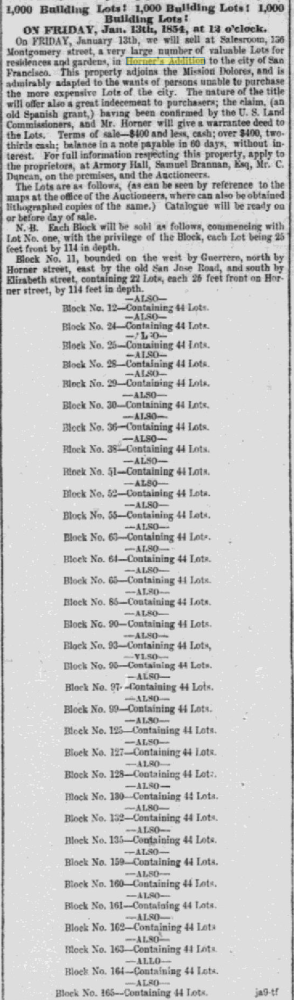
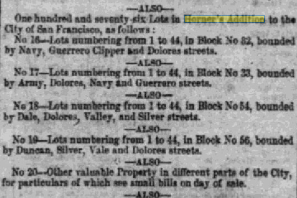
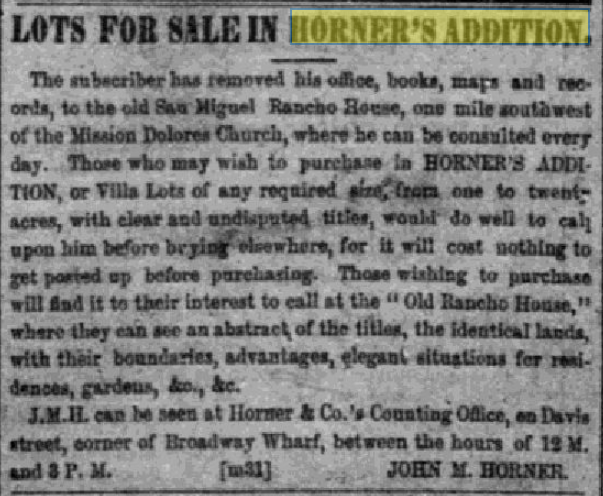
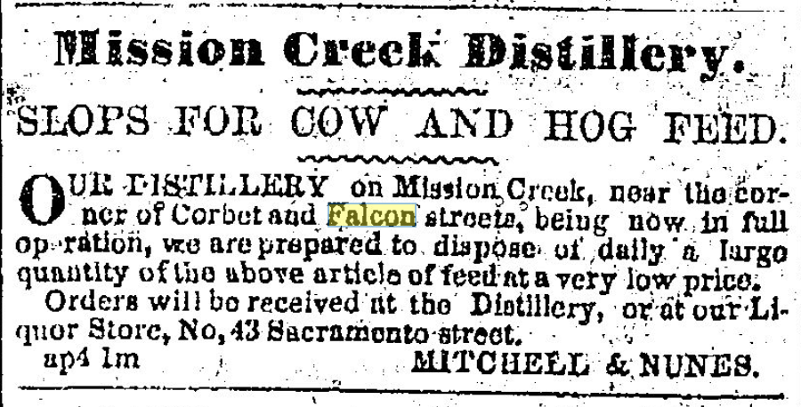
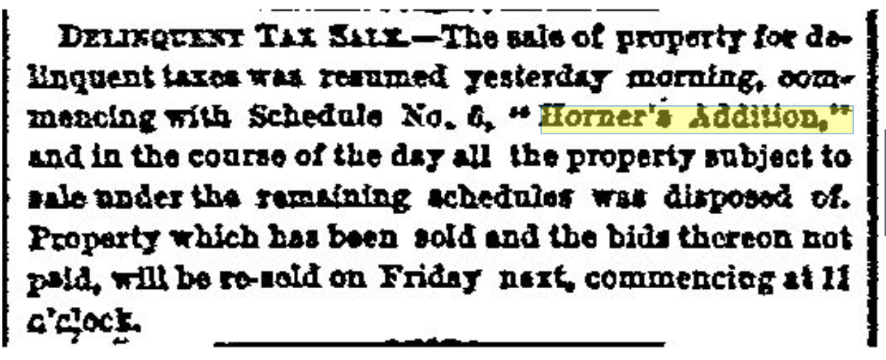

> "Subdivision of blocks in 'H.A.' [Horners Addition] as per map made for John M. Horner by J.J. Gardiner, City & Co. Surveyor, A.D. 1854 on January 1st.": ms. map on sheet 20 x 25.5 cm., mounted on lower half of lithographed map"For particulars refer to large map at J. M. Horners Office, Armory Hall, Montgomery St."  MS notes: Map of Horners addition Rancho de San Miguel or Noe Rancho. A copy of this map filed at the request of A. C. Thayer Nov 11, 63, 22 min past 10 O'clock. Rbbs 173 to 180 are now located on the new maps of the City....  Prime meridian: GM.  Relief: no.  Graphic Scale: Feet.  Projection: Cylindrical.  Printing Process: Lithography.  Verso Text: MS notes: 442362 Horners Addition.
[Map of San Francisco with Horners Addition](https://hdl.huntington.org/digital/collection/p15150coll4/id/3502/)

[Daily Placer Times and Transcript - January 10, 1854](https://infoweb-newsbank-com.ezproxy.sfpl.org/apps/news/openurl?ctx_ver=z39.88-2004&rft_id=info%3Asid/infoweb.newsbank.com&svc_dat=EANX-NB&req_dat=C4A791F4197B4BD28C27A2A6A0C93929&rft_val_format=info%3Aofi/fmt%3Akev%3Amtx%3Actx&rft_dat=document_id%3Aimage%252Fv2%253A11B56327F72F7EE7%2540EANX-NB-11BE41F06A163738%25402398229-11BE41F097B82C90%25402-11BE41F12843C510%2540Advertisement/hlterms%3A%2522horner%2527s%2520addition)

> 1,000 Building Lots! 1,000 Building Lots! 1,000 Building Lots!
> ON FRIDAY, Jan. 13th, 1854, at 12 o'clock.
> On FRIDAY, January 13th, we will sell at Salesroom, 136 Montgomery street, a very large number of valuable Lots for residences and gardens, in Horner's Addition to the city of San Francisco. This property adjoins the Mission Dolores, and is admirably adapted to the wants of persons unable to purchase the more expensive Lots of the city. The nature of the title will offer also a great inducement to purchasers; the claim, (an old Spanish grant,) having been confirmed by the U. S. Land Commissioners, and Mr. Horner will give a warrantee deed to the Lots. Terms of sale—$400 and less, cash; over $400, two-thirds cash; balance in a note payable in 60 days, without interest. For full information respecting this property, apply to the proprietors, at Armory Hall, Samuel Brannan, Esq, Mr. C. Duncan, on the premises, and the Auctioneers.
> The Lots are as follows, (as can be seen by reference to the maps at the office of the Auctioneers, where can also be obtained lithographed copies of the same.) Catalogue will be ready on or before day of sale.
> N. B. Each Block will be sold as follows, commencing with Lot No. one, with the privilege of the Block, each Lot being 25 feet front by 114 in depth.
> Block No. 11, bounded on the west by Guerrero, north by Horner street, east by the old San Jose Road, and south by Elizabeth street, containing 22 Lots, each 25 feet front on Horner street, by 114 feet in depth.
"Advertisement." Daily Placer Times and Transcript (San Francisco, California) V, no. 1164, January 10, 1854: [3]. NewsBank: San Francisco Chronicle Historical Archive. <https://infoweb-newsbank-com.ezproxy.sfpl.org/apps/news/document-view?p=EANX-NB&docref=image/v2%3A11B56327F72F7EE7%40EANX-NB-11BE41F06A163738%402398229-11BE41F097B82C90%402-11BE41F12843C510%40Advertisement>.

[Daily Placer Times and Transcript - January 30, 1854](https://infoweb-newsbank-com.ezproxy.sfpl.org/apps/news/openurl?ctx_ver=z39.88-2004&rft_id=info%3Asid/infoweb.newsbank.com&svc_dat=EANX-NB&req_dat=C4A791F4197B4BD28C27A2A6A0C93929&rft_val_format=info%3Aofi/fmt%3Akev%3Amtx%3Actx&rft_dat=document_id%3Aimage%252Fv2%253A11B56327F72F7EE7%2540EANX-NB-11BE41D774A0E680%25402398249-11BE41D7A3999620%25402-11BE41D85EA93670%2540Advertisement/hlterms%3A%2522horner%2527s%2520addition)

> —ALSO—
> One hundred and seventy-six Lots in Horner's Addition to the City of San Francisco, as follows:
> No 16—Lots numbering from 1 to 44, in Block No 32, bounded by Navy, Guerrero Clipper and Dolores streets.
> —ALSO—
> No 17—Lots numbering from 1 to 44, in Block No 33, bounded by Army, Dolores, Navy and Guerrero streets.
> —ALSO—
> No 18—Lots numbering from 1 to 44, in Block No 54, bounded by Dale, Dolores, Valley, and Silver streets.
> —ALSO—
> No 19—Lots numbering from 1 to 44, in Block No 56, bounded by Duncan, Silver, Vale and Dolores streets.
"Advertisement." Daily Placer Times and Transcript (San Francisco, California) V, no. 1181, January 30, 1854: [3]. NewsBank: San Francisco Chronicle Historical Archive. <https://infoweb-newsbank-com.ezproxy.sfpl.org/apps/news/document-view?p=EANX-NB&docref=image/v2%3A11B56327F72F7EE7%40EANX-NB-11BE41D774A0E680%402398249-11BE41D7A3999620%402-11BE41D85EA93670%40Advertisement>.

[Daily Placer Times and Transcript - March 31, 1854](https://infoweb-newsbank-com.ezproxy.sfpl.org/apps/news/document-view?p=EANX-NB&t=&sort=YMD_date%3AA&fld-base-0=alltext&maxresults=20&val-base-0=%22horner%27s%20addition&docref=image/v2%3A11B56327F72F7EE7%40EANX-NB-11BE421B52BC3038%402398309-11BE421B6DB074F8%401-11BE421BCB82BB48%40Advertisement)

> LOTS FOR SALE IN HORNER'S ADDITION.
> The subscriber has removed his office, books, maps and records, to the old San Miguel Rancho House, one mile southwest of the Mission Dolores Church, where he can be consulted every day. Those who may wish to purchase in HORNER'S ADDITION, or Villa Lots of any required size, from one to twenty acres, with clear and undisputed titles, would do well to call upon him before buying elsewhere, for it will cost nothing to get posted up before purchasing. Those wishing to purchase will find it to their interest to call at the " Old Rancho House," where they can see an abstract of the titles, the identical lands, with their boundaries, advantages, elegant situations for residences, gardens, &c., &c.
> J.M.H. can be seen at Horner & Co.'s Counting Office, on Davis street, corner of Broadway Wharf, between the hours of 12 M. and 3 P. M.                          JOHN M. HORNER.
"Advertisement." Daily Placer Times and Transcript (San Francisco, California) V, no. 1233, March 31, 1854: [2]. NewsBank: San Francisco Chronicle Historical Archive. <https://infoweb-newsbank-com.ezproxy.sfpl.org/apps/news/document-view?p=EANX-NB&docref=image/v2%3A11B56327F72F7EE7%40EANX-NB-11BE421B52BC3038%402398309-11BE421B6DB074F8%401-11BE421BCB82BB48%40Advertisement>.

Uhhh huh. Falcon and Corbett are parallel.

> Mission Creek Distillery.
> SLOPS FOR COW AND HOG FEED.
> OUR DISTILLERY on Mission Creek, near the corner of Corbet and Falcon streets, being now in full operation, we are prepared to dispose of daily a large quantity of the above article of feed at a very low price.
> Orders will be received at the Distillery, or at our Liquor Store, No, 43 Sacramento street.
> ap4 1m    MITCHELL & NUNES.

[San Francisco Bulletin - December 31, 1862](https://infoweb-newsbank-com.ezproxy.sfpl.org/apps/news/document-view?p=EANX-NB&t=&sort=YMD_date%3AA&page=4&fld-base-0=alltext&maxresults=20&val-base-0=%22horner%27s%20addition&docref=image/v2%3A113ACFC4DAF84818%40EANX-NB-117B344D19857668%402401506-117B344D8025E338%402-117B344ED95A8A20%40Delinquent%2BTax%2BSale)

> DELINQUENT TAX SALE.—The sale of property for delinquent taxes was resumed yesterday morning, commencing with Schedule No. 6, "Horner's Addition," and in the course of the day all the property subject to sale under the remaining schedules was disposed of. Property which has been sold and the bids thereon not paid, will be re-sold on Friday next, commencing at 11 o'clock.
"Delinquent Tax Sale." <em>San Francisco Bulletin</em> (San Francisco, California) XV, no. 71, December 31, 1862: [3]. <em>NewsBank: San Francisco Chronicle Historical Archive</em>. <https://infoweb-newsbank-com.ezproxy.sfpl.org/apps/news/document-view?p=EANX-NB&docref=image/v2%3A113ACFC4DAF84818%40EANX-NB-117B344D19857668%402401506-117B344D8025E338%402-117B344ED95A8A20%40Delinquent%2BTax%2BSale>.
