Nelson’s brother in law.

1881 Sept 28 Married Sarah J Brown [link](https://cdnc.ucr.edu/?a=d&d=OT18810930.1.4&srpos=18&e=-------en--20--1-byDA-txt-txIN-William+Hamerton-------) Sarah J Brown was Nelson’s wife’s sister.
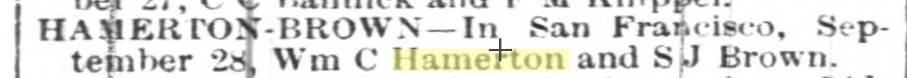

1882 Dec 7 bought property at 29th and Church
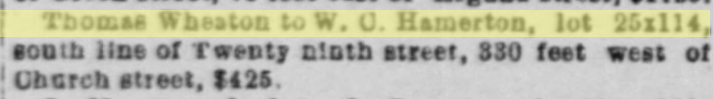

1889 Dec 10 - Nelson sold land and mortgaged it to relatives?
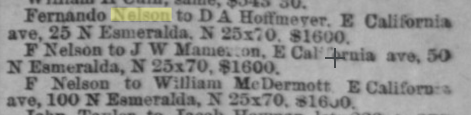
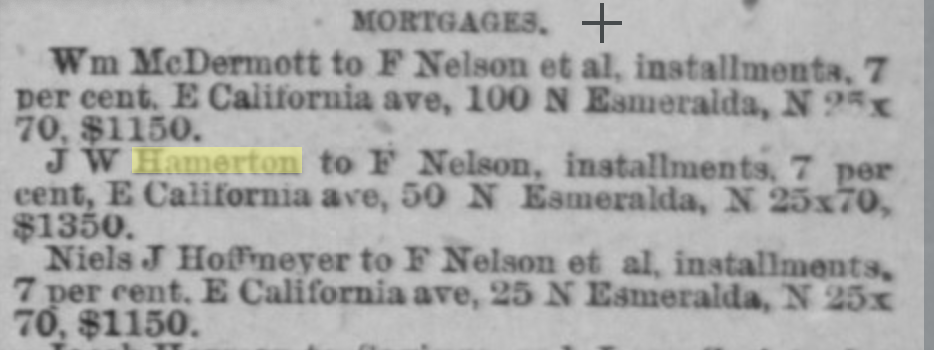

1890 Sept 7 - bailed out a friend?
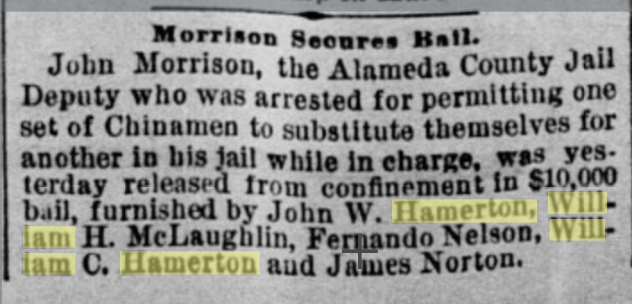

1890 Sept 17 - bought more at 29th and Church
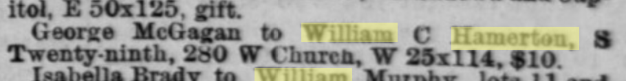

1891 April 10 - in business with BiL Fernando
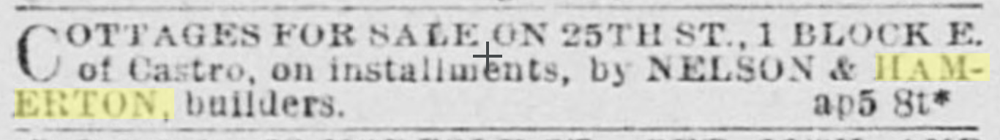

1892 Oct 13
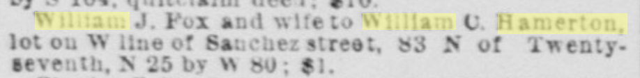

1893 May 7
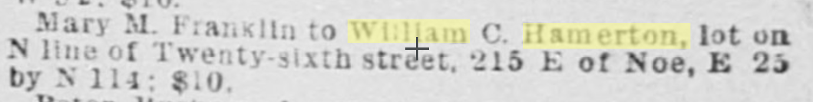

1893 July 25
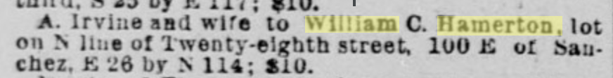

1893 Sept 4
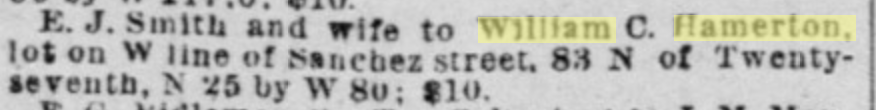

1893 Nov 11
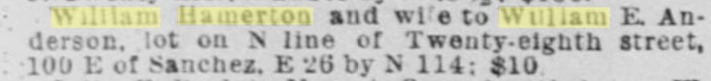

1895 March 15
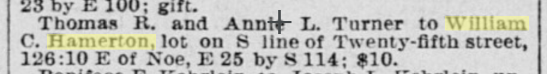

1895 April 4 - BiL on the next line
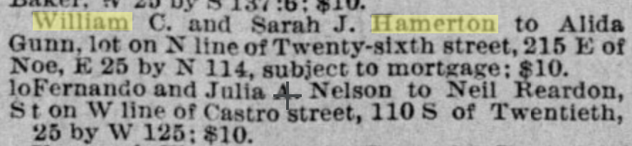

1895 April 25 - Who’s Sadie? Giving the nephew a place?  (Sadie is his daughter.)
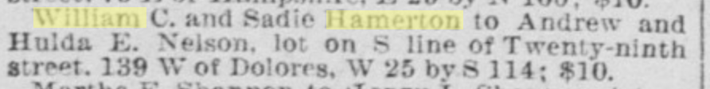

1895 May 23
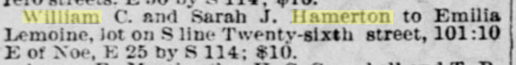

1895 Aug 1
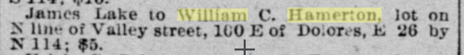

1895 Sept 26
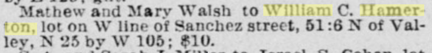

1895 Nov 7 - selling off some stock?
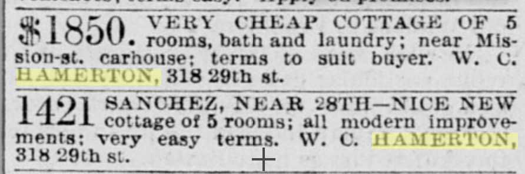

1896 Feb 13
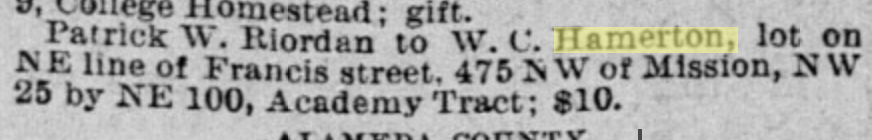

1896 April 9
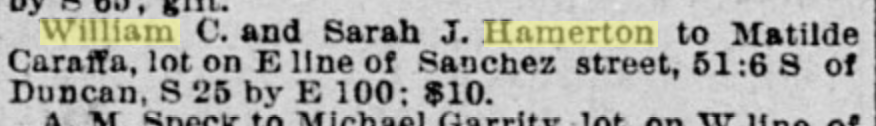

1896 May 19
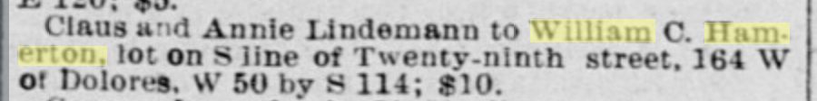

1896 Aug 6 - more into horses than cars it seems
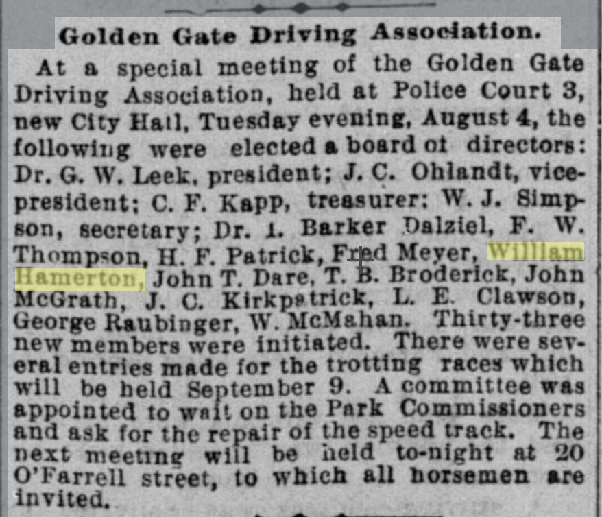

1896 Sept 10 - exciting race day?
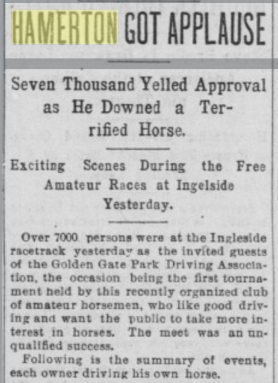
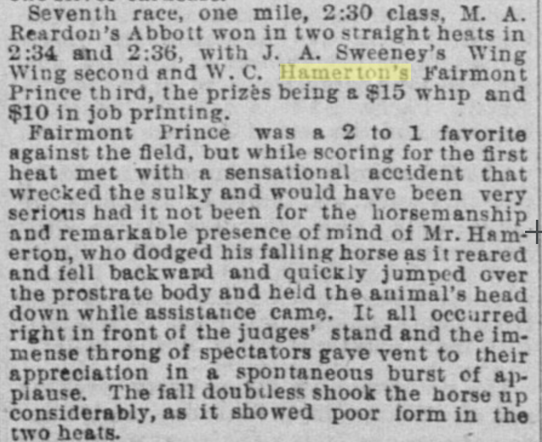

1896 Oct 23
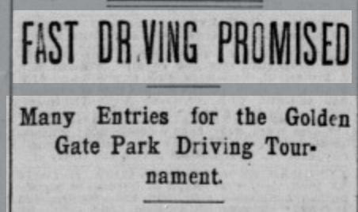
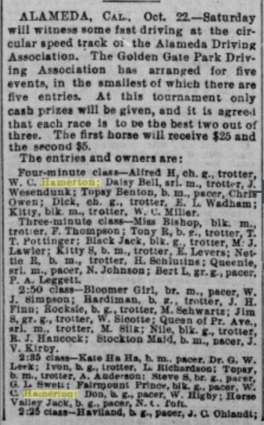

1897 Oct 8
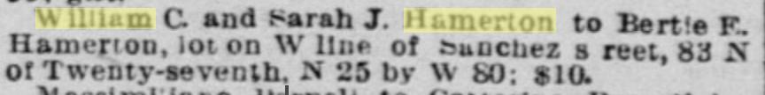

1898 Oct 27
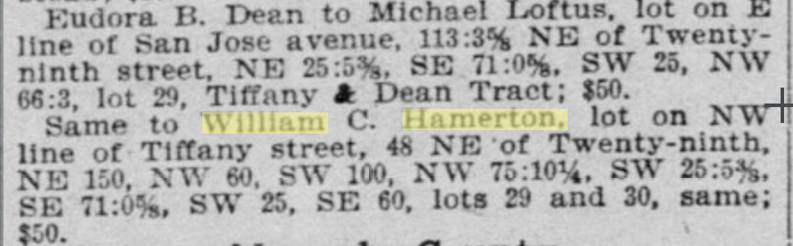

1898 Dec 23 - moving into Oakland
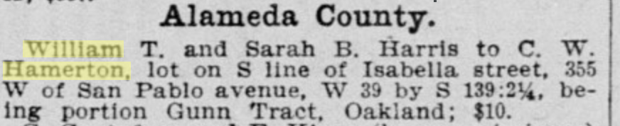

1899 Aug 8 - Gift map??
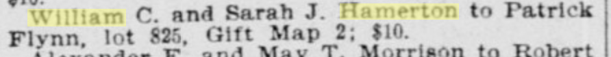

1900 Feb 14
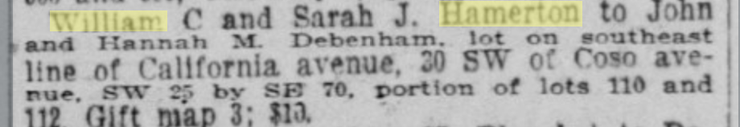

1900 May 25 - more racing, this time in Oakland ([link](https://cdnc.ucr.edu/?a=d&d=SFC19000525.2.41&srpos=144&e=-------en--20--141-byDA-txt-txIN-William+Hamerton-------)) Hamerton’s brother also participating sounds like
1900 May 25
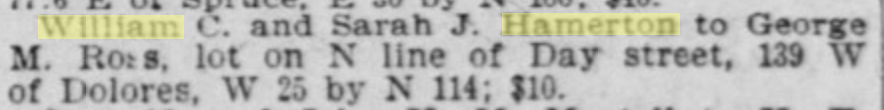

1900 May 29 - more racing, this time in Emeryville ([link](https://cdnc.ucr.edu/?a=d&d=SFC19000529.2.84&srpos=146&e=-------en--20--141-byDA-txt-txIN-William+Hamerton-------))

1900 June 23 - racing up in Santa Rosa for July 4th celebrations ([link](https://cdnc.ucr.edu/?a=d&d=SRPD19000623.2.36&srpos=150&e=-------en--20--141-byDA-txt-txIN-William+Hamerton-------))

1900 July 21
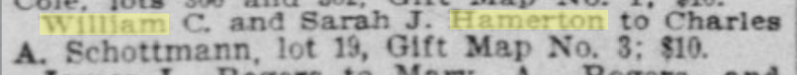

1901 March 26
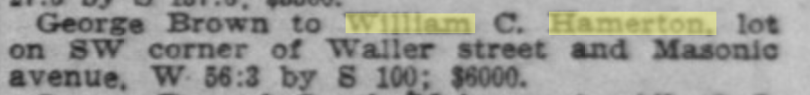

1901 Nov 16
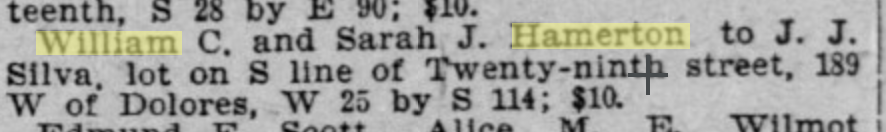

This is probably someone else - [Morning Echo, Bakersfield 1902 Feb 25](https://cdnc.ucr.edu/?a=d&d=BME19020225.1.7&srpos=171&e=-------en--20--161-byDA-txt-txIN-William+Hamerton-------)
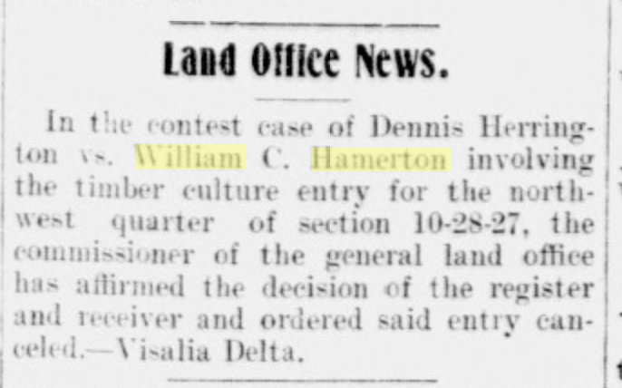

1902 July 17 - more racing, down in Los Angeles this time. ([link](https://cdnc.ucr.edu/?a=d&d=LAH19020717.2.89&srpos=174&e=-------en--20--161-byDA-txt-txIN-William+Hamerton-------))

1904 May 7 - selling/donating to the Roman Catholics?
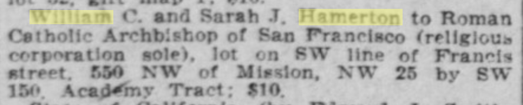

1904 May 21 - building contract huh
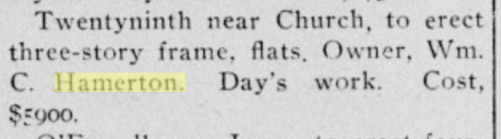

1905 April 21
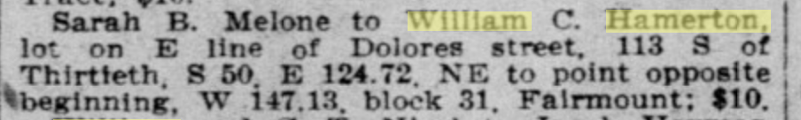

1905 July 8
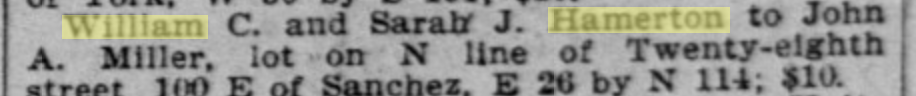

1905 Aug 12 - it’s "and sons" now
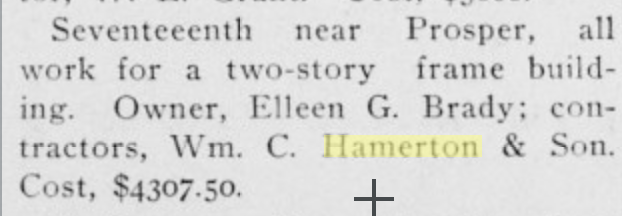

1906 Nov 29 - post fire, did we lose maps? "One other piece"
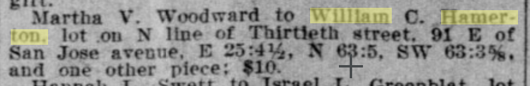

1906 Dec 21
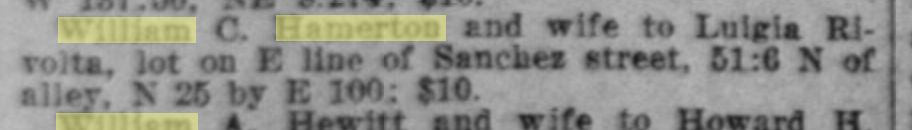

1907 Feb 28 - Woodward Subdivision??
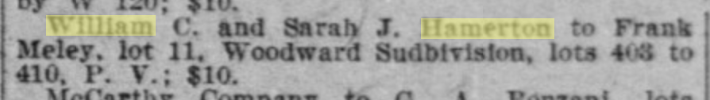

1907 Oct 18 - more racing, this time back on park speedway ([link](https://cdnc.ucr.edu/?a=d&d=SFC19071018.2.83.9&srpos=235&e=-------en--20--221-byDA-txt-txIN-William+Hamerton-------))

1908 Jan 30
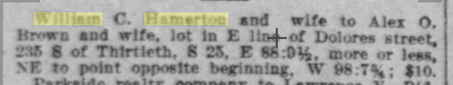

1909 April 24
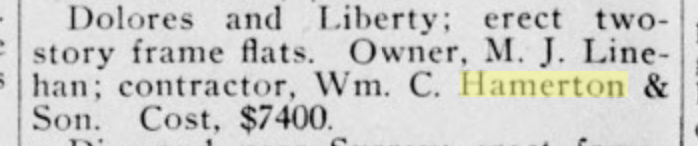

1909 July 31 - Sons?
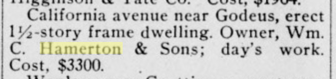

1910 Feb 19 
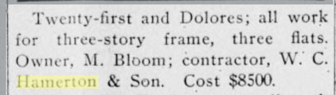

1910 March 23 - ah, that’s who Sadie was :( 
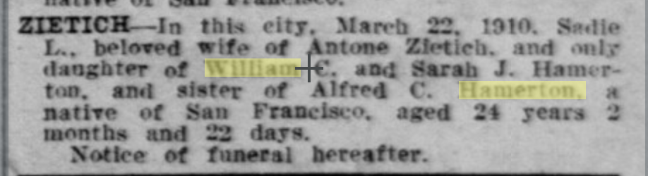

1910 May 25

1910 Oct 8

1910 Nov 19

1911 Feb 18

1911 Mar 4

1911 March 18

1911 Apr 13

1911 July 1

1912 Apr 27

1912 May 4 - Again?

1912 Dec 14

1913 June 7 - this is in Nelson’s Lincoln Terrace isn’t it?

1914 June 2 - son endorses car. ([link](https://cdnc.ucr.edu/?a=d&d=SRPD19140602.2.27.1&srpos=292&e=-------en--20--281-byDA-txt-txIN-William+Hamerton-------)) I wonder what dad thought of these since he seemed to take up horse racing in opposition to Nelson’s car-craziness.

1914 Nov 24

1914 Dec 12

1916 Oct 14

1919 May 31

1921 Feb 19 - building for Fernando Nelson in the new West Portal division?  After this we no longer see "WC Hamerton and Son" it's just AC. [link](https://cdnc.ucr.edu/?a=d&d=OLSF19210219.2.37&srpos=2&e=------192-en--20--1-byDA-txt-txIN-hamerton+nelson+taraval-------)

Alfred C Hamerton has an architecture entry: [https://pcad.lib.washington.edu/person/1411/](https://pcad.lib.washington.edu/person/1411/)
