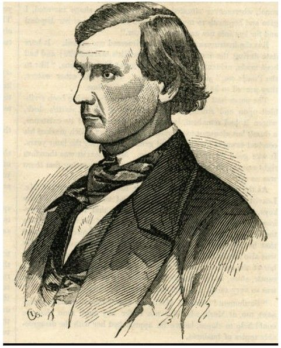

b. June 15, 1821
d. May 14, 1907 (in Hawaii)

Arrived in CA in 1846 on the Brooklyn with Sam Brannan.
Originally a teacher in New Jersey, began farming in Mission San Jose in 1847, bought 30,000 acres from Pio Pico and put it to the plow, making immense profits which he in turn invested into more land. Founded Union City, and lived along its north edge - then known as Centerville.

_1854 engraving from [Gleason's Pictorial Drawing Room Companion](https://www.google.com/books/edition/Gleason_s_Pictorial/4fbsSupGupQC?hl=en&gbpv=1&dq=%22Mr.%20Horner%2C%20the%20Greatest%20Farmer%20in%20California%22&pg=RA1-PA164&printsec=frontcover) "Mr. Horner, the Greatest Farmer in California."_

- Established a commission house (store) in San Francisco, under the firm name of J. M. Horner & Co., to sell their own and others' produce.
- We secured by purchase the steamer Union to carry our produce to market.
- First agricultural fair. (And second)
- Flouring mills not being sufficient in California at this time, we built one at Union City, with eight run of burrs, at a cost of eighty-five thousand dollars, and ground our grain and that of others.
- We equipped and ran a stage line in connection with our steamer, as far up the valley as San Jose, twenty-five miles. Thus completing a through passenger line from San Francisco to San Jose. We opened sixteen miles of public roads, mostly through our own land, and fenced the larger part on both sides.

> the unsettled state of land titles rendered investments in land almost as hazardous as depositing money in commercial banks, as we found to our cost. The United States opposed all land titles. and requested proof of their genuineness to be made before its land commissioners, reserving the right of appeal to its district court, in the event the commissioners decided against the government; and to appeal again to its supreme court, if the district court decided against it. Thus years of costly law suits, and in some cases ruin to owners of land titles, intervened before final settlement. We suffered from the law's delay in settling titles, and from squatters keeping from as, by force, a goodly portion of our lands, being encouraged to do so by the government; for as long as the government withheld final confirmation, the squatter continued to hold possession, however good the title. We suffered more mentally and financially during these years from the above named causes, than from all floods and four-footed animals in former years.

Purchased some part of Rancho San Miguel from [Jose de Jesús Noé](/people/noe/) in mid 1853 and called it "Horner's Addition". This was when the land and titles were all very confused with the delayed conversion of the Californio lands.

[Via SF Genealogy](https://legacy.sfgenealogy.org/sf/history/hgoe04.htm):

> "In San Francisco county, we paid two hundred and eighty-five thousand dollars for five thousand two hundred and fifty acres of land adjoining the city of San Francisco, and expended nearly eight thousand dollars upon it in surveys, fences and other improvements. One thousand and fifty acres of these lands we surveyed and staked into streets, blocks, and lots, extending the streets of San Francisco over it. It is now, and has been for over thirty years, a part of that flourishing city." —John M. Horner

He says a large number of squatters devalued his property:
> [...] the closer these squatters could get to San Francisco, the better they liked it; and if the land was surveyed and staked into streets, blocks, and lots, the better, as then they could and did sell lots cheap to innocent parties.

Basically, with the owners living in Union City, there was little or nothing that could be done to prevent some random guy from setting up shop and selling the lots to unwary newcomers.

> There is an interesting account of the early days of the development of Horner's Addition in the writings of Caroline Barnes Crosby who lived with the Horner's during 1854 and 1855. One the accounts read:

>> "Sun 29th [January 1854] A beautiful pleasant morning. . .Alma Frances and myself took a walk over the hills, to take a view of br Horners new purchase, and to get a peep at the Spanish house where we expect to reside, after a few weeks. We admired the scenery very much; and think in short time it will be a great place. We walked from bluff to bluff untill we arrived at the top of a high one nearly in front of the dobie house where the spaniard resides of whom Mr H bought the land. We then sat down to admire the prospect. And we came to the conclusion that altho it was not quite retired, yet it was a most beautiful and romantic place. . ." [pages 239-240]

Started the Eureka Homestead Association, but very few lots sold.[The Panic of 1854-7](https://en.wikipedia.org/wiki/Panic_of_1857) took out his and his brothers' investments.

> ...the first wave of money panic struck California, and swept over America with such disastrous results, from 1853 to 1859. [...] thousands of tons of farm products were never sent to market, for there was no sale; good potatoes were ten cents per bushel, but there were no ten cents
> All this happened in the Golden State of California, in 1854, where millions of gold and silver were dug from its mines every month. Most, or all, of it was sent to San Francisco as soon as produced, and tons of it were hoarded in banks, treasury vaults, napkins, old bonnets, and other places, thought safe to keep money, after drawing it from the banks. Gold was gloated over and worshiped. A man with a few hundred dollars in gold coin was independent, while the owner of scores of thousands of property was poverty stricken, and permitted it to be sold for taxes, and in some cases never redeemed it. Some with ready money held it for purchasing properties at the depreciated rates for which it was sold by the sheriff, and money could not be borrowed on real estate, however good the title.

Ended up in "The Sandwich Islands" (Hawaii) because he heard from Spreckels that there were about to be large sugar cane plantations started in Maui. So thither went he and the rest is history.

> ...At this time my oldest son was cultivating sugar cane in the Hawaiian Islands, and hearing that Mr. Claus Spreckels was about to open the largest sugar plantation known, he advised us to see Mr. Spreckels and get a contract from him to cultivate cane for him. If we could do so, he thought, we would do better in the Islands than in California.
> We saw Mr. Spreckels, and contracted with him to go to the islands and cultivate cane on shares. In fulfillment of this contract we sold our farms, chartered a schooner, and placed there in our families—eighteen souls—our household eflects, horses and farming tools, and started for the islands, where we arrived on the 25th of December, 1879.

<https://en.wikipedia.org/wiki/John_M._Horner>
<https://www.foundsf.org/index.php?title=The_Farmer_with_the_Golden_Plow:_John_Meirs_Horner_(1821-1912)>
<https://imagesofoldhawaii.com/john-meirs-horner/>

---

Certainly was an [opinionated old coot in his dotage](https://search.worldcat.org/search?q=au%3D%22Horner%2C+J.+M.%22&author=Horner+J+M%7CHorner%2C+J.+M&orderBy=publicationDateAsc&datePublished=1830-1910).

---
_[National finance and public money; settling the money question; government ownership of railroads and telegraphs;](https://archive.org/details/nationalfinancep00hornrich/page/n1/mode/2up) by J. M. Horner AND [Some Personal History of the Author](https://archive.org/details/nationalfinancep00hornrich/page/n257/mode/2up)_

Archive.org produced an OCR, and I've [excerpted his autobiography here](horner_autobiography.txt).

---
[Voyage of the Ship Brooklyn, by John M. Horner](https://archive.org/details/improvementera0910unse/page/794/mode/1up?q=brooklyn) from _Improvement Era_ Aug 1906
[Part 2 of same](https://archive.org/details/improvementera0911unse/page/890/mode/1up?q=horner), Sept 1906

Excerpted [in text form here](horner-voyage_of_the_brooklyn.txt)

---
Excerpted from [California and Californians Vol 4](https://www.google.com/books/edition/California_and_Californians/-fgHAQAAIAAJ?hl=en&gbpv=1&dq=john%20m%20Horner&pg=PA365&printsec=frontcover) 1926 by Rockwell D. Hunt and Nellie Van de Grift Sanchez

> JOHN MEIRS HORNER At the first agricultural fair in John Meirs Horner was awarded the silver medal and officially given title of Pioneer Farmer of California His experiences and achievements are of extraordinary interest in the history of the state
> He was born on a farm in Monmouth County New Jersey June 15 1821 He lived there to the age of twenty one securing a good school education but his bent was always in the direction of farming For several years he hired out to a farmer for 9 a and also taught school Then while continuing his teaching during time he spent several summers in the West as far out as Iowa Kansas seeking a favorable place for farming Not finding as regarded as good opportunities in the West he returned East in and married a neighbor's daughter They took their honeymoon on lengthy sea voyage around Cape Horn by way of the Juan Island and the Hawaiian Islands and after six months on the sea traveling 18,000 miles they arrived in California On reaching they first learned that war had broken out between the United States Mexico At San Francisco was collected a little community of forty people called Yerba Buena Going to lower San Joaquin Mr Horner sowed forty acres of grain and harvested a good crop next year 1847 he moved to a more favorable situation at San Jose In 1848 he rented a piece of land from an Indian built a two room house and while it was necessary to guard his crops almost night and day the incursion of wild animals he made a profit from his venture
> In October and November 1849 came the gold hunters to by land and sea and they craved nothing more than vegetables Mr Horner was the only farmer who had an abundance of vegetables for sale The newcomers traveled from the mines 200 miles distance to wagon loads of produce at fair prices His first crop in 1849 8,000 In 1850 his brother William came by way of the Isthmus was made a partner in the business They enclosed and farmed 500 acres that year the total volume of sales aggregating 150,000 Onions sold at 40 per hundred tomatoes at 300 per ton and potatoes at 150 per ton To sell their crop in 1850 they opened the commission house JM Horner & Company in San Francisco In 1851 they bought steamboat The Union to carry produce to market and that year did business of more than 275,000 In 1853 the potato crop was in excess of 22,000,000 pounds besides 1,500 acres of wheat barley cabbages onions and tomatoes
> The Horners built a flour mill at Union City at a cost of 85,000 and they also equipped and ran a stage line in connection with the steamer as far as San Jose Due to their enterprise fifteen miles of road were opened and these remained traveled thoroughfares into modern times During 1851 52 they purchased 450 acres then known as Potereo Nuevo and soon afterward bought 5,000 acres adjoining for 200,000 in the Potereo district Six hundred acres were laid out in lots and streets and JM Horner gave the names which have for the most part since been retained This was called Horner's Addition No planting of and bushes had been made and fencing material had to be hauled twenty five miles It was very difficult to secure nails spikes or hinges rawhide was made to answer the purpose instead The Indians were mechanics making carts saddles shoes and houses and also did of the agricultural labor in the fields
> In 1857 came the panic which completely destroyed the agricultural promise and prosperity development by Mr Horner Thou sands of tons of farm produce were never sent to market Potatoes offered for 10 cents per bushel Millions of gold and silver were dug from the mines in California and tons were hoarded in banks treasury vaults The man with a few hundred dollars in gold was inde pendent while the owner of property that cost hundreds of thousands of gold was hard up and in many cases he allowed his property to sold for taxes That property costing Mr Horner 280,000 was away to pay a 40 endorsement and in the end he was back at the condition financially that he had started seven years previously Even his watch had gone in the settlement of debt
> About the same time occurred illness which robbed him of one of his daughters and he himself was sickened with lockjaw and his life was despaired of for several months After recovering he took a to build a bridge over the Alameda River for the county and 300 from it
> Finally in 1879 Claus Spreckles contracted with JM Horner to go to the Sandwich Islands and cultivate sugar cane on the shares he recovered himself financially and in time had developed another for tune estimated at around half a million For many years he was associated in business with his brother William Y Horner who February 21 1898
> John M Horner himself died at Honolulu in 1902 at the age eighty one His life story of which the above is a very record was written out by himself and published at the end of a volume which he wrote on the financial history of the Hawaiian Islands
> The children of John M Horner were Josephine Horner Blacow of Alhambra California Albert Horner and Robert Horner both in Honolulu Mrs Frank W Taylor of 4455 Park Boulevard Oakland and William Horner who died in 1925 and was born in 1847 one of first American native sons of California
