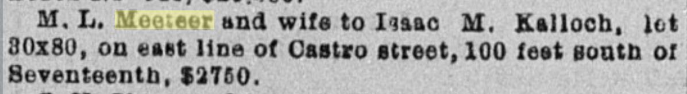

 Meeteer to Isaac Kalloch & separately Annie?

Kallochs arrive  [Daily Alta California, Volume 30, Number 10426, 28 October 1878](https://cdnc.ucr.edu/?a=d&d=DAC18781028.2.46&srpos=1&e=-------en--20-DAC-1-byDA-txt-txIN-+Kalloch+castro-------)

[Daily Alta California, Volume 32, Number 10938, 26 March 1880](https://cdnc.ucr.edu/?a=d&d=DAC18800326.2.44&srpos=3&e=-------en--20-DAC-1-byDA-txt-txIN-%22meeteer%22-------)

> M. L. Meeteer and wife to Isaac M. Kalloch, lot 80x80; on east Una of Castro street, 100 feet South of Seventeenth, $2750. 

[Daily Alta California, Volume 32, Number 11023, 19 June 1880](https://cdnc.ucr.edu/?a=d&d=DAC18800619.2.48&srpos=3&e=-------en--20-DAC-1-byDA-txt-txIN-+Kalloch+castro-------)
> M. L. McCleer and wife to Annie F. Kalloch, lot 68x80, commencing 80 feet east of Castro street, and 180 south of Seventeenth, $5.
