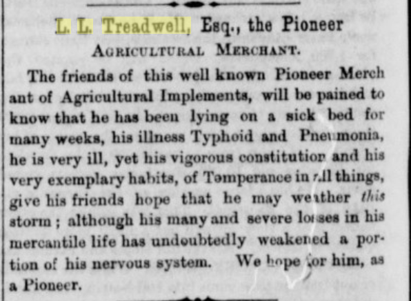
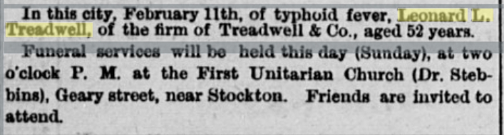
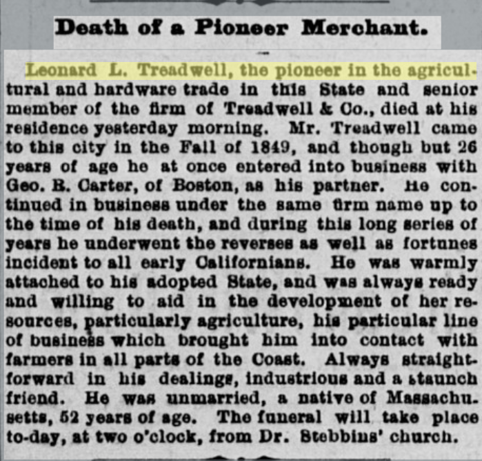
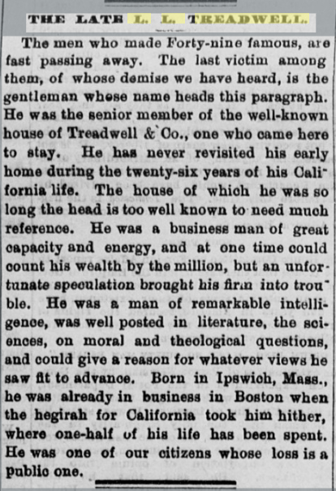
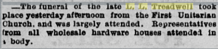
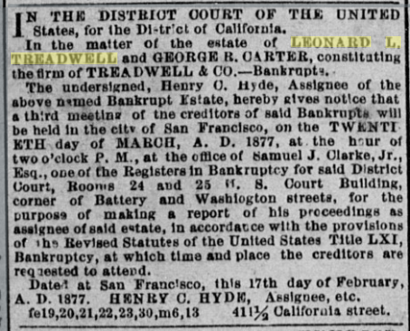
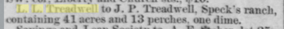
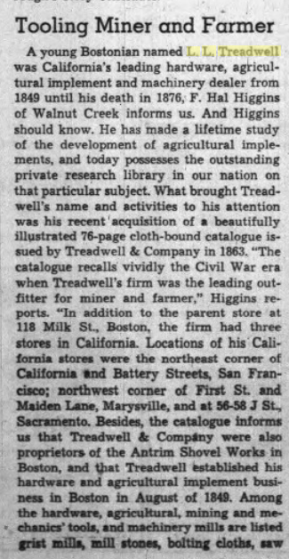
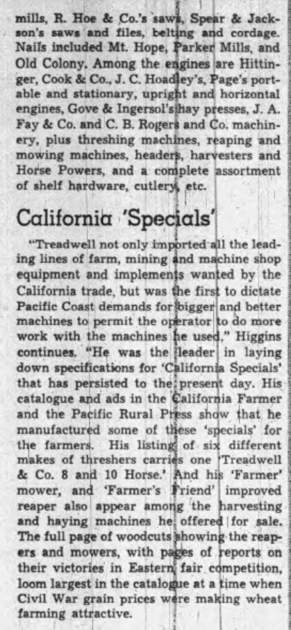
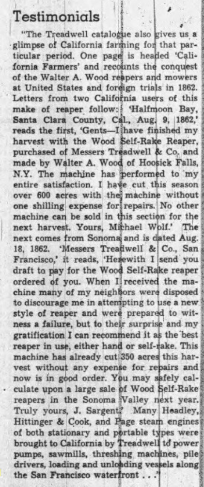

Leonard L Treadwell

>L. L Treadwell, Esq. the Pioneer
> Agricultural Merchant.
> The friends of this well known Pioneer Merchant of Agricultural Implements, will be pained to know that he has been lying on a sick bed for many weeks, his illness Typhoid and Pneumonia. he is very ill, yet his vigorous constitution and his very exemplary habits, of Temperance in all things, give his friends hope that he may weather this storm ; although his many and severe buses in his mercantile life has undoubtedly weakened a portion of his nervous system. We hope for him, as a Pioneer.
[California Farmer and Journal of Useful Sciences, Volume 44, Number 20, 3 February 1876](https://cdnc.ucr.edu/?a=d&d=CF18760203&e=-------en--20--141-byDA-txt-txIN-%22l+l+treadwell%22-------)

>In this city, February 11th, of typhoid fever, Leonard L. Treadwell, of the firm of Treadwell & Co., aged 52 years.
>Funeral services will be held this day (Sunday), at two o’clock P. M at the First Unitarian Church (Dr. Stebbins), Geary street, near Stockton. Friends are invited to attend.
[Daily Alta California, Volume 28, Number 9444, 13 February 1876](https://cdnc.ucr.edu/?a=d&d=DAC18760213.2.57.1&srpos=20&e=-------en--20--1-byDA-txt-txIN-%22leonard+l+treadwell%22-------)

> Death of a Pioneer Merchant.
>Leonard L. Treadwell, the pioneer in the agricultural and hardware trade in this State and senior member of the firm of Treadwell & Co., died at his residence yesterday morning. Mr. Treadwell came to this city in the Fall of 1849, and though but 26 years of age he at once entered into business with Geo. B. Carter, of Boston, as his partner. He continued in business under the same firm name up to the time of his death, and during this long series of years he underwent the reverses as well as fortunes incident to all early Californians. He was warmly attached to his adopted State, and was always ready and willing to aid in the development of her resources, particularly agriculture, his particular line of business which brought him into contact with farmers in all parts of the Coast. Always straightforward in his dealings, industrious and a staunch friend. He was unmarried, a native of Massachusetts, 62 years of age. The funeral will take place to-day, at two o’clock, from Dr. Stebbins’ church.
[Daily Alta California, Volume 28, Number 9444, 13 February 1876](https://cdnc.ucr.edu/?a=d&d=DAC18760213.2.13&srpos=19&e=-------en--20--1-byDA-txt-txIN-%22leonard+l+treadwell%22-------)

> THE LATE L. L. TREADWELL.
> The men who made Forty-nine famous, are fast passing away. The last victim among them, of whose demise we have heard, is the gentleman whose name heads this paragraph. He was the senior member of the well-known house of Treadwell & Co., one who came here to stay. He has never revisited his early home daring the twenty-six years of his California life. The house of which he was so long the head is too well known to need much reference. He was a business man of great capacity and energy, and at one time could count his wealth by the million, but an unfortunate speculation brought his firm into trouble. He was a man of remarkable intelligence, was well posted in literature, the sciences, on moral and theological questions, and could give a reason for whatever views he saw fit to advance. Born in Ipswich, Mass., he was already in business in Boston when the hegirah for California took him hither, where one-half of his life has been spent. He was one of our citizens whose loss is a public one.
[Daily Alta California, Volume 28, Number 9444, 13 February 1876](https://cdnc.ucr.edu/?a=d&d=DAC18760213.2.36&srpos=142&e=-------en--20--141-byDA-txt-txIN-%22l+l+treadwell%22-------)

> The funeral of tho late L. L. Treadwell took place yesterday afternoon from the First Unitarian church, and was largely attended. Representatives from all wholesale hardware houses attended In \ body.
[Daily Alta California, Volume 28, Number 9445, 14 February 1876](https://cdnc.ucr.edu/?a=d&d=DAC18760214.2.9&srpos=143&e=-------en--20--141-byDA-txt-txIN-%22l+l+treadwell%22-------)

## Bankrupt estate notice

> IN THE DISTRICT COURT OF THE UNITED States, for the District of Columbia
> In the matter of the estate of LEONARD L. TREADWELL and GEORGE R. CARTER, constituting the of TREADWELL & CO.— Bankrupts*. • . 1
> The undersigned , Henry 0. Hyde, Assignee of the above named Bankrupt Estate, hereby gives notice that a third meeting of the creditors of said Bankrupts will be held in the city of San Francisco, on the TWENTIETH day of MARCH, A. D. 1877, at the hour of two o'clock P. M., at the office of Samuel J. Clarke, Jr., Esq. one of the the Registers in Bankruptcy for said District Court, Rooms 24 and 25 U.S. Court Building, corner of Battery and Washiogton streets, for the [jurposs "of « making a report of bis proceedings ag assignee of ssld e«tate, In accordat.ee with the provlßlonti of tin Bevlsed SUtutts of the United States Title LXI, Bankruptcy, at which time aud place ; the creditors are requested to attend. i r .... • ' . Date? at : San " Francisco,' this : 17th day of February, A. I). 1877. H BY. o.' HYDK, Assignee, etc. 411% California street.
[Daily Alta California, Volume 29, Number 9824, 1 March 1877](https://cdnc.ucr.edu/?a=d&d=DAC18770301.2.52.3&srpos=22&e=-------en--20--21-byDA-txt-txIN-%22leonard+l+treadwell%22-------)

## 1887 postmortem transfers????

> L. L. Treadwell to J. P. Treadwell, Speck's ranch, containing 41 acres and 13 perches, one dime.
[Daily Alta California, Volume 42, Number 13840, 23 July 1887](https://cdnc.ucr.edu/?a=d&d=DAC18870723.2.59&srpos=149&e=-------en--20--141-byDA-txt-txIN-%22l+l+treadwell%22-------)

## 1955 retrospective

[Oakland Tribune, Volume 163, Number 178, 25 December 1955](https://cdnc.ucr.edu/?a=d&d=OT19551225.1.41&srpos=150&e=-------en--20--141-byDA-txt-txIN-%22l+l+treadwell%22-------)

>ToolinCf Miner and Farmer A young Bostonian named L. L. Treadwell was California's leading hardware, agricultural implement and machinery dealer from 1849 until his death in 1876; F. Hal Higgins of Walnut Creek informs us. And Higgins should know. He has made a lifetime study of the development of agricultural implements, and today possesses the outstanding private research library in our nation on that particular subject. What brought Treadwell's name and activities to his attention was his recent ' acquisition of a beautifully illustrated 76-page cloth-bound catalogue issued by Treadwell & Company in 1863.. "The catalogue recalls' vividly the Civil War era when TreadweU's firm was the leading outfitter for miner and farmer," Higgins reports. "In addition to the parent store at 118 Milk St., Boston, the firm had three stores in California. Locations of his' California stores were the northeast corner of California and Battery Streets, San Francisco; northwest ; corner of First St and Maiden Lane, Marysville, and at 55-53 J St, Sacramento. Besides, the catalogue informs us that Treadwell in Complny were also proprietors of the Antrim Shovel Works in Boston, and that Treadwell established his hardware and agricultural implement business in Boston in August of 1849. Among the hardware, agricultural, mining and mechanics tools, and machinery mills are listed grist mills, cull stones, bolting cloths, sawmills, R. Hoe & Co.'s saws, Spear & Jack- f son's saws 'and files,1 beltfng and cordage, -f Nails included Mt. Hope, Parkeif Mills, and Old Colony. Among the engines are Hittin- ? ger, Cook & Co., J. C. Hoadf ey's, Page's port- f able and stationary, uprigfit and horizontal ? engines, Gove & Ingersol'sjhay presses, J. A. f; Fay & Co. and C. B. Roger! and Co. machinery, plus threshing machines, reaping and i mowing machines, header, harvesters and Hor'se Powers, and a complete assortment f of shelf hardware, cutlery etc. j J Californih'Specids "Treadwell not only impbrtedall the leading lines of farm, mining nd machine shop X equipment and implements wanjted by1 the California trade, but was the firsji to dictate Pacific Coast demands for fbigger land. better machines toi permit the operator o do more work with the machines lie usecj," Higgins continues. fHe was j the fleader in laying down specifications for .'California Specials' that has persisted to the; present day. His -catalogue arid ads in the California Farmer t and the Pacific Rural Press show ihat he i manufactured some of tnese 'specials' for f the farmers. His listing of six different makes of threshers carries one Treadwell & Co. 8 and 10 Horse.' ihd his 'Farmer' mower, and 'Farmer's friend' j improved reaper also j appear amorjg the harvesting -k and haying machines he offere for sale. The full page of woodcuts howing-the reapers and mowers, with pagjes of reports on j their victories in Easternf fair, competition, f loom largest, in the catalogue at a Ijme when kivil war gram prices were making wneai farming attractive. I i Testimonials j . 1 "The Treadwell catalogue also gives us a glimpse of California farming fori that par ticular neriod. One naee is hea ked Cali fornia Farmers' and recounts the conqu: est of the Walter A. Wood reapers and mowers at United States and foreign trials' in 186? Letters from two California users of this make of reaper follow: I 'Halfmoon Bay, Santa Clara County, Cal., Aug 9, 1862 reads the first, 'Gents Ifhave finished my harvest with the Wood iSelf-Rak-e Reaper, purchased of Messers Treadwell It Co. and made by Walter A. Woo4 .of Hoosick Falls, N.Y. The nlachine has performed to 'my entire satisfaction. I hae cut.ttis season h over 600 acfes with the machine without one shilling1 expense fork repairs.! No other machine can be sold in tjiis section for the I next harvest Yours, Mijbhael Wblf The next comes irom Sonoma and is dated Aug. 18 1862. 'Messers Treapwel! & Co., San. Francisco,' it reads, i'Heewith I send you draft to playj for the Wool Self -Rake reaper f ordered o'f you. When I j received! the machine many of my neighbors were disposed to discourage me in attempting to Use a new style of reaper and were preparqd to wit-! ness a failure, but to their surprise' and my t gratification! I can recommend it a the 'best ) reaper in use, either hand or self-i ake. This machine has already cut '350 acres this har- f vest without any expense for re jairs and now is in good order. Yu may safely cal-f culate upon a large sale pf Wood self-Rake v Truly yours, J. Sargent' .Many. Headley,r Hittinger & :Cook, and Page steam engines I of both stationary and portable tv pes were brought to California by Treadwel td power pumps, sawmUls, threshing machines, pilef drivers, loading and unloading vessels along I the San Francisco waterfront . . .':
