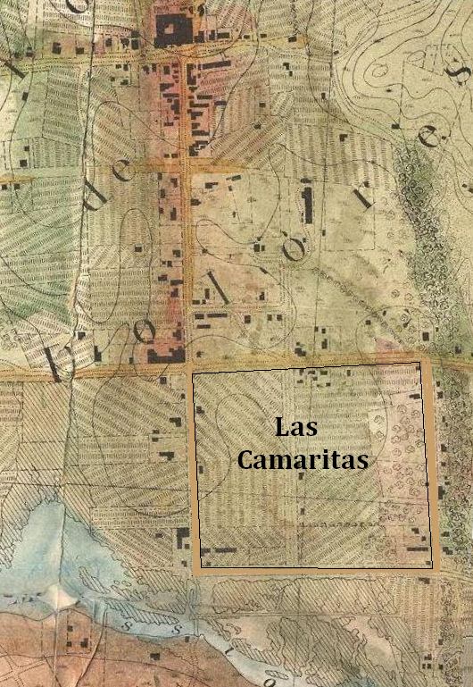

1805 – 17 March 1862

José de Jesús Noé was a prominent Californio farmer and rancher (although his original profession was listed as "tailor"), and the last Hispanic Alcalde (roughly equivalent to a mayor and a magistrate or sheriff) of Yerba Buena. He was born in Puebla, Mexico, in 1805, and in 1834 he and his wife Guadalupe Garduno joined a group of colonists who sailed north to populate Alta California.

Californios were the the civilian settlers and colonists who emigrated into Alta California in waves, first under the auspices of a faltering imperial Spain, and later during the tumultuous land rush at the beginning of the modern Mexican state. The early immigrants had only gained independence from Spain after the _sixteen year long_ Mexican War of Independence which ended in fall of 1821, and looked on the later newcomers with suspicion.

The Mission system by this point was seen mainly as a failed collaboration between the Spanish monarchy and the Catholic Church. The Missionaries had failed to create either the good enlightened Catholics of their nominal goal, or the thriving agrarian or manufacturing hubs of their more secular backers. The land they claimed was largely vacant, in _theory_ administered and held in trust by the Franciscans for the native peoples, to be distributed to them upon their "awakening". With the ouster of Spanish control the mission system was in peril.

The secularization of the missions in 1833 made these empty tracts of land available for distribution to Mexican citizens. The process was a simple four part application, and the San Francisco Peninsula was consequently divided up into various ranchos, both large and small.

## Híjar-Padrés colony in Yerba Buena

Jose Noé was part of the Híjar-Padrés expedition, sent in 1834 to settle and populate the contested lands of Alta California. Noé was the one of very few Híjar colony members who remained in San Francsico.

In 1833, the Mexican Congress passed legislation to secularize the California missions, and acting Mexican president Valentín Gómez Farías appointed José María de Híjar and D. José María Padrés to lead a group to colonize some of the empty mission lands. The colonists were volunteer farmers, teachers, and artisans carefully selected by Farías to populate the region, educate the citizens, and modernize and strengthen Mexican industry in California. This was partly to protect against incursions from Russia, who'd recently settled in Fort Ross, and the United States. Farias gave orders that Híjar was to replace the current governor, José Figueroa, and appointed Padrés as military commander.

The wagon train of [239 colonists](https://californioancestry.com/hijar-padres-colony-1834-list-of-colonists/) left Mexico City on April 15, 1834, bound for the western seaport of San Blas. On August 1, 1834, they departed San Blas on two ships, _La Natalie_ and _Morelos_. While the expedition was under way, President Farias was deposed by his co-president, Antonio López de Santa Anna. An express rider traveled by horse from Mexico City to Monterey, a trip of roughly 40 days, carrying the news and Santa Anna's orders. Farias's instructions were countermanded: Figueroa remained governor and was no longer obliged to follow Farias's instructions that Hijar’s brought with him.

The colony ships arrived in San Diego on 1 September 1833, and in Monterey on 25 September, and Híjar learned on arrival that he had no official powers. Most of the colonists continued northward, to begin building near Mission San Francisco de Solano in Sonoma. But Híjar remained in Monterey from October of 1834 to February 1835, in an increasingly acrimonious wrangle with Figueroa over the colonial plan.

In February 1835, Híjar and the rest of the colonists traveled north to Mission Dolores, where they met with Figueroa one last time. Figueroa said he could not fully fund the colony, and offered to let it disband and let the colonists settle separately wherever they liked. Híjar rejected the terms, and Figueroa then ordered the colony disbanded. But as Híjar went north to dissolve the group in Sonoma, on 7 March 1835 a small group of the Híjar-Padrés colonists in Los Angeles launched a brief rebellion against Figueroa, which promptly collapsed. Its local leaders were arrested and their arms confiscated, and Híjar and Padres were arrested and put on a ship bound for Mexico.

Some of the colonists went back to Mexico in disgust, but many of the colonists, like Noé, stayed and became prominent citizens.

In June 1835 William Richardson started a trading station and port at Yerba Buena, and in 1836 some of the remaining colonists joined him.

In these early days, Noé had a 50 vara lot on Portsmouth Square, and a lot on Grant at Clay.

## Rancho Las Camaritas

Juan Alvarado granted Noé the 18.57 acres (8 ha) Rancho Las Camaritas on January 21 1840. (US Northern District land case 387).

The land is located in San Francisco's Mission District within the area bounded by 14th Street, Mission Street, 16th Street, and Shotwell Street, with its southern border parallel to and about 300 feet north of 16th Street (the property extending 825 feet south from 14th Street and the same distance east from Mission Street).

Noe supposedly turned control of Las Camaritas over to former Alcalde Francisco Guerrero around 1846, after he and his wife moved to their new home on Rancho San Miguel. Guerrero was killed in 1851 while coming back to the Mission from a Public Land Commission hearing.

Ownership of Las Camaritas was disputed in court by the U.S. government from 1856 until 1882 due to conflicting documentation presented by its American owner Ferdinand Vassault after a string of sales initiated by Jose Noe sometime between 1842 and 1846.

## Rancho San Miguel

Pio Pico granted Noe the 4,443 acres (1,798 ha) Rancho San Miguel in 1845 (US Northern District land case 6).

Noé was alcalde of Yerba Buena in 1842-43.

In 1846, near the Noé was appointed alcalde by U.S. Navy Commodore Robert F. Stockton, under his authority as military governor of the occupied territory. Also appointed alcalde, and serving concurrently with Noé, was Navy Lt. Washington Allon Bartlett. As a military officer, Bartlett was a direct representative of the military governor, functionally similar to the office of prefect in the Mexican system. One of the last acts of the Noé/Bartlett year was to rename Yerba Buena to its current name, San Francisco.

## Selling on

Noé's wife died in 1848, while the state was still in post-war turmoil, leaving him with his three sons to provide for. So he began selling off, deeding, and distributing his lands.

He sold half of his original 50 vara Portsmouth Square lot at Grant and Clay to Charles A. Gurley for $20,000. He later deeded the rest of the lot to his son Miguel on December 26, 1855. (Miguel sold that property to Francisco de Leon on November 24, 1856, for one dollar.)

In 1852, with the change from absentee Mexican government to the newly-formed State of California, Noé was required to file land claims for all of his properties in order to keep them. The legal process and fees dragged out until the first resolution in 1857 - which was immediately appealed.

In 1854, Noé sold a large part of Rancho San Miguel to John Meirs Horner and his brother William J. Horner, and the sales continued.

May 6, 1845 Noe to Andres Hoeppner

He died in 1862 and passed what remained of the rancho to his children. By 1862, French financier François Louis Alfred Pioche owned most of the rancho, but lost it in a foreclosure sale in 1878. In 1880, former Mayor of San Francisco Adolph Sutro bought the northwesterly portion.[8]

In 1895, Noé's heirs contended that his sale to Horner was illegal, and unsuccessfully sued to have half of the rancho land, their mother's share, restored to them.

---

One of them was Noé's Rancho San Miguel.

Granted in Rancho in 1845.
June 1846, Bear Flag Revolt, California Republic.
July 1846 - Feb 1848 - US invasion, Mexican American War
Jan 24 1848, Gold found at Sutter's Mill
Feb 2 1848, Treaty of Guadelupe Hildago signed Feb, US ratified March, Mex ratified May
March 1848, gold discovery published in SF papers. SF population about 1,000 residents.
Aug 19 1848, NY paper publishes gold news
Dec 1848, US President James Polk confirms.
Sept 9 1850 - California becomes a US State, SF population about 25,000 residents.

Noe Valley named for him.

<https://en.wikipedia.org/wiki/Rancho_San_Miguel_(No%C3%A9)>

[The Colonial History of San Francisco](https://www.google.com/books/edition/The_Colonial_History_of_the_City_of_San/_TRxieEteLAC?hl=en&gbpv=1) by (Judge) John Whipple Dwinelle (1867)
