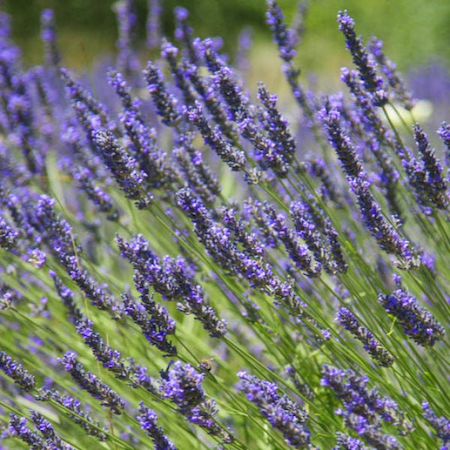
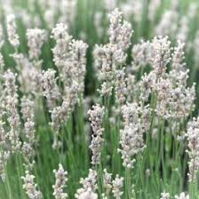
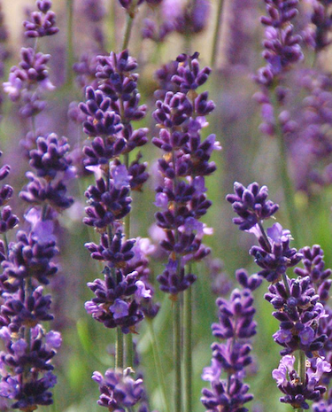
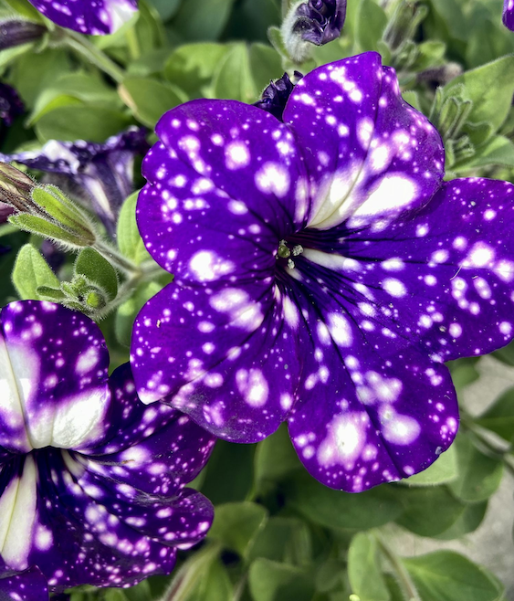
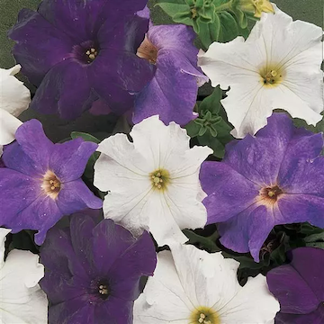
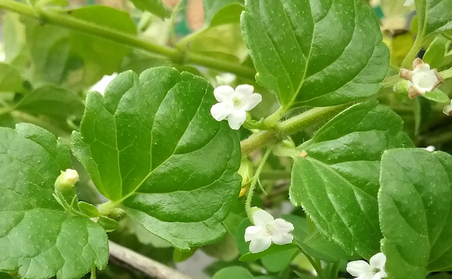
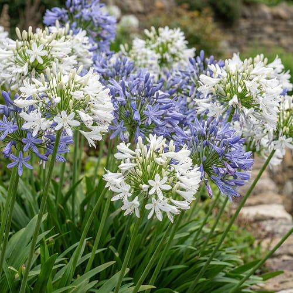
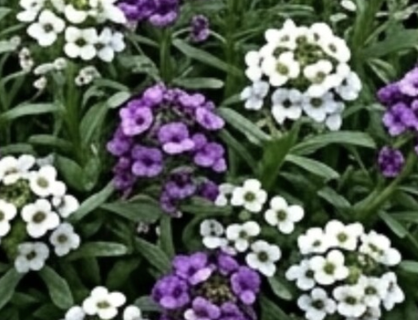

Our house was painted white and gray when we moved in, which was a little disappointing in contrast to our neighbors' beautiful lavender paint scheme. Colorful paint is still in the plan _someday_, but for now we're planting white flowers against the purple house, and purple flowers against the white house, so they'll look nice and also contrast.

Here's a little info about what's in the garden bed in 2026:

### Lavender

We love lavender, and it comes in a lot of different types. It's generally hardy and drought tolerant, and seems to love our California climate as long as you can keep its roots from getting soggy.

- _Lavandula x intermedia "Provence"_ - This is also known as French perfume lavender. It grows big and bushy, produces lots of strongly-scented cylindircal flower heads, and can be shaved down over and over and bounce back after each harvest. It's not great for cooking though because it tastes a bit menthol-y.

  

- _Lavandula intermedia 'Alba'_ - This is a white version of, I think, the standard Provence variety.

  

- _Lavandula intermedia 'Phenomenal'_ - this is a fairly new variety. It's supposed to produce a lot more oil in the flower heads than normal Provence, and you're supposed to be able to harvest it and it'll grow back and flower a second time in a season. We'll see!

  

### Petunias

- _Petunia grandiflora - Starry Sky/Night Sky_ - this is the most striking flower in the planter, deep purple with white flecks. The density of the white dots changes depending on the average temperature while the blossom was forming, so some will be solid purple, and some will be nearly white, depending on how foggy it's been. They are aggressive trailing spreaders and we're not mad about it!

  

- Petunia grandiflora - Waterfall mix - This is always a nice mix of white, light lavender/purple, and deep purple, and they provide a nice variety and fill in the spaces between other plants.

  

### Yerba Buena

Creeping between the petunias and other plants you'll find _Clinopodium douglasii_, also known as Yerba Buena ("good herb" in Spanish). This is a fragrant relative of the mint family that's native to San Francisco and coastal California, and for which [the early settlement of San Francisco](/history/yerba-buena/) was named. It spreads well along loosely packed soil or sand, enjoys mixed sun and shade, and seems to bounce back well when walked on. The Ohlone and other native people of California used yerba buena as breath freshener, a mild pain reliever, and brewed it into tea as a stomach tonic.

### Agapanthus

Agapanthus, also sometimes called "African lily" or "Lily of the Nile", is super popular in California because it's very drought hardy, and doesn't need a whole lot of maintenance. That said, if left alone they can become badly overgrown, and in places with more rain than here, they can be classed as invasive.

- Really **quite big** purple agapanthus - it was here when we got here, and we keep having to chop it out, separate it, replant a little and give the rest away.
- Quite small _polite_ purple agapanthus - it was also already here when we got here, but has been much easier to manage, and puts out more flowers per capita than the giant one.
- _Agapanthus 'Getty White'_
- _Agapanthus 'Mood Indigo'_
- _Agapanthus 'Indigo Frost'_ (or _'Twister'_ - we're not sure which one we got and won't know until it blooms)

### Sweet alyssym

Sweet alyssym, _Lobularia maritima_, is cute, small, colorful, hardy, a self-seeding annual (it'll come back if you let it seed and give it enough water), and smells so sweet sometimes it smells a little rotten to me. But it's very cute creeping along between the other plants.

### Hyacinths

They're still here, but they flower in the spring and are done for the year. But that's what the sort of sad looking green bits are.
